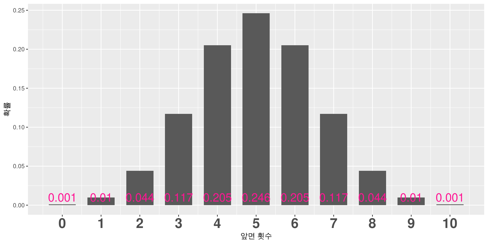
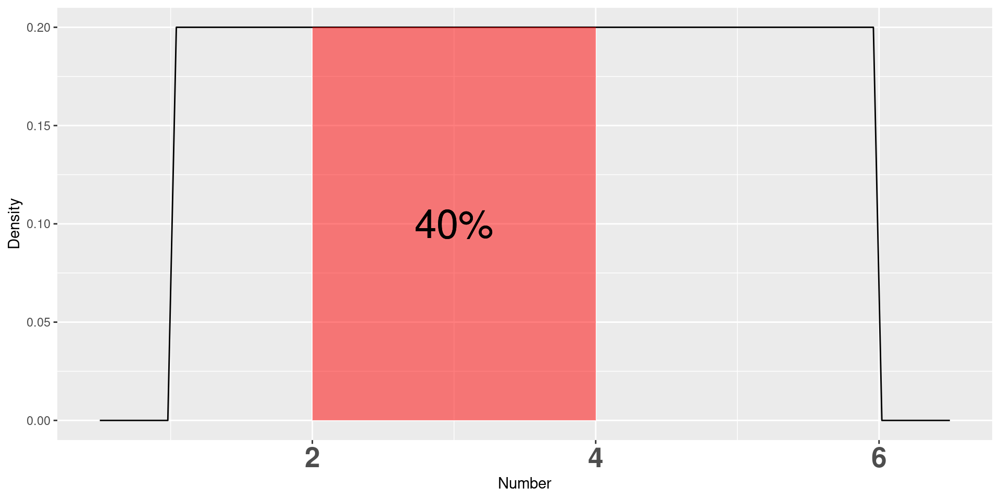
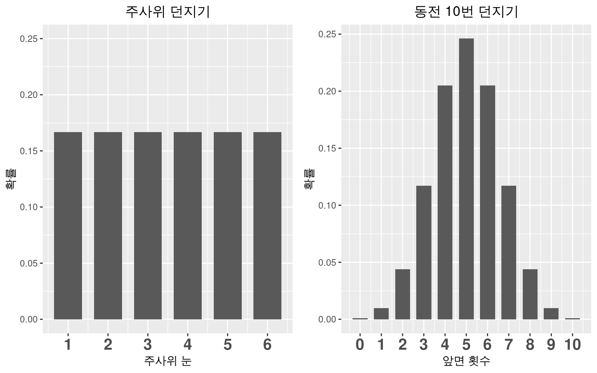
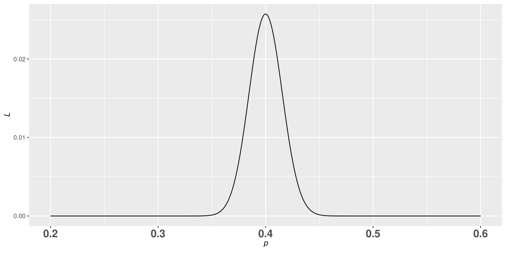
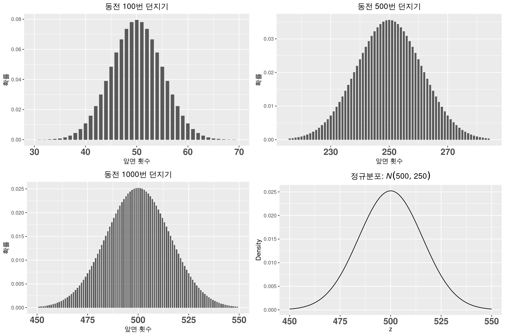
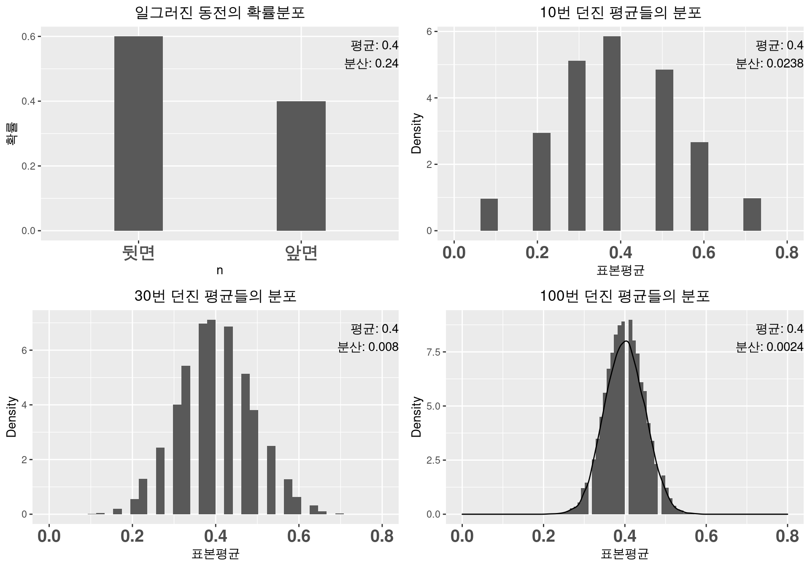
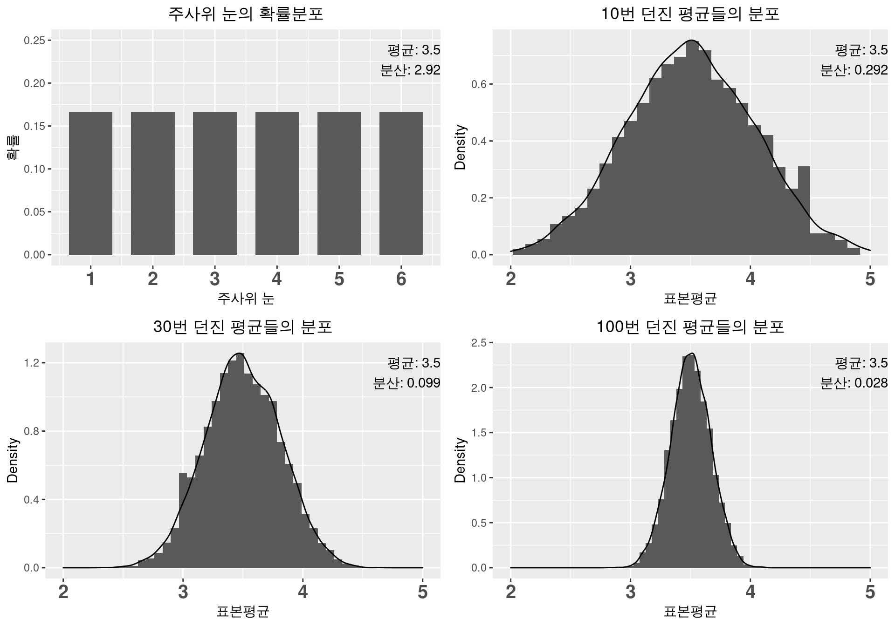
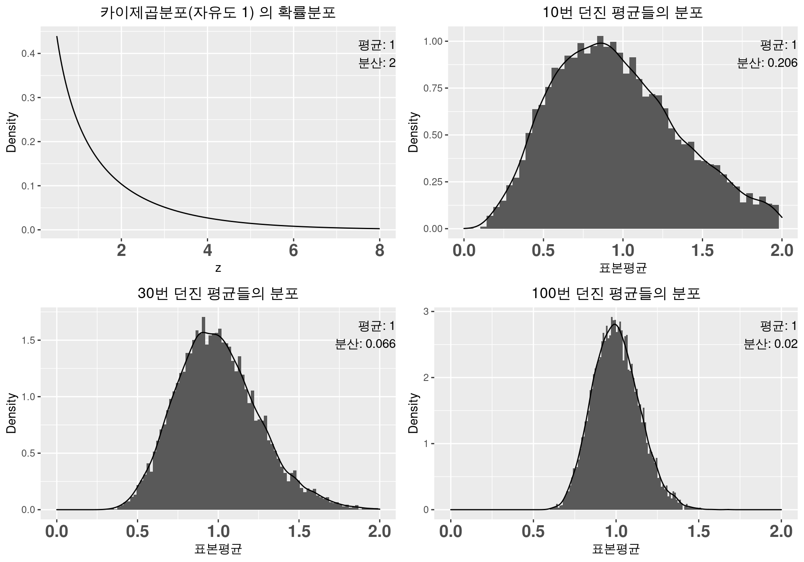

# 가능도(Likelihood)

## HEADLINE

**기억해 두자.**

> 셀 수 있는 사건 : **확률 = 가능도**

> 셀 수 없는 사건 中 특정 사건이 일어날 확률 = **0**

> 셀 수 없는 사건 : **PDF값 = 가능도**

> 진실을 찾는 방법 : **최대가능도 추정량(Maximum Likelihood Estimator, MLE)**

## Contents

1)  Intro

2)  이산사건의 확률

3)  연속사건의 확률

4)  가능도(Likelihood) : 연속사건 中 특정 사건이 일어날 가능성

5)  사건이 여러번 일어날 경우의 가능도

6)  최대가능도 추정량(Maximum Likelihood Estimator, MLE) : 모양이 일그러진 동전

7)  최대가능도 추정량(Maximum Likelihood Estimator, MLE) : 나의 실제 키

8)  Conclusion

## Intro

-   **가능도(Likelihood)** 의 직관적 이해가 목표
-   중요한 개념 but 의학통계 책에서는 생략.
-   **확률(Probability)**과의 비교
-   **최대가능도 추정량(Maximum Likelihood Estimator)** 이해

## 이산사건의 확률: 주사위

-   가능한 숫자는 1,2,3,4,5,6
-   각 숫자가 나올 확률은 $\frac{1}{6}$ 동일.

::: {.likelihood-figure}
{fig-alt="주사위 눈의 확률분포"}
:::

## 이산사건의 확률: 동전

-   10번 던질 때 앞면나오는 횟수 $n$
-   확률은 $p = _{10}C_{n}\frac{1}{2}^n\frac{1}{2}^{10-n} = _{10}C_{n}\frac{1}{2}^{10}=\frac{_{10}C_{n}}{1024}$

::: {.likelihood-figure}
{fig-alt="동전 10번 던지기의 앞면 횟수 확률분포"}
:::

## 이산사건의 확률 = 가능도

-   총 사건의 갯수를 셀 수 있음(ex: 6, 11개).
-   따라서 각 확률을 계산가능(합=1).
-   **확률 = 가능도** 로 정의.

::: {.likelihood-figure}
{fig-alt="주사위와 동전의 이산 확률 비교"}
:::

## 연속사건의 확률: 랜덤 숫자(실수) 뽑기

-   1 \~ 6의 실수 랜덤으로 뽑기
-   1 \~ 6 사이 무한히 많은 실수 존재
-   5가 뽑힐 확률 = $\frac{1}{\infty}=0$
-   4가 뽑힐 확률도 마찬가지, 즉 **특정 사건의 확률은 모두 0**.
-   끝?

## 연속사건의 확률: 특정구간의 확률

-   5가 뽑힐 확률은 0 but, 4 \~ 5 가 뽑힐 확률은 $\frac{5-4}{6-1}=0.2$.
-   연속사건은 **특정 구간에 속할 확률** 이용: **확률밀도함수(Probability Density Function: PDF)**
-   PDF 그래프에서 **특정 구간에 속한 넓이 = 특정 구간에 속할 확률**, **전체 넓이는 1**

## PDF 예시: 실수 뽑기

-   PDF: 1 \~ 6 은 모두 0.2, 나머지는 0.
-   2 \~ 4 가 뽑힐 확률은 $2\times 0.2 = 0.4$.

::: {.likelihood-figure}
{fig-alt="1에서 6 사이 균등분포의 확률밀도함수"}
:::

## PDF 예시: 표준정규분포

-   평균 0, 분산 1 인 정규분포
-   PDF는 $\frac{1}{\sqrt{2\pi}}e^{-z^2/2}$
-   $z$가 특정 값일 확률은 전부 0
-   -1.96 \~ 1.96 일 확률은 0.95: p-value

::: {.likelihood-figure}
{fig-alt="표준정규분포에서 -1.96부터 1.96까지의 면적"}
:::

## 표준정규분포: 특정사건 비교는 포기?

-   $z$ 가 -2, 0, ... 999 등 특정 숫자일 확률은 모두 0
-   따라서 각 사건의 발생가능성 차이는 없다? But
-   가장 솟아 있는 0 근처가 가능성 높고, 0에서 멀어질수록 가능성이 낮음을 느끼고있다.
-   **확률** 은 연속사건의 가능성 차이를 나타낼 수 없음

::: {.likelihood-figure}
{fig-alt="표준정규분포의 확률밀도"}
:::

## 가능도 in 연속사건: 특정 사건의 가능성

> PDF값을 가능도로 정의하면 되겠다.

-   가능도의 **직관적인** 정의 : 확률밀도함수의 $y$값 (PDF)
    -   이산사건: **확률 = 가능도**
    -   연속사건: **확률** $\neq$ 가능도 =\> **PDF값 = 가능도**

::: {.likelihood-pair}
{fig-alt="이산사건에서 확률과 가능도 비교"}

{fig-alt="연속사건에서 확률밀도와 가능도 비교"}
:::

## 가능도 응용: 사건이 여러번 일어난다면?

-   주사위 3번 던져 1,3,6이 나올 확률 = $\frac{1}{6}\times\frac{1}{6}\times\frac{1}{6}=\frac{1}{216}$

-   **동전 10번 던져서 앞면 갯수 세기** 를 3회 시행하여 앞면이 2,5,7번 나올 확률

    =\> 0.044 $\times$ 0.246 $\times$ 0.117$=$ 0.001

-   **이산사건 확률 = 가능도** 이므로 각 예시의 가능도도 $\frac{1}{216}$과 0.001

## 가능도 응용: 연속사건이 여러번?

-   표준정규분포에서 3번 뽑을때 -1, 0, 1이 나올 확률과 가능도는?

-   **확률** : 각 사건이 일어날 확률은 모두 0이므로 0

-   **가능도** : 각 사건의 가능도가 0.24, 0.4, 0.24이므로 0.24 $\times$ 0.4 $\times$ 0.24 $=$ 0.02

-   연속사건에서 가능도와 확률은 다르다

# 최대가능도 추정량(Maximum Likelihood Estimator, MLE)

## 이산사건: 모양이 일그러진 동전

-   앞면확률 $p \neq 0.5$, 알려면 실제 던져봐야..
-   1000번 던져 앞면 400번 나왔다면 $p=0.4$?
-   이 사건이 일어날 가능성 $L=_{1000} C_{400}p^{400}(1-p)^{600}$
-   가능성 $L$을 최대(MLE)로 만드는 $p=0.4$
-   일그러진 동전의 앞면나올 확률은 0.4라고 추정. 직관과 일치

::: {.likelihood-figure}
{fig-alt="동전 앞면 확률에 따른 가능도"}
:::

## 연속사건: 키

-   5번 측정결과 178, 179, 180, 181, 182(cm) 일때 실제 키는 평균값?

-   가정: 키측정은 **정규분포**를 따른다(평균 $\mu$, 분산 $\sigma^2$)

-   측정값 $x$에 해당하는 가능도 = $\frac{1}{\sqrt{2\pi}\sigma}e^{-\frac{(x-\mu)^2}{2\sigma^2}}$

-   위 5번 측정결과가 나타날 가능성 $L$ <small> $=\frac{1}{\sqrt{2\pi}\sigma^2}e^{-\frac{(178-\mu)^2}{2\sigma^2}}\times\frac{1}{\sqrt{2\pi}\sigma^2}e^{-\frac{(179-\mu)^2}{2\sigma^2}}\times\frac{1}{\sqrt{2\pi}\sigma^2}e^{-\frac{(180-\mu)^2}{2\sigma^2}}\times\frac{1}{\sqrt{2\pi}\sigma^2}e^{-\frac{(181-\mu)^2}{2\sigma^2}}\times\frac{1}{\sqrt{2\pi}\sigma^2}e^{-\frac{(182-\mu)^2}{2\sigma^2}}$</small>

-   $L$이 최대이려면 $(178-\mu)^2+(179-\mu)^2+(180-\mu)^2+(181-\mu)^2+(182-\mu)^2$이 최소여야 함. $\mu=180$일 때 최소.

::: {.likelihood-figure}
{fig-alt="실제 키에 따른 가능도"}
:::

## Conclusion

> 셀 수 있는 사건 : **확률 = 가능도**

> 셀 수 없는 사건 中 특정 사건이 일어날 확률 = **0**

> 셀 수 없는 사건 : **PDF값 = 가능도**

> 진실을 찾는 방법 : **최대가능도 추정량(Maximum Likelihood Estimator, MLE)**

# 정규분포(Normal Distribution)

## HEADLINE

**정규분포의 위대함**

> by **이항분포**

> by **오차의 법칙**

> by **중심극한정리**

> 시행 횟수/표본 개수 $n$이 커질수록 **표본평균** $\bar{X}$는 $N(\mu,\frac{\sigma^2}{n})$을 따른다.

## Contents

1)  Intro

2)  이항분포의 근사

3)  오차의 법칙: 오차라면 마땅히 가지고 있어야 할 조건

4)  중심극한정리: 모양이 일그러진 동전 / 주사위 던지기

5)  중심극한정리: 표준정규분포 / 카이제곱분포

6)  중심극한정리 고찰

7)  Conclusion

## 목표

-   **정규분포(Normal distribution)**의 위대함과 당위성 이해

-   연속변수는 대부분 정규분포를 가정

-   실제로 키, 몸무게, 시험 점수 등 대다수의 측정값은 정규분포

-   Why?

-   **이항분포의 근사, 오차의 법칙, 중심극한정리**

## 이항분포(Binomial Distribution)

-   **이항분포** $B(n,p)$ : 확률 $p$인 사건을 $n$번 시행 시 각 사건들 확률분포
-   **평균:** $np$, 분산: $np(1-p)$
-   이항분포가 삶의 대부분(선거, 타율, 객관식시험..)
-   정규분포가 이항분포의 근사값으로 표현된다면?

## 이항분포 근사: 동전을 무한히 던지면? {.normal-approx-slide}

::: {.likelihood-figure}
{fig-alt="동전 던지기 이항분포와 정규분포 근사"}
:::

::: {.likelihood-formula}
$B(1000,\frac{1}{2}) \simeq N(1000\times \frac{1}{2}, 1000\times \frac{1}{2} \times \frac{1}{2})$
:::

## 이항분포의 근사: 주사위를 무한히 던지면? {.normal-approx-slide}

::: {.likelihood-figure}
{fig-alt="주사위 던지기 이항분포와 정규분포 근사"}
:::

::: {.likelihood-formula}
$B(600,\frac{1}{6}) \simeq N(600\times \frac{1}{6}, 600\times \frac{1}{6} \times \frac{5}{6})$
:::

## 이항분포 근사: 일반화

-   동전과 주사위 예시

    -   $B(1000,\frac{1}{2}) \simeq N(1000\times \frac{1}{2}, 1000\times \frac{1}{2} \times \frac{1}{2})$
    -   $B(600,\frac{1}{6}) \simeq N(600\times \frac{1}{6}, 600\times \frac{1}{6} \times \frac{5}{6})$

-   일반화, $n$이 커질수록

    -   $B(n,\frac{1}{2}) \simeq N(n \times \frac{1}{2}, n \times \frac{1}{2} \times \frac{1}{2})$
    -   $B(n,\frac{1}{6}) \simeq N(n \times \frac{1}{6}, n \times \frac{1}{6} \times \frac{5}{6})$

-   종합

    -   **시행횟수** $n$이 커질수록 $B(n,p) \simeq N(np, np(1-p))$
    -   정규분포가 이항분포의 근사로 설명, 이상분포의 지위를 물려받는다.

## 오차의 법칙: 오차라면 마땅히 이래야

수학자 Gauss는 **오차에 대한 고찰**만으로 정규분포를 유도.

-

    1.  +오차와 -오차가 나올 가능성 같다: $f(-\epsilon)=f(\epsilon)$인 좌우대칭 함수

-

    2.  작은 오차가 흔하고 큰 오차는 드물다: $f(\epsilon)$는 위로 볼록한 모양

-

    3.  $f(\epsilon)$는 부드러운 모양(2번 미분가능)이고 확률의 합은 1: $\int_{-\infty}^{\infty} f(\epsilon) d\epsilon=1$

-   **4. 오차의 참값일 가능성이 가장 높은(MLE) 값은 측정한 오차들의 평균**

-\> 측정값이 각각 $\epsilon_1, \epsilon_2, \cdots, \epsilon_n$일 때 가능도 $L=f(\epsilon_1 - \epsilon)f(\epsilon_2 - \epsilon)\dots f(\epsilon_n - \epsilon)$는 $\epsilon=\frac{\epsilon_1+\epsilon_2+\cdots+\epsilon_n}{n}$에서 최대

정말 간단한 4개 조건만으로 정규분포 PDF를 수학적으로 유도.

-   정규분포가 대부분일 것이다

## 중심극한정리: 무조건 정규분포 OK?

-   평균은 가장 흔히 쓰이는 지표.
-   표본을 뽑아 **표본평균(Sample mean)** 구하여 전체 평균으로 간주
-   믿음의 정도로 표준오차(Standard error, 표본평균들의 표준편차) 이용
-   수백, 수천 명의 여론조사를 민심의 척도로 간주해도 되나?

## 예: 일그러진 동전 $p = 0.4$ {.clt-slide}

-   행위 1: **10번 던져** 앞면 나올 확률 $\hat{p}$ 계산
-   행위 1 을 10000번 수행하여 $\hat{p}$ 의 분포 확인, **행위 2은 30번, 행위 3은 100번 던지기**

::: columns
::: {.column width="50%"}
::: {.likelihood-figure}
{fig-alt="일그러진 동전 예시의 중심극한정리"}
:::

:::

::: {.column width="50%"}
1.  $n$ 커질수록 $\hat{p}$ 이 정규분포에 가까워짐
2.  $\hat{p}$의 평균이 실제 $p$값인 0.4에 가까워짐
3.  $\hat{p}$의 분산이 $\frac{0.24}{n}=\frac{p(1-p)}{n}$에 가까워짐

따라서 $n$이 커지면 $\hat{p}$ 는 $N(p,\frac{p(1-p)}{n})$ 을 따른다
:::
:::

## 주사위 던지기 {.clt-slide}

-   주사위눈 **평균(**$\mu$): $\frac{1+2+3+4+5+6}{6}=3.5$, **분산(**$\sigma^2$): $\frac{(1-3.5)^2+(2-3.5)^2+\cdots+(6-3.5)^2}{6}\approx 2.92$
-   행위 1: **10번 던져** 평균 $\bar{x}$ 구하는 작업을 10000번 반복. 행위2, 3은 앞과 동일

::: columns
::: {.column width="50%"}
::: {.likelihood-figure}
{fig-alt="주사위 예시의 중심극한정리"}
:::

:::

::: {.column width="50%"}
1.  $n$이 커지면 표본평균 $\bar{X}$의 분포 $\simeq$ 정규분포
2.  $\bar{X}$의 평균 $\simeq$ 실제 평균인 $\mu=3.5$
3.  $\bar{X}$의 분산 $\simeq$ $\frac{2.92}{n}=\frac{\sigma^2}{n}$

$n$이 커지면 $\bar{X}$는 $N(\mu,\frac{\sigma^2}{n})$을 따른다.
:::
:::

## 표준정규분포 {.clt-slide}

-   표준 정규분포($\mu=0$, $\sigma^2=1$)에서 $n$개 뽑아 평균내기
-   세팅은 이전과 동일

::: {.clt-grid}
::: {.clt-visual}
::: {.likelihood-figure}
{fig-alt="표준정규분포 예시의 중심극한정리"}
:::

:::

::: {.clt-notes}
1.  $n$이 커질수록 표본평균 $\bar{X}$ 분포 $\simeq$ 정규분포
2.  $\bar{X}$의 평균 $\simeq$ 실제평균 0
3.  $\bar{X}$의 분산 $\simeq$ $\frac{1}{n}$에 가까워졌다.

**연속확률의 경우에도** $n$이 커지면 $\bar{X}$는 $N(\mu,\frac{\sigma^2}{n})$을 따른다.
:::
:::

## 카이제곱분포 {.clt-slide .clt-with-summary}

-   자유도 1인 카이제곱분포($\mu=1$, $\sigma^2=2$): 왼쪽으로 치우친 분포에서 뽑아도?
-   세팅은 동일

::: columns
::: {.column width="50%"}
::: {.likelihood-figure}
{fig-alt="카이제곱분포 예시의 중심극한정리"}
:::

:::

::: {.column width="50%"}
1.  $n$이 커질수록 $\bar{X}$의 분포 $\simeq$ 정규분포
2.  $\bar{X}$의 평균과 분산이 각각 1, $\frac{2}{n}$에 가까워짐

$\bar{X}$는 $n$이 커질수록 $N(\mu,\frac{\sigma^2}{n})$을 따른다.
:::
:::

> **중심극한정리(Central Limit Theorem, CLT)** : 어떤 모집단이든 30개 정도의 $\bar{X}$가 확보되면 정규분포를 따른다.

## 중심극한정리 고찰 - 쪽수가 깡패(?)

$n$ 이 커질수록

-   표본평균의 평균이 모집단 평균에 가까워짐
-   표준오차(표본평균의 분산) $\frac{\sigma^2}{n}$ 이 0에 가까워짐

> 즉, 표본평균을 실제평균으로 간주해도 됨

## 중심극한정리 고찰 - 의심의 정도를 숫자로 표현(p-value)

예: $p = 0.4$ 인 일그러진 동전 여러번 던지기

-   여러번 던져서 계산한 $\hat{p}$의 분포가 $N(0.4,0.024)$에 가까워짐.

-   10번 던져서 앞면 6번($\hat{p}=0.6$) 나왔다면? 6번 이상 나올 확률: 19.7% $\div2$ = 9.85% -\> 그럴 수 있지

-   30번 던져서 앞면 18번($\hat{p}=0.6$) 나왔다면? 18번 이상 나올 확률: 2.5% $\div2$ = 1.25% -\> 이상한데

-   100번 던져서 앞면 60번($\hat{p}=0.6$) 나왔다면? 60번 이상 나올 확률: 0.004% $\div2$ = 0.002% -\> 동전조작!

::: {.likelihood-figure-wide}
{fig-alt="표본 크기별 p-value 직관"}
:::

## Conclusion

-   정규분포의 위대함을 설명하는 3개의 논리, 중심극한정리 고찰

**정규분포의 위대함**

> by **이항분포**

> by **오차의 법칙**

> by **중심극한정리**

> 시행 횟수/표본 개수 $n$이 커질수록 **표본평균** $\bar{X}$는 $N(\mu,\frac{\sigma^2}{n})$을 따른다.
