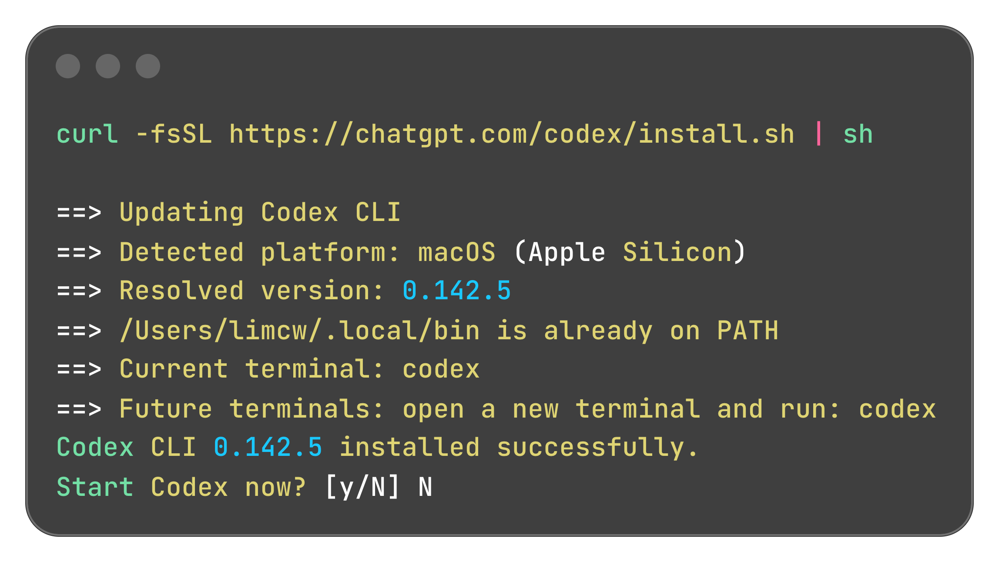
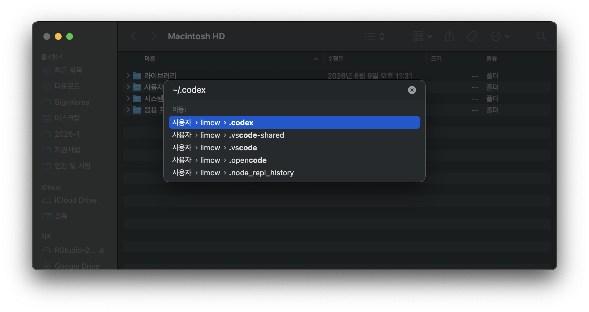
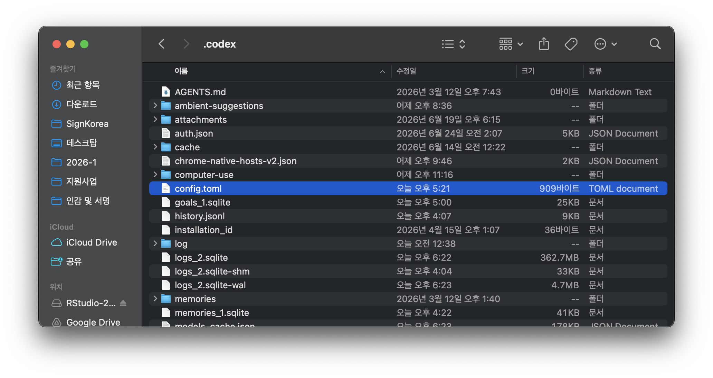
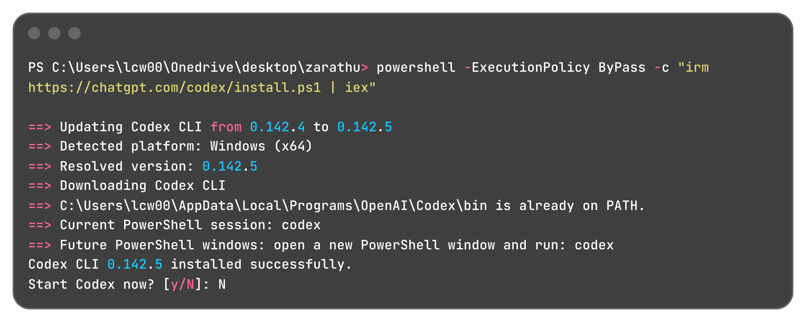
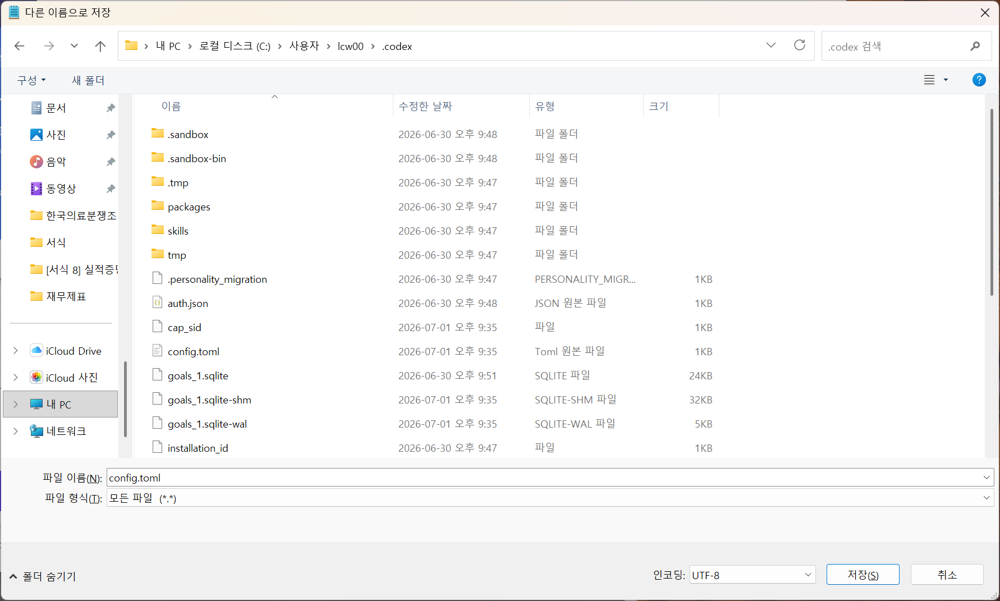
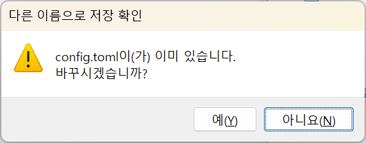
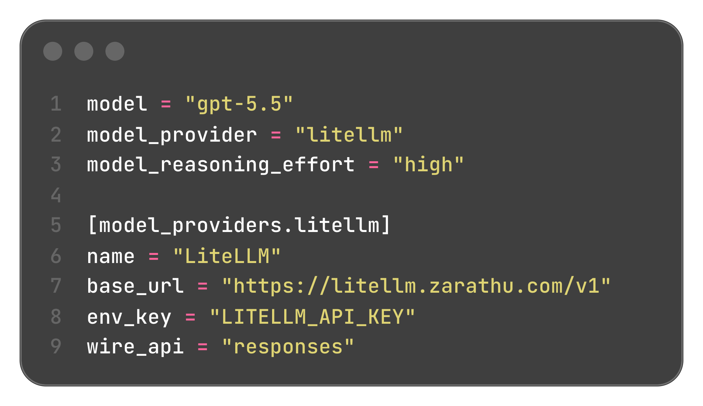

## 오늘 할 일

::: {.summary-grid-4}
::: {.summary-item .si-green}
**1. 설치**

Mac과 Windows에서 Codex CLI를 설치한다.
:::

::: {.summary-item .si-blue}
**2. 설정**

수업용 API 키와 `config.toml`을 연결한다.
:::

::: {.summary-item .si-teal}
**3. 실행**

작업 폴더에서 `codex`를 실행한다.
:::

::: {.summary-item .si-purple}
**4. 실습**

R 분석 파일과 결과물을 Codex로 만든다.
:::
:::

## Codex는 터미널에서 일하는 코딩 에이전트

| 구분 | 일반 챗봇 | Codex |
|---|---|---|
| 작업 방식 | 답변을 읽고 사람이 복사 | 파일을 읽고 수정하며 명령을 실행 |
| 실행 위치 | 웹 브라우저 중심 | 내 컴퓨터의 터미널과 작업 폴더 |
| 맥락 | 한 번의 질문 중심 | 프로젝트 파일과 이전 작업을 함께 반영 |
| 결과물 | 코드 조각 | `.R`, `.qmd`, 표, 그림, 보고서 파일 |

::: {.highlight-box}
Codex는 "R 코드를 알려주는 도구"가 아니라, 작업 폴더 안에서 코드를 만들고 실행하며 고치는 도구다.
:::

## 수업에서 사용할 흐름

::: columns
::: {.column width="48%"}
::: {.large}
- Codex CLI 설치
- 수업용 API 키 설정
- `config.toml` 저장
- 작업 폴더에서 `codex` 실행
:::
:::

::: {.column width="75%"}
```         
설치 -> 설정 -> 실행 -> 요청 -> 검토
                 |
                 v
        R 코드, 표, 그림, 결과 파일
```
:::
:::

# 설치: Mac

## Mac 1 - 터미널에서 설치

::: columns
::: {.column width="45%"}
::: {.large}
- `Command + Space`로 Spotlight를 연다.
- `터미널.app`을 검색해서 실행한다.
- 설치 명령을 붙여넣고 실행한다.
:::

``` bash
curl -fsSL https://chatgpt.com/codex/install.sh | sh
```
:::
:::

::: {.highlight-box-blue}
설치 마지막에 `Start Codex now? [y/N]`가 나오면 수업에서는 `N`을 입력한다. 설정 파일을 먼저 만든 뒤 실행한다.
:::

## Mac 2 - 설치 결과 확인

{fig-alt="Mac에서 Codex CLI 설치가 완료된 터미널 화면" width="82%"}

::: {.highlight-box-gray}
`Codex CLI installed successfully`가 보이면 설치가 끝난 것이다.
:::

## Mac 3 - API 키 설정

::: columns
::: {.column width="45%"}

터미널에서 이어서 실행한다.

``` bash
export LITELLM_API_KEY="전달받은 개별 API KEY"
```
:::
:::

::: {.highlight-box-gray}
이 명령은 화면에 특별한 결과가 나오지 않는 것이 정상이다. 터미널을 닫으면 다시 설정해야 하므로, 실습 중에는 같은 터미널을 유지한다.
:::

## Mac 4 - config.toml 저장 위치

`~/.codex` 폴더를 열고 `config.toml` 파일을 만든다.

::: columns
::: {.column width="43%"}
::: {.large}
- Finder를 연다.
- `Command + Shift + G`를 누른다.
- `~/.codex`를 입력한다.
- `config.toml` 파일을 저장한다.
:::
:::

::: {.column width="57%"}
{fig-alt="Mac Finder에서 ~/.codex 경로로 이동하는 화면" width="100%"}
:::
:::

## Mac 5 - config.toml 배치

{fig-alt="Mac Finder의 .codex 폴더 안에 config.toml 파일이 있는 화면" width="78%"}

::: {.highlight-box}
파일 이름은 반드시 `config.toml`이어야 한다.
:::

## Mac 6 - config.toml 내용

::: columns
::: {.column width="46%"}

``` toml
model = "gpt-5.5"
model_provider = "litellm"
model_reasoning_effort = "high"

[model_providers.litellm]
name = "LiteLLM"
base_url = "https://litellm.zarathu.com/v1"
env_key = "LITELLM_API_KEY"
wire_api = "responses"
```
:::
:::

::: {.highlight-box}
`env_key`에는 API 키 값이 아니라 환경변수 이름인 `LITELLM_API_KEY`를 적는다.
:::

## Mac 7 - Codex 실행

작업할 폴더로 이동한 뒤 실행한다.

``` bash
cd ~/Documents/my_research
codex
```

::: {.highlight-box-blue}
처음 실행할 때 권한, 작업 폴더 신뢰 여부, 로그인 방식 등을 묻는 화면이 나올 수 있다. 수업에서는 강사 안내에 맞춰 진행한다.
:::

# 설치: Windows

## Windows 1 - PowerShell에서 설치

::: columns
::: {.column width="100%"}
::: {.large}
- `Windows + R`을 누른다.
- 실행 창에 `powershell`을 입력한다.
- 설치 명령을 붙여넣고 실행한다.
:::

``` powershell
powershell -ExecutionPolicy ByPass -c "irm https://chatgpt.com/codex/install.ps1 | iex"
```
:::
:::

## Windows 2 - 설치 결과 확인

{fig-alt="Windows에서 Codex CLI 설치가 완료된 PowerShell 화면" width="82%"}

::: {.highlight-box-gray}
`Codex CLI installed successfully`가 보이면 설치가 끝난 것이다.
:::

## Windows 3 - API 키 설정

::: columns
::: {.column width="45%"}

PowerShell에서 이어서 실행한다.

``` powershell
$env:LITELLM_API_KEY="전달받은 개별 API KEY"
```
:::
:::

::: {.highlight-box-gray}
이 명령도 실행 결과가 없는 것이 정상이다. 실습 중에는 같은 PowerShell 창을 유지한다.
:::

## Windows 4 - config.toml 저장

메모장에서 텍스트 파일을 만들고 아래 위치에 저장한다.

``` powershell
%USERPROFILE%\.codex
```

저장할 때 확인할 것:

::: {.large}
- 파일 이름: `config.toml`
- 파일 형식: 모든 파일
- 인코딩: UTF-8
:::

::: {.highlight-box-blue}
확장자가 `config.toml.txt`가 되면 Codex가 읽지 못한다. 파일 이름을 다시 확인한다.
:::

## Windows 5 - 저장 화면 확인

::: columns
::: {.column width="70%"}
{fig-alt="Windows에서 config.toml을 .codex 폴더에 저장하는 화면" width="100%"}
:::

::: {.column width="30%"}
{fig-alt="Windows에서 config.toml 덮어쓰기를 확인하는 대화상자" width="100%"}
:::
:::

::: {.highlight-box-gray}
이미 `config.toml`이 있으면 덮어쓸지 묻는 창이 나올 수 있다.
:::

## Windows 6 - config.toml 내용

::: columns
::: {.column width="46%"}

``` toml
model = "gpt-5.5"
model_provider = "litellm"
model_reasoning_effort = "high"

[model_providers.litellm]
name = "LiteLLM"
base_url = "https://litellm.zarathu.com/v1"
env_key = "LITELLM_API_KEY"
wire_api = "responses"
```
:::

::: {.column width="54%"}
{fig-alt="Codex config.toml에 LiteLLM 설정을 입력한 화면" width="88%"}
:::
:::

::: {.highlight-box-gray}
수업용 LiteLLM 주소와 API 키는 강의 운영 환경에 맞춘 설정이다. 개인 환경에서는 ChatGPT 로그인이나 OpenAI API key 로그인 방식도 사용할 수 있다.
:::

## Windows 7 - Codex 실행

작업할 폴더로 이동한 뒤 실행한다.

``` powershell
Set-Location "$env:USERPROFILE\Documents\my_research"
codex
```

문제가 있으면 먼저 진단한다.

``` powershell
codex doctor
```

# AGENTS.md: 분석 스타일 설정

## AGENTS.md란?

**프로젝트 루트에 두는 AI 지시 파일**

::: {.large}
- Codex가 작업 시작 때 자동으로 읽는 규칙 파일
- 코딩 스타일, 사용 패키지, 분석 컨벤션 등을 고정
- **한 번 작성하면 매번 동일한 스타일로 분석**
:::

``` bash
# 프로젝트 루트에 생성
my_research/
├── AGENTS.md         ← 분석 스타일 지시
├── data/             ← 원본 데이터
├── global.R          ← 데이터 전처리
├── analysis.R        ← 분석 코드
└── results/          ← 결과물 (pptx, xlsx)
```

## AGENTS.md 예시 (1/2)

``` markdown
# 분석 스타일

## 기본 원칙
- data.table을 메인 패키지로 사용 (dplyr 사용 안 함)
- pipe operator(%>%)만 사용 (magrittr)
- global.R에서 전처리, analysis.R에서 분석 (파일 분리)

## global.R 구조
1. 데이터 읽기
2. 전처리 + 파생변수 생성
3. varlist에 분석 변수 저장
4. out = 분석용 데이터, out.label = 라벨 정보
5. **varlist와 out 나오기 전에 파생변수 모두 완료**

## 테이블 저장
- flextable으로 포맷팅 (논문에 바로 쓸 수 있는 형태)
- flexlsx + openxlsx2로 Excel 여러 시트에 저장
```

## AGENTS.md 예시 (2/2)

``` markdown
## 그림 저장
- 기본은 ppt (rvg::dml + officer 패키지)
- 벡터 그래픽, fullsize

## 주요 패키지
- jstable: CreateTableOneJS, cox2.display, glmshow.display
- jskm: Kaplan-Meier plot (jskm, svyjskm)
- 라벨 적용: LabeljsCox, LabeljsTable 등

## 주의사항
- survfit/coxph는 eval(substitute()) 패턴 필수
- 테이블 부등호: >= → ≥, <= → ≤ (유니코드)
- Table 1 footer는 실제 사용된 검정과 일치시키기
```

::: {.highlight-box}
이 AGENTS.md를 한 번 만들어두면, "Table 1 만들어줘"라고만 해도 **항상 같은 스타일**로 생성할 수 있다.
:::

# 실전: R 데이터분석

## 예제 1: 데이터 전처리 (global.R)

**자연어로 지시**:

::: {.prompt-box}
data 폴더의 엑셀 파일 읽어서 global.R 만들어줘.  
성별은 factor, 나이/BMI는 numeric으로.  
DM은 0/1 코딩이고 label은 No/Yes로.
:::

**Codex가 생성하는 코드**:

``` r
library(data.table);library(magrittr);library(jstable)
a <- readxl::read_excel("data/patient_data.xlsx") %>% data.table

a[, DM := factor(DM, levels = c(0, 1), labels = c("No", "Yes"))]

varlist <- list(
  Base = c("Sex", "Age", "BMI", "DM", "HbA1c")
)

out <- a[, .SD, .SDcols = c(unlist(varlist))]
factor_vars <- c("Sex", "DM")
out[, (factor_vars) := lapply(.SD, factor), .SDcols = factor_vars]
conti_vars <- setdiff(names(out), factor_vars)
out[, (conti_vars) := lapply(.SD, as.numeric), .SDcols = conti_vars]

out.label <- jstable::mk.lev(out)
```

## 예제 2: Table 1

**자연어로 지시**:

::: {.prompt-box}
DM 기준으로 Table 1 만들어줘.  
nonnormal 변수는 Age, BMI로.  
Excel로 저장.
:::

**Codex가 실행하는 코드**:

``` r
source("global.R")

tb1 <- jstable::CreateTableOneJS(
  vars = names(out), strata = "DM", data = out,
  nonnormal = c("Age", "BMI"),
  labeldata = out.label, Labels = TRUE,
  testNonNormal = wilcox.test
)

ft <- tb1$table %>%
  cbind(Variable = rownames(.), .) %>%
  flextable::flextable() %>%
  flextable::set_caption("Table 1. Baseline characteristics") %>%
  flextable::add_footer_lines(
    "P by Wilcoxon rank-sum test / Chi-squared or Fisher's exact test"
  )
```

## 예제 3: 생존분석

**자연어로 지시**:

::: {.prompt-box}
DM 여부에 따른 Kaplan-Meier plot 그려줘.  
p-value 표시하고, JAMA 스타일로.  
ppt로 저장.
:::

**Codex가 실행하는 코드**:

``` r
library(survival);library(jskm);library(officer);library(rvg)

dd <- out  # 분석 데이터
fmla <- Surv(time, event) ~ DM
fit <- eval(substitute(survfit(f, data = dd), list(f = fmla)))

p <- jskm(fit, data = dd, pval = TRUE, table = TRUE,
           marks = FALSE, theme = "jama",
           ystratalabs = c("No DM", "DM"),
           ystrataname = "DM status")

# PPT 저장
doc <- read_pptx() %>%
  add_slide(layout = "Blank") %>%
  ph_with(dml(ggobj = p), location = ph_location_fullsize())
print(doc, target = "results/km_plot.pptx")
```

## 예제 4: Cox Regression

**자연어로 지시**:

::: {.prompt-box}
DM의 사망 위험을 Cox regression으로 분석해줘.  
Age, Sex, BMI 보정하고, label 적용해서 Excel로 저장.
:::

**Codex가 실행하는 코드**:

``` r
fmla <- Surv(time, event) ~ DM + Age + Sex + BMI
fit <- eval(substitute(coxph(f, data = dd), list(f = fmla)))

cox_result <- jstable::cox2.display(fit)
cox_labeled <- jstable::LabeljsCox(cox_result, ref = out.label)

ft <- cox_labeled$table %>%
  flextable::flextable() %>%
  flextable::set_caption("Table 2. Cox proportional hazards model") %>%
  flextable::add_footer_lines("HR, hazard ratio; CI, confidence interval")

# Excel 저장
library(flexlsx);library(openxlsx2)
wb <- wb_workbook()
wb$add_worksheet("Cox")
wb <- wb_add_flextable(wb, "Cox", ft)
wb$save("results/Tables.xlsx")
```

## 대화 이어가기

**Codex의 강점: 맥락을 기억**

``` {.prompt-box}
> 위의 Cox 모델에서 DM 유의하면,
  subgroup 분석도 해줘. Sex, Age 65세 기준으로.
  forestploter로 그려서 ppt에 추가.

> Table 1이랑 Cox table을 한 엑셀 파일에
  각각 다른 시트로 저장해줘.

> 결과 요약해서 professor_reply.md 만들어줘.
  Statistical Analysis는 영어로.
```

- 이전 대화에서 만든 코드/결과를 **기억하고 이어서** 작업
- 추가 지시만 하면 기존 코드를 수정하거나 확장

# 팁과 주의사항

## 효과적인 지시 방법

**구체적일수록 좋다**

| 나쁜 예 | 좋은 예 |
|---|---|
| "분석해줘" | "DM 기준 Table 1 만들어줘, nonnormal은 Age" |
| "그래프 그려" | "KM plot 그려줘, JAMA 스타일, p-value 표시" |
| "저장해" | "ppt로 저장, fullsize, 벡터그래픽" |

**단계별 지시가 안전**

1. 먼저: "data 폴더의 엑셀 읽어서 구조 보여줘"
2. 다음: "global.R 만들어줘"
3. 그 다음: "Table 1 만들어줘"
4. 마지막: "결과 Excel로 저장"

## 자주 쓰는 명령어

**Codex 기본 명령**

``` bash
# Codex 시작
codex

# 대화 내 명령어
/help              # 도움말
/clear             # 대화 초기화
/compact           # 대화 요약
```

**유용한 자연어 패턴**

``` bash  
> global.R 읽어보고 어떤 변수가 있는지 알려줘
> analysis.R의 에러 고쳐줘
> 이 코드 리뷰해줘
> 결과를 professor_reply.md로 정리해줘
```

## 비용과 구독

**Codex 사용 방식**

| 방식 | 비용 | 특징 |
|---|---|---|
| **수업용 LiteLLM** | 강의 안내 기준 | 수업 중 동일한 설정으로 사용 |
| **ChatGPT 계정 로그인** | 플랜에 따라 다름 | 개인 실습과 일반 사용에 적합 |
| **OpenAI API key** | 사용량 기반 | 호출량에 따라 과금 |

::: {.highlight-box-blue}
수업에서는 안내받은 LiteLLM 설정을 사용한다. 개인 계정이나 API key를 쓸 때는 각 서비스의 과금 기준을 확인한다.
:::

## 주의사항

**반드시 확인할 것**

1. **코드 리뷰**: AI가 만든 코드를 반드시 확인

    - 특히 통계 방법이 맞는지, 변수 코딩이 맞는지

2. **환자 데이터 보안**: Codex는 **로컬에서 실행**

    - 분석 파일과 명령을 읽고 처리할 수 있으므로 민감정보를 넣지 않는다.
    - 프롬프트에 환자 정보를 직접 입력하지 않는다.

3. **재현성**: global.R + analysis.R + AGENTS.md를 함께 보관

    - 동일한 지시로 동일한 결과를 다시 확인할 수 있다.

::: {.highlight-box-gray}
AI는 도구일 뿐이다. 통계적 판단과 결과 해석은 **연구자의 몫**이다.
:::

## 설치 후 확인: codex doctor

**설치가 잘 됐는지 한 번에 진단**

``` powershell
codex doctor
```

- 설치 방식, 버전, PATH, Git 상태 등 자동 체크
- 문제 발견 시 해결 방법 안내

**그래도 안 되면?**

| 상황 | 해결 |
|---|---|
| codex 명령어 안 됨 | PATH에 `~/.local/bin` 추가 |
| R 못 찾음 | Rscript PATH 확인 |
| 한글 깨짐 | Windows 설정에서 UTF-8 활성화 |
| 패키지 설치 에러 | Rtools 설치 |

## 정리

**Codex + R 데이터분석 워크플로우**

``` bash
1. AGENTS.md 작성 (분석 스타일 고정)
    ↓
2. 데이터를 프로젝트 폴더에 준비
    ↓
3. codex 실행 → 자연어로 지시
    ↓
4. global.R → analysis.R → 결과물 자동 생성
    ↓
5. 코드 리뷰 후 최종 확인
```

**기대 효과**

- 반복적인 코딩 작업 시간 **대폭 단축**
- 일관된 분석 스타일 유지 (AGENTS.md)
- 논문 수준 테이블/그림 **즉시 생성**

## 감사합니다

**실습 및 질문**