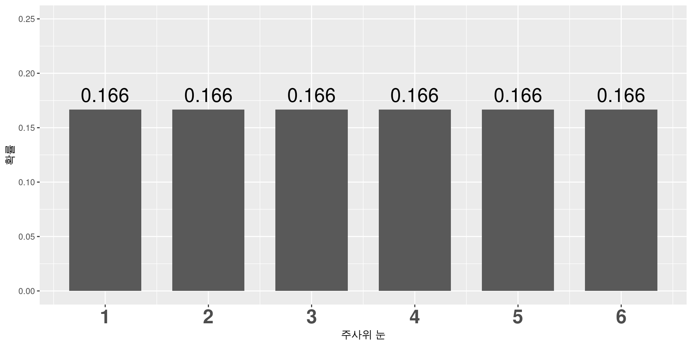
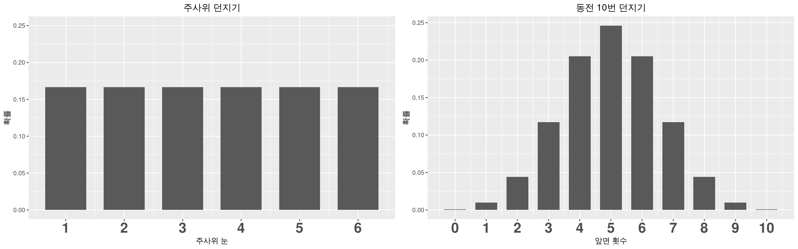
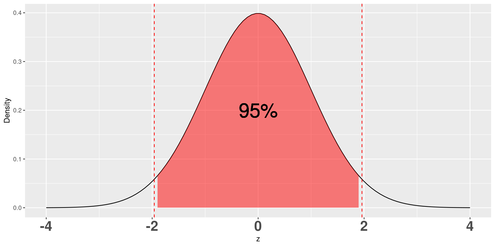
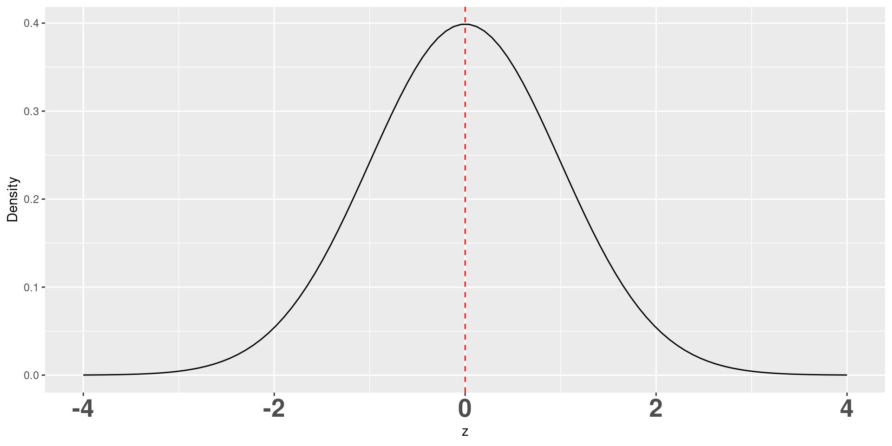
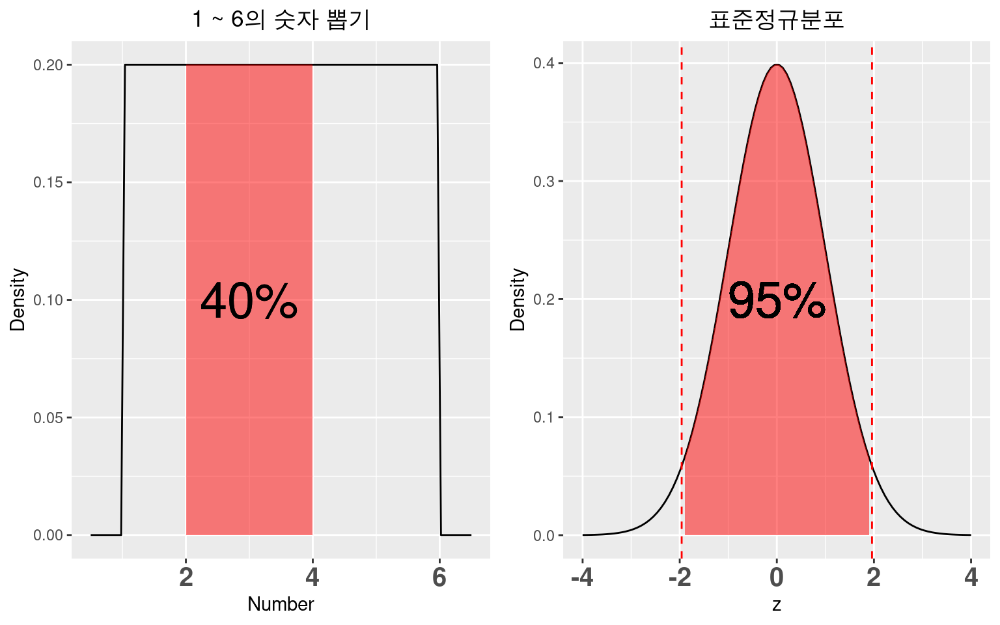
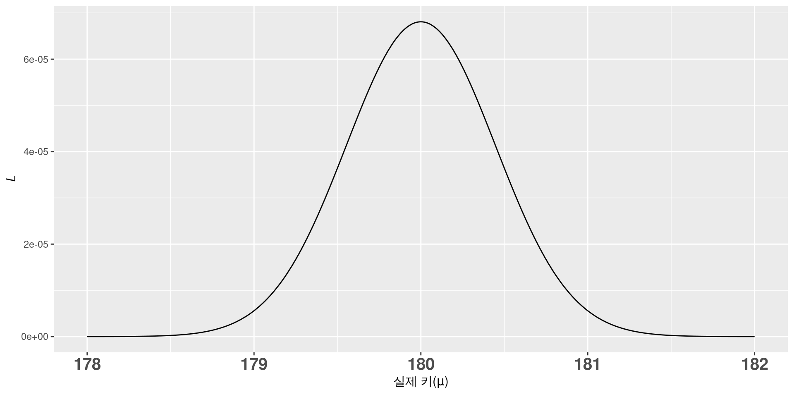
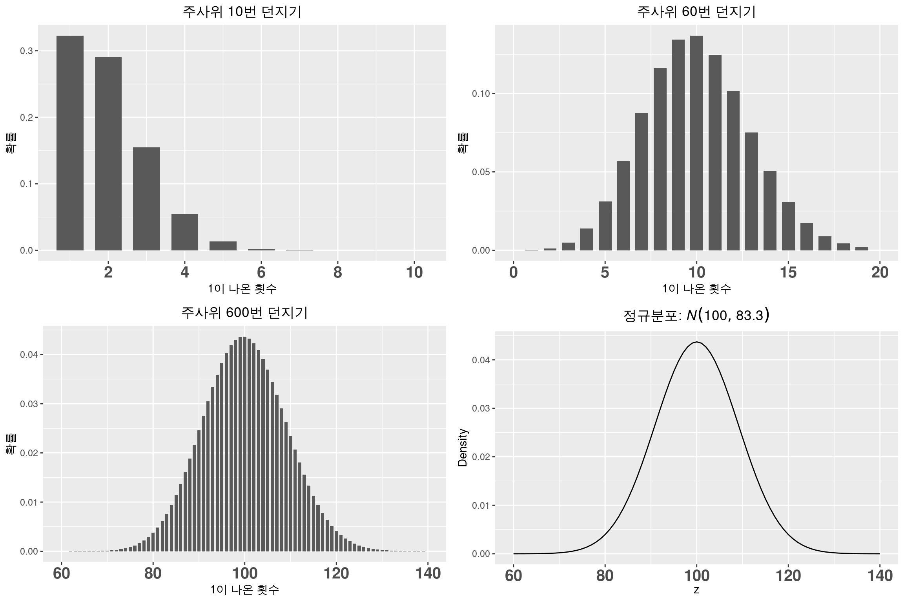
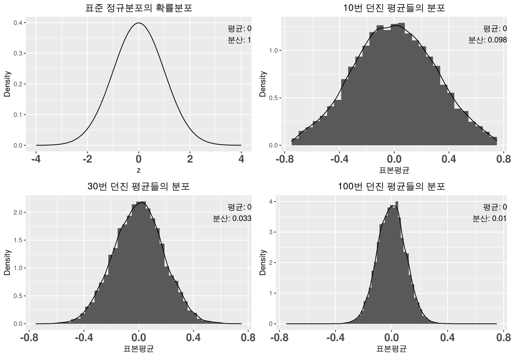
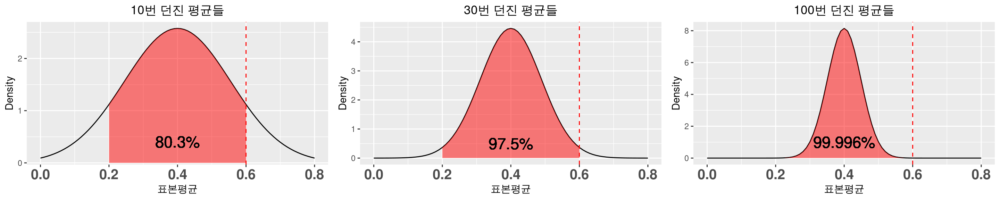

## 오늘의 목표

::: {.large}
- **가능도(Likelihood)**를 확률(Probability)과 비교해 직관적으로 이해합니다.
- **최대가능도 추정량(Maximum Likelihood Estimator, MLE)**이 왜 자연스러운 추정 방법인지 봅니다.
- **정규분포(Normal distribution)**가 왜 통계에서 기본 분포처럼 쓰이는지 세 가지 관점으로 정리합니다.
- 시행 횟수와 표본 개수가 커질수록 표본평균이 어떻게 움직이는지 확인합니다.
:::

::: {.highlight-box-gray}
이 자료는 이번 차시의 앞부분인 **가능도**와 **정규분포**를 다룹니다. 샘플수 계산과 생존분석 심화는 별도 자료에서 이어집니다.
:::

## 강의 흐름

::: {style="padding: 10px 40px;"}

::: {.highlight-box}
**01. 가능도** — 이산사건과 연속사건에서 확률과 가능도의 차이
:::

::: {.highlight-box-blue}
**02. 최대가능도 추정** — 관찰된 자료를 가장 그럴듯하게 만드는 값 찾기
:::

::: {.highlight-box-teal}
**03. 정규분포** — 이항분포 근사, 오차의 법칙, 중심극한정리
:::

::: {.highlight-box-purple}
**04. 정리** — PDF, MLE, 표본평균 분포를 한 줄로 연결
:::

:::

## 핵심 메시지 {.intro-slide}

::: spacer-xs
:::

::: accent-box
셀 수 있는 사건에서는 **확률 = 가능도**로 보아도 충분합니다. 셀 수 없는 연속사건에서는 특정 값이 나올 확률은 0이므로, **PDF값**으로 가능성을 비교합니다.
:::

::: columns
::: {.column width="50%"}
[**가능도**]{.section-title}

- 관찰된 자료가 주어졌을 때, 어떤 모수가 더 그럴듯한지 비교합니다.
- 가능도를 최대로 만드는 모수가 **MLE**입니다.
:::

::: {.column width="50%"}
[**정규분포**]{.section-title}

- 많은 이산분포를 큰 표본에서 정규분포로 근사할 수 있습니다.
- 표본평균은 표본 수가 커질수록 $N(\mu,\frac{\sigma^2}{n})$에 가까워집니다.
:::
:::

## 가능도 한 줄 요약

::: {.center}
**기억해 둡시다.**

> 셀 수 있는 사건: **확률 = 가능도**

> 셀 수 없는 사건 중 특정 사건이 일어날 확률: **0**

> 셀 수 없는 사건: **PDF값 = 가능도**

> 진실을 찾는 방법: **최대가능도 추정량(Maximum Likelihood Estimator, MLE)**
:::

## 이산사건의 확률: 주사위

::: columns
::: {.column width="42%"}
::: {.large}
- 가능한 숫자는 1, 2, 3, 4, 5, 6입니다.
- 각 숫자가 나올 확률은 $\frac{1}{6}$로 같습니다.
- 가능한 사건의 개수를 셀 수 있으므로 각 사건의 확률을 바로 계산할 수 있습니다.
:::
:::

::: {.column width="58%"}
{fig-alt="주사위 눈별 확률 막대그래프" width="100%"}
:::
:::

## 이산사건의 확률: 동전

::: columns
::: {.column width="44%"}
::: {.large}
- 동전을 10번 던질 때 앞면이 나오는 횟수를 $n$이라고 둡니다.
- 확률은 다음과 같습니다.

$$
P(n)=\binom{10}{n}\left(\frac{1}{2}\right)^n\left(\frac{1}{2}\right)^{10-n}
=\frac{\binom{10}{n}}{1024}
$$
:::
:::

::: {.column width="56%"}
{fig-alt="동전 10번 던지기에서 앞면 횟수별 확률 막대그래프" width="100%"}
:::
:::

## 이산사건에서는 확률 = 가능도

::: columns
::: {.column width="42%"}
::: {.large}
- 사건의 전체 개수를 셀 수 있습니다.
- 각 사건의 확률을 계산할 수 있고, 전체 확률의 합은 1입니다.
- 이런 상황에서는 **확률을 가능도처럼** 해석해도 직관에 어긋나지 않습니다.
:::
:::

::: {.column width="58%"}
{fig-alt="주사위 던지기와 동전 10번 던지기의 이산 확률분포 비교" width="100%"}
:::
:::

## 연속사건의 확률: 실수 뽑기

::: {.large}
- 1부터 6 사이의 실수를 무작위로 하나 뽑는다고 생각합니다.
- 1과 6 사이에는 무한히 많은 실수가 있습니다.
- 정확히 5가 뽑힐 확률은 $\frac{1}{\infty}=0$입니다.
- 정확히 4가 뽑힐 확률도 0입니다.
- 연속사건에서는 **특정 값 하나의 확률이 모두 0**입니다.
:::

::: {.highlight-box}
그래서 연속사건은 특정 값이 아니라 **구간에 속할 확률**을 봅니다.
:::

## 연속사건의 확률: 특정 구간

::: columns
::: {.column width="48%"}
::: {.large}
- 5가 정확히 뽑힐 확률은 0입니다.
- 하지만 4부터 5 사이 값이 뽑힐 확률은 $\frac{5-4}{6-1}=0.2$입니다.
- 연속사건에서는 **확률밀도함수(Probability Density Function, PDF)**를 씁니다.
- PDF 그래프의 특정 구간 넓이가 그 구간에 속할 확률입니다.
:::
:::

::: {.column width="52%"}
{fig-alt="1부터 6 사이 균등분포에서 2부터 4 사이 구간의 확률" width="100%"}
:::
:::

## PDF 예시: 표준정규분포

::: columns
::: {.column width="43%"}
::: {.large}
- 평균 0, 분산 1인 정규분포를 **표준정규분포**라고 합니다.
- PDF는 다음과 같습니다.

$$
f(z)=\frac{1}{\sqrt{2\pi}}e^{-z^2/2}
$$

- $z$가 특정 값일 확률은 모두 0입니다.
- $-1.96$부터 $1.96$ 사이일 확률은 약 0.95입니다.
:::
:::

::: {.column width="57%"}
{fig-alt="표준정규분포에서 -1.96부터 1.96까지 95퍼센트 영역" width="100%"}
:::
:::

## 특정 사건의 가능성은 어떻게 비교할까

::: columns
::: {.column width="45%"}
::: {.large}
- $z$가 -2, 0, 999처럼 특정 숫자일 확률은 모두 0입니다.
- 그렇다고 모든 값이 똑같이 그럴듯한 것은 아닙니다.
- 표준정규분포에서는 0 근처가 가장 그럴듯하고, 0에서 멀어질수록 가능성이 낮아집니다.
:::

::: {.highlight-box-blue}
연속사건에서 확률만으로는 특정 값들의 가능성 차이를 표현할 수 없습니다.
:::
:::

::: {.column width="55%"}
{fig-alt="표준정규분포의 밀도함수와 0 위치" width="100%"}
:::
:::

## 연속사건에서 가능도

::: {.large}
연속사건에서는 PDF의 $y$값을 가능도로 봅니다.
:::

::: columns
::: {.column width="50%"}
::: {.highlight-box}
**이산사건**

확률 = 가능도
:::

{fig-alt="이산사건에서 확률과 가능도 비교" width="100%"}
:::

::: {.column width="50%"}
::: {.highlight-box-blue}
**연속사건**

확률 $\neq$ 가능도, PDF값 = 가능도
:::

{fig-alt="연속사건에서 구간 확률과 PDF값 비교" width="100%"}
:::
:::

## 사건이 여러 번 일어난다면

::: {.large}
- 주사위를 3번 던져 1, 3, 6이 나올 확률은 다음과 같습니다.

$$
\frac{1}{6}\times\frac{1}{6}\times\frac{1}{6}=\frac{1}{216}
$$

- 동전을 10번 던져 앞면 개수를 세는 일을 3회 시행해 앞면이 2, 5, 7번 나올 확률은 다음과 같습니다.

$$
0.044 \times 0.246 \times 0.117 \approx 0.001
$$

- 이산사건에서는 확률과 가능도를 같은 방식으로 곱해 비교할 수 있습니다.
:::

## 연속사건이 여러 번 일어난다면

::: {.large}
- 표준정규분포에서 3번 뽑을 때 -1, 0, 1이 나올 확률은 0입니다.
- 각 특정 값이 정확히 나올 확률이 0이기 때문입니다.
- 하지만 가능도는 PDF값으로 비교할 수 있습니다.

$$
f(-1)\times f(0)\times f(1) \approx 0.24 \times 0.40 \times 0.24 \approx 0.02
$$

- 연속사건에서 가능도와 확률은 다릅니다.
:::

# 최대가능도 추정량(MLE)

## 이산사건: 모양이 일그러진 동전

::: columns
::: {.column width="45%"}
::: {.large}
- 앞면이 나올 확률이 $p \neq 0.5$인 동전이 있다고 합시다.
- 1000번 던졌더니 앞면이 400번 나왔습니다.
- 이 사건의 가능도는 다음과 같습니다.

$$
L=\binom{1000}{400}p^{400}(1-p)^{600}
$$

- 이 가능도 $L$을 최대로 만드는 값은 $p=0.4$입니다.
:::
:::

::: {.column width="55%"}
{fig-alt="동전 앞면 확률 p에 따른 가능도 곡선" width="100%"}
:::
:::

## 연속사건: 키

::: columns
::: {.column width="48%"}
::: {.large}
- 키를 5번 측정했더니 178, 179, 180, 181, 182cm가 나왔습니다.
- 실제 키 $\mu$를 어떻게 추정할까요?
- 키 측정값이 평균 $\mu$, 분산 $\sigma^2$인 정규분포를 따른다고 가정합니다.
- 관찰된 5개 값의 가능도 $L$을 최대로 만들려면 다음 값이 최소가 되어야 합니다.

$$
\sum (x_i-\mu)^2
$$

- 이 값은 $\mu=180$일 때 최소입니다.
:::
:::

::: {.column width="52%"}
{fig-alt="실제 키 후보 mu에 따른 가능도 곡선" width="100%"}
:::
:::

## 정규분포 한 줄 요약

::: {.center}
**정규분포의 위대함**

> by **이항분포**

> by **오차의 법칙**

> by **중심극한정리**

> 시행 횟수와 표본 개수 $n$이 커질수록 **표본평균** $\bar{X}$는 $N(\mu,\frac{\sigma^2}{n})$을 따릅니다.
:::

## 정규분포를 왜 자주 쓸까

::: {.large}
- 연속변수는 대부분 정규분포를 가정하고 분석을 시작합니다.
- 실제로 키, 몸무게, 시험 점수 같은 측정값은 정규분포와 비슷한 모양을 보이는 경우가 많습니다.
- 중요한 이유는 세 가지입니다.
:::

::: {.summary-grid}
::: {.summary-item .si-green}
**이항분포의 근사**

시행 횟수가 커지면 이항분포가 정규분포 모양에 가까워집니다.
:::

::: {.summary-item .si-blue}
**오차의 법칙**

작은 오차가 흔하고 큰 오차가 드문 구조는 정규분포와 잘 맞습니다.
:::

::: {.summary-item .si-teal}
**중심극한정리**

모집단 모양과 무관하게 표본평균은 정규분포에 가까워집니다.
:::
:::

## 이항분포

::: {.large}
- **이항분포** $B(n,p)$는 확률 $p$인 사건을 $n$번 시행할 때 성공 횟수의 확률분포입니다.
- 평균은 $np$, 분산은 $np(1-p)$입니다.
- 선거, 타율, 객관식 시험처럼 삶의 많은 문제가 이항분포로 표현됩니다.
- 정규분포가 이항분포의 근사라면 정규분포의 쓰임은 매우 넓어집니다.
:::

## 이항분포 근사: 동전을 많이 던지면

::: columns
::: {.column width="42%"}
::: {.large}
- 공정한 동전을 많이 던지면 앞면 횟수의 분포가 점점 종 모양에 가까워집니다.
- 예를 들어 $B(1000,\frac{1}{2})$는 다음 정규분포로 근사할 수 있습니다.

$$
B(1000,\frac{1}{2}) \simeq N(500,250)
$$
:::
:::

::: {.column width="58%"}
{fig-alt="동전 던지기 횟수가 커질수록 이항분포가 정규분포에 가까워지는 그림" width="100%"}
:::
:::

## 이항분포 근사: 주사위를 많이 던지면

::: columns
::: {.column width="42%"}
::: {.large}
- 주사위에서 1이 나온 횟수도 이항분포로 볼 수 있습니다.
- 시행 횟수가 커지면 역시 정규분포 모양에 가까워집니다.

$$
B(600,\frac{1}{6}) \simeq
N(600\times\frac{1}{6}, 600\times\frac{1}{6}\times\frac{5}{6})
$$
:::
:::

::: {.column width="58%"}
{fig-alt="주사위 던지기 횟수가 커질수록 이항분포가 정규분포에 가까워지는 그림" width="100%"}
:::
:::

## 이항분포 근사: 일반화

::: {.large}
동전과 주사위 예시를 일반화하면, 시행 횟수 $n$이 커질수록 다음 관계가 성립합니다.
:::

::: {.accent-box}
$$
B(n,p) \simeq N(np, np(1-p))
$$
:::

::: {.large}
정규분포는 이항분포의 큰 표본 근사로 설명됩니다. 그래서 셀 수 있는 성공 횟수 문제에서도 정규분포가 자주 등장합니다.
:::

## 오차의 법칙

::: {.large}
수학자 Gauss는 오차에 대한 고찰만으로 정규분포를 유도했습니다. 오차라면 다음 조건을 만족해야 자연스럽습니다.
:::

::: {.highlight-box}
1. 양의 오차와 음의 오차가 나올 가능성은 같습니다. 즉, $f(-\epsilon)=f(\epsilon)$인 좌우대칭 함수입니다.
:::

::: {.highlight-box-blue}
2. 작은 오차는 흔하고 큰 오차는 드뭅니다. 즉, $f(\epsilon)$은 가운데가 높고 양끝으로 갈수록 낮아집니다.
:::

::: {.highlight-box-teal}
3. $f(\epsilon)$은 부드러운 모양이고 확률의 합은 1입니다. 즉, $\int_{-\infty}^{\infty} f(\epsilon)d\epsilon=1$입니다.
:::

::: {.highlight-box-purple}
4. 관찰된 오차들의 평균이 가능도를 최대로 만드는 값입니다.
:::

## 오차의 법칙과 MLE

::: {.large}
측정값이 $\epsilon_1, \epsilon_2, \cdots, \epsilon_n$일 때 가능도는 다음과 같습니다.

$$
L=f(\epsilon_1-\epsilon)f(\epsilon_2-\epsilon)\cdots f(\epsilon_n-\epsilon)
$$

이 가능도는 다음 값에서 최대가 됩니다.

$$
\epsilon=\frac{\epsilon_1+\epsilon_2+\cdots+\epsilon_n}{n}
$$
:::

::: {.highlight-box}
간단한 조건만으로 정규분포 PDF를 수학적으로 유도할 수 있다는 점이 정규분포의 강점입니다.
:::

## 중심극한정리: 왜 표본평균을 믿을까

::: {.large}
- 평균은 가장 흔히 쓰이는 지표입니다.
- 표본을 뽑아 **표본평균(Sample mean)**을 구하고 전체 평균으로 간주합니다.
- 표본평균의 불확실성은 **표준오차(Standard error)**로 표현합니다.
- 수백, 수천 명의 여론조사를 민심의 척도로 쓰는 이유도 여기에 있습니다.
:::

::: {.accent-box}
표본 개수 $n$이 커지면 표본평균 $\bar{X}$는 $N(\mu,\frac{\sigma^2}{n})$에 가까워집니다.
:::

## 중심극한정리: 일그러진 동전

::: columns
::: {.column width="42%"}
::: {.large}
- 앞면 확률이 $p=0.4$인 동전을 생각합니다.
- 10번, 30번, 100번 던져 앞면 비율 $\hat{p}$을 계산합니다.
- 이 실험을 10000번 반복하면 $\hat{p}$의 분포를 볼 수 있습니다.
:::

::: {.highlight-box}
표본 수가 커질수록 $\hat{p}$는 $N(p,\frac{p(1-p)}{n})$에 가까워집니다.
:::
:::

::: {.column width="58%"}
{fig-alt="일그러진 동전에서 시행 횟수가 커질수록 표본평균 분포가 정규분포에 가까워지는 그림" width="100%"}
:::
:::

## 중심극한정리: 주사위 평균

::: columns
::: {.column width="42%"}
::: {.large}
- 주사위 눈의 평균은 $\mu=3.5$입니다.
- 분산은 약 $\sigma^2=2.92$입니다.
- 10번, 30번, 100번 던진 평균을 반복해서 계산하면 표본평균의 분포가 보입니다.
:::

::: {.highlight-box-blue}
$n$이 커지면 $\bar{X}$는 $N(\mu,\frac{\sigma^2}{n})$을 따릅니다.
:::
:::

::: {.column width="58%"}
{fig-alt="주사위 평균에서 시행 횟수가 커질수록 표본평균 분포가 정규분포에 가까워지는 그림" width="100%"}
:::
:::

## 중심극한정리: 표준정규분포

::: columns
::: {.column width="42%"}
::: {.large}
- 표준정규분포는 평균 0, 분산 1입니다.
- 표준정규분포에서 표본을 뽑아 평균을 내도 표본평균의 분산은 줄어듭니다.
- $n$이 커지면 표본평균의 분산은 $\frac{1}{n}$에 가까워집니다.
:::

::: {.highlight-box-teal}
연속확률의 경우에도 $n$이 커지면 $\bar{X}$는 $N(\mu,\frac{\sigma^2}{n})$을 따릅니다.
:::
:::

::: {.column width="58%"}
{fig-alt="표준정규분포에서 표본 수가 커질수록 표본평균 분포의 분산이 줄어드는 그림" width="100%"}
:::
:::

## 중심극한정리: 카이제곱분포

::: columns
::: {.column width="42%"}
::: {.large}
- 자유도 1인 카이제곱분포는 왼쪽으로 치우친 분포입니다.
- 모집단 분포가 정규분포처럼 보이지 않아도 표본평균은 다르게 움직입니다.
- $n$이 커질수록 $\bar{X}$의 분포는 정규분포에 가까워집니다.
:::

::: {.highlight-box-purple}
표본평균의 평균은 $\mu=1$, 분산은 $\frac{2}{n}$에 가까워집니다.
:::
:::

::: {.column width="58%"}
{fig-alt="카이제곱분포에서 표본 수가 커질수록 표본평균 분포가 정규분포에 가까워지는 그림" width="100%"}
:::
:::

## 중심극한정리 고찰

::: {.large}
$n$이 커질수록 두 가지 일이 일어납니다.
:::

::: {.summary-grid}
::: {.summary-item .si-green}
**평균**

표본평균의 평균이 모집단 평균에 가까워집니다.
:::

::: {.summary-item .si-blue}
**분산**

표본평균의 분산 $\frac{\sigma^2}{n}$이 0에 가까워집니다.
:::

::: {.summary-item .si-teal}
**해석**

표본평균을 실제 평균의 근사값으로 볼 근거가 생깁니다.
:::
:::

## p-value: 의심의 정도를 숫자로 표현

::: columns
::: {.column width="45%"}
::: {.large}
예를 들어 $p=0.4$인 일그러진 동전을 던졌는데, 앞면 비율이 $\hat{p}=0.6$으로 나왔다고 합시다.

- 10번 던져 앞면 6번: 그럴 수 있습니다.
- 30번 던져 앞면 18번: 이상하다고 볼 수 있습니다.
- 100번 던져 앞면 60번: 동전이 조작되었다고 의심할 만합니다.
:::

::: {.highlight-box-gray}
같은 $\hat{p}=0.6$이라도 표본 수가 커지면 표준오차가 작아져 더 강한 근거가 됩니다.
:::
:::

::: {.column width="55%"}
{fig-alt="시행 횟수에 따라 앞면 비율 0.6의 p-value가 달라지는 정규근사 그림" width="100%"}
:::
:::

## 정리 {.conclusion-slide}

::: spacer-xs
:::

::: {.conclusion-layout}
::: {.conclusion-hero}

마무리

가능도와 정규분포

관찰된 자료를 설명하는 모수를 찾고, 표본평균의 불확실성을 정규분포로 다룹니다.

이산사건에서는 확률을 가능도로 볼 수 있습니다. 연속사건에서는 PDF값으로 가능성을 비교합니다. MLE는 관찰된 자료의 가능도를 가장 크게 만드는 값을 찾는 방법입니다.
:::

::: {.conclusion-sidegrid}
::: {.conclusion-card .cc-gray}
**가능도**

연속사건에서 특정 값의 확률은 0이지만 PDF값으로 가능성을 비교할 수 있습니다.
:::

::: {.conclusion-card .cc-purple}
**MLE**

관찰된 자료가 가장 그럴듯해지는 모수값을 선택합니다.
:::

::: {.conclusion-card .cc-green}
**정규분포**

$n$이 커질수록 표본평균은 $N(\mu,\frac{\sigma^2}{n})$에 가까워집니다.
:::
:::
:::
