## 프로젝트 목표

- 마지막 실습에서는 codex를 이용해 논문 한 편을 흉내 내는 프로젝트를 진행합니다. <br>
- 실제 환자 데이터 대신 RACING Trial을 바탕으로 만든 synthetic data를 사용하여 RCT 분석의 전체 흐름을 익힙니다.

## codex 실행

::: space-xs
:::

::: accent-box
codex는 Terminal에서 실행한다.
:::

::::: columns
::: {.column width="50%"}
\[**터미널에 들어가기**\]

{width="200%"}

\[**터미널에 "codex" 입력하고 enter**\]

{width="20000%"}
:::

::: {.column width="50%"}
\[**터미널 화면에 이렇게 뜨면 codex가 정상적으로 실행된 것**\]

{width="100%"}
:::
:::::

## codex 명령

:::::: columns
:::: {.column width="50%"}
\[**준비단계**\]

- 준비물:<br> RACING,Lancet(2).pdf, RACING_synthetic_data.csv, AGENTS.md

- 위 세가지가 Files 아래 Home \> yonsei-healthcare-bootcamp-2026 에 저장되어 있는 것 확인.

::: center
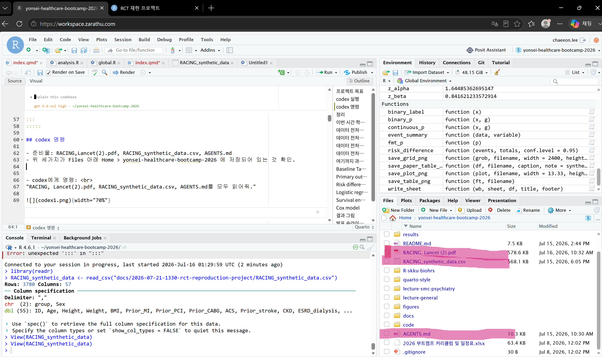{width="80%"}
:::
::::

::: {.column width="50%"}
\[**codex에게 명령**\]

- "RACING, Lancet(2).pdf, RACING_synthetic_data.csv, AGENTS.md를 모두 읽어줘."

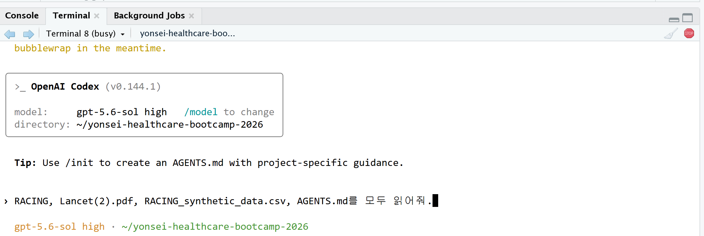{width="100%"} <br>

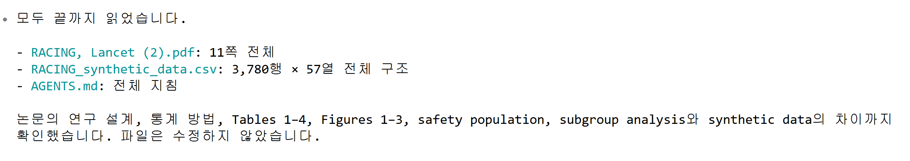{width="100%"}
:::
::::::

## codex 명령

\[**codex 명령**\]

- "csv 파일과 AGENTS.md를 참고해서 RACING 논문 PDF처럼 분석해줘. 최종적으로 RACING 논문 내 모든 figures(1\~3)와 tables(1\~4)을 재현하고 싶어."

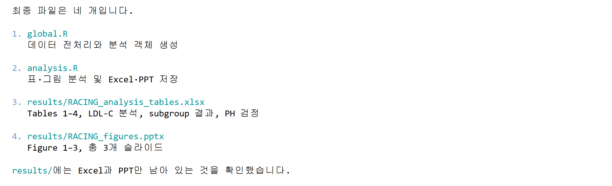{width="600%"}

[**주의사항**]{.section-title}

- codex가 임의로 PNG, CSV, TXT, MD 파일을 만드는 경우가 있다. 이때 codex에게 불필요한 (내가 명시적으로 지시하지 않은) 파일과 생성코드를 모두 제거하도록 시킨다. <br>
- "global.R, analysis.R, Figures.pptx, Tables.xlsx가 아닌 불필요한 문서는 모두 제거해줘."

## codex 실행 결과 정리

::: accent-box
codex를 이용하여 4개의 문서를 생성했음.
:::

::: large
- global.R
- analysis.R
- Figures.pptx
- Tables.pptx
:::

::: highlight-box-blue
[**저번 시간 review**]{.section-title}

global.R은 데이터 전처리와 분석 준비하는 문서<br> analysis.R은 실제 분석과 결과물 생성하는 문서
:::

::: highlight-box-blue
[**표와 그림**]{.section-title}

Figures와 Tables는 RACING synthetic data를 가지고 논문의 표와 그림을 재현했음.<br> (synthetic data는 실제 RACING 논문을 최대한 모방한 데이터이기 때문에 결과가 비슷하지만 아예 일치하지는 않음.)
:::

## 결과 확인하기

::: space-xs
:::

::::::: summary-grid-2
::: {.summary-item .si-green}
**Global.R**

`global.R`의 핵심 코드 이해하기
:::

::: {.summary-item .si-blue}
**Analysis.R**

`global.R`의 핵심 코드 이해하기
:::

::: {.summary-item .si-teal}
**tables**

출력된 Tables 표 확인하기
:::

::: {.summary-item .si-purple}
**figures**

출력된 Figures 그림 확인하기
:::
:::::::

## global.R

::: space-xs
:::

::::::: columns
:::: {.column width="58%"}
::: {style="font-size: 0.68em;"}
```{r}
 # ─────────────────────────────────────
  # 1. 패키지 불러오기
  # ─────────────────────────────────────

  library(data.table)
  library(jstable)
  library(survival)
  library(ggplot2)


  # ─────────────────────────────────────
  # 2. 원자료 불러오기
  # ─────────────────────────────────────

  a <- fread(
    "RACING_synthetic_data.csv",
    na.strings = c("", "NA", "N/A")
  )

  # 데이터 크기 확인
  stopifnot(
    nrow(a) == 3780L,
    ncol(a) == 57L
  )


  # ─────────────────────────────────────
  # 3. 치료군 형식 정리
  # ─────────────────────────────────────

  a[, group := factor(
    group,
    levels = c("Combination", "Monotherapy"),
    labels = c(
      "Moderate-intensity statin + ezetimibe",
      "High-intensity statin monotherapy"
    )
  )]


  # ─────────────────────────────────────
  # 4. 사건과 추적 기간 정리
  # ─────────────────────────────────────

  # 이름이 _event로 끝나는 변수 찾기
  event_vars <- grep(
    "_event$",
    names(a),
    value = TRUE
  )

  # 사건 변수를 정수형으로 변환
  for (v in event_vars) {
    set(
      a,
      j = v,
      value = as.integer(a[[v]])
    )
  }

  a[, admend_mo := as.integer(admend_mo)]
  a[, primary_time_mo := as.integer(primary_time_mo)]

  # 사건이 발생하면 사건 발생 시점,
  # 사건이 없으면 마지막 추적 시점을 사용
  a[, primary_followup_mo := fifelse(
    primary_event == 1L,
    primary_time_mo,
    admend_mo
  )]


  # ─────────────────────────────────────
  # 5. 분석에 사용할 변수 선택
  # ─────────────────────────────────────

  analysis_vars <- c(
    "group",
    "Age",
    "Sex",
    "BMI",
    "Prior_MI",
    "Prior_stroke",
    "CKD",
    "Hypertension",
    "Diabetes",
    "Smoking",
    "Baseline_LDL",
    "primary_followup_mo",
    "primary_event"
  )

  out <- copy(
    a[, .SD, .SDcols = analysis_vars]
  )


  # ─────────────────────────────────────
  # 6. 범주형 변수 정리
  # ─────────────────────────────────────

  binary_base_vars <- c(
    "Prior_MI",
    "Prior_stroke",
    "CKD",
    "Hypertension",
    "Diabetes",
    "Smoking"
  )

  # 0과 1 두 수준을 모두 유지
  for (v in binary_base_vars) {
    out[, (v) := factor(
      as.character(get(v)),
      levels = c("0", "1")
    )]
  }

  # 성별 순서 지정
  out[, Sex := factor(
    Sex,
    levels = c("Female", "Male")
  )]

  # 일차 평가변수도 0과 1로 지정
  out[, primary_event := factor(
    as.character(primary_event),
    levels = c("0", "1")
  )]


  # ─────────────────────────────────────
  # 7. 결과표용 변수 라벨 만들기
  # ─────────────────────────────────────

  variable_labels <- c(
    group = "Treatment group",
    Age = "Age, years",
    Sex = "Sex",
    BMI = "Body-mass index, kg/m²",
    Prior_MI = "Previous myocardial infarction",
    Prior_stroke = "Previous ischaemic stroke",
    CKD = "Chronic kidney disease",
    Hypertension = "Hypertension",
    Diabetes = "Diabetes",
    Smoking = "Current smoker",
    Baseline_LDL = "Serum LDL-C, mg/dL",
    primary_followup_mo = "Primary endpoint follow-up, months",
    primary_event = "Primary endpoint"
  )

  # 변수와 범주 정보를 담은 라벨표 생성
  out.label <- jstable::mk.lev(out)

  # 읽기 쉬운 변수명 적용
  for (v in names(variable_labels)) {
    out.label[
      variable == v,
      var_label := unname(variable_labels[v])
    ]
  }

  # 0/1 범주를 No/Yes로 표시
  for (v in c(binary_base_vars, "primary_event")) {
    out.label[
      variable == v,
      val_label := c("No", "Yes")
    ]
  }


  # ─────────────────────────────────────
  # 8. 치료군 순서 저장
  # ─────────────────────────────────────

  group_levels <- levels(out$group)
```
:::
::::

:::: {.column width="42%"}
::: highlight-box
[**global.R 요약**]{.section-title}

`global.R`은 RACING 합성 데이터를 불러와 분석에 필요한 형태로 정리하는 파일이다.<br><br> 변수들의 자료형을 맞추고 분석 목적별 변수 목록을 구성해 최종 분석 데이터 `out`을 만들고, 결과표용 라벨 `out.label`도 함께 생성한다.
:::
::::
:::::::

## analysis.R

::: space-xs
:::

::::::: columns
:::: {.column width="58%"}
::: {style="font-size: 0.68em;"}
```{r}
  # ─────────────────────────────────────
  # 1. 기저 특성 Table 1 만들기
  # ─────────────────────────────────────

  table1_vars <- c(
    "Age", "Sex", "BMI",
    "Prior_MI", "Prior_stroke",
    "CKD", "Hypertension", "Diabetes",
    "Smoking", "Baseline_LDL"
  )

  table1_factor_vars <- c(
    "Sex", "Prior_MI", "Prior_stroke",
    "CKD", "Hypertension", "Diabetes", "Smoking"
  )

  table1 <- jstable::CreateTableOneJS(
    vars = table1_vars,
    strata = "group",
    data = out,
    factorVars = table1_factor_vars,
    test = TRUE,
    showAllLevels = TRUE,
    Labels = TRUE,
    labeldata = out.label,
    nonnormal = "Baseline_LDL"
  )$table

  # 행 이름을 Variable 열로 추가
  table1 <- cbind(
    Variable = rownames(table1),
    table1
  )

  # 검정 방법 등 불필요한 열 제거
  remove_cols <- intersect(
    c("test", "sig"),
    colnames(table1)
  )

  table1 <- table1[
    ,
    setdiff(colnames(table1), remove_cols),
    drop = FALSE
  ]

  table1


  # ─────────────────────────────────────
  # 2. 일차 평가변수 누적발생률 그림
  # ─────────────────────────────────────

  primary_data <- out[, .(
    group,
    time = primary_followup_mo,
    event = as.integer(as.character(primary_event))
  )]

  # Kaplan–Meier 모형 적합
  km_fit <- survival::survfit(
    survival::Surv(time, event) ~ group,
    data = primary_data
  )

  # 생존확률을 누적발생률 1-S(t)로 변환
  km_summary <- summary(km_fit)

  km_data <- data.table(
    time = km_summary$time / 12,
    cumulative_incidence = 1 - km_summary$surv,
    group = sub("^group=", "", km_summary$strata)
  )

  # 각 치료군의 시작점을 추가
  km_data <- rbind(
    data.table(
      time = 0,
      cumulative_incidence = 0,
      group = group_levels
    ),
    km_data
  )

  km_data[, group := factor(
    group,
    levels = group_levels
  )]

  # 누적발생률 그림
  primary_plot <- ggplot(
    km_data,
    aes(
      x = time,
      y = cumulative_incidence,
      colour = group
    )
  ) +
    geom_step(linewidth = 1.1) +
    scale_y_continuous(
      labels = scales::percent_format()
    ) +
    labs(
      x = "Time since randomisation, years",
      y = "Cumulative incidence",
      colour = NULL
    ) +
    theme_minimal()

  primary_plot


  # ─────────────────────────────────────
  # 3. 비열등성 확인
  # ─────────────────────────────────────

  primary_summary <- primary_data[, .(
    N = .N,
    Events = sum(event),
    Event_rate = mean(event)
  ), by = group]

  # 두 치료군의 절대위험도 차이와 90% 신뢰구간
  ni_fit <- prop.test(
    x = primary_summary$Events,
    n = primary_summary$N,
    conf.level = 0.90,
    correct = FALSE
  )

  risk_difference <- (
    primary_summary$Event_rate[1] -
    primary_summary$Event_rate[2]
  )

  ni_result <- data.table(
    Risk_difference = risk_difference,
    Lower_90CI = ni_fit$conf.int[1],
    Upper_90CI = ni_fit$conf.int[2],
    Noninferiority_margin = 0.02,
    Noninferior = ni_fit$conf.int[2] < 0.02
  )

  ni_result


  # ─────────────────────────────────────
  # 4. Cox 비례위험 모형
  # ─────────────────────────────────────

  # 단독요법군을 기준군으로 지정
  primary_data[, group_cox := relevel(
    group,
    ref = group_levels[2]
  )]

  cox_fit <- survival::coxph(
    survival::Surv(time, event) ~ group_cox,
    data = primary_data
  )

  cox_summary <- summary(cox_fit)

  # HR, 95% 신뢰구간, p값 정리
  cox_result <- data.table(
    HR = cox_summary$conf.int[1, "exp(coef)"],
    Lower_95CI = cox_summary$conf.int[1, "lower .95"],
    Upper_95CI = cox_summary$conf.int[1, "upper .95"],
    P_value = cox_summary$coefficients[1, "Pr(>|z|)"]
  )

  cox_result


  # ─────────────────────────────────────
  # 5. PH 가정 확인
  # ─────────────────────────────────────

  ph_test <- survival::cox.zph(
    cox_fit,
    transform = "identity"
  )

  ph_test

  # PH 가정 진단 그림
  plot(ph_test)
```
:::
::::

:::: {.column width="42%"}
::: highlight-box
[**analysis.R 요약**]{.section-title}

`analysis.R`은 `global.R`에서 정리한 데이터를 사용해 RACING 논문의 주요 분석을 재현하는 파일이다.<br><br> 치료군별 기저 특성, 임상 평가변수, LDL-C 목표 달성률, 안전성 결과를 `Tables`로 만들고, <br> 연구 대상자 흐름도, 일차 평가변수 누적발생률, subgroup analysis는 `Figures`로 만든다. <br><br> 일차 평가변수의 비열등성, Cox 모형과 PH 가정을 확인하며,<br> 최종 Tables는 Excel로, Figures은 PPT로 저장한다.
:::
::::
:::::::

## Table 1_치료군별 기저 특성

::: accent-box
codex가 만든 표와 그림은 개인마다 조금씩 다르게 나타날 수 있다. 형식보다는 내용에 집중하자.
:::

:::::: columns
:::: {.column width="50%"}
::: center
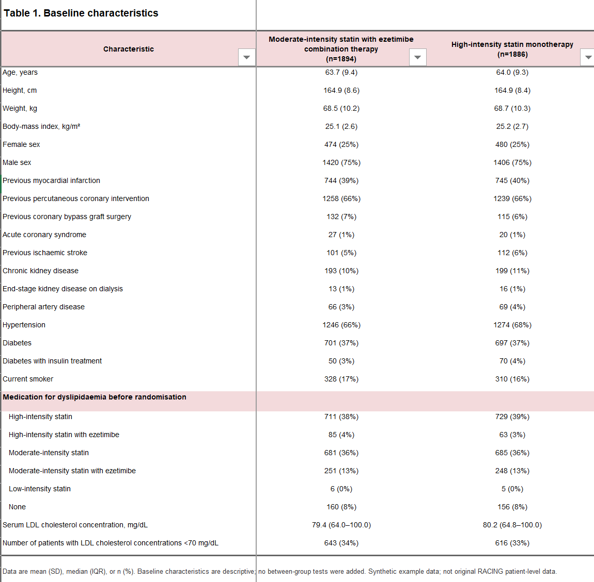{width="250%"}
:::
::::

::: {.column width="50%"}
\[**Table 1 설명**\]

- 무작위 배정된 환자의 연령, 성별, BMI, 과거력, 기저 LDL-C 및 기존 치료제 사용현황을 치료군별로 정리한 표이다.
- 두 치료군에 균등하게 분배되었으며 randomization이 잘 이루어진 것을 확인할 수 있다.
- diabetes나 LDL 수치 고위험군 환자들 수도 균등한 것으로 보아 층화 랜덤도 잘 이루어진 것을 확인할 수 있다.
:::
::::::

## Table 2_ 3년 임상 평가변수

::: accent-box
codex가 만든 표와 그림은 개인마다 조금씩 다르게 나타날 수 있다. 형식보다는 내용에 집중하자.
:::

::::::: columns
::::: {.column width="50%"}
::: center
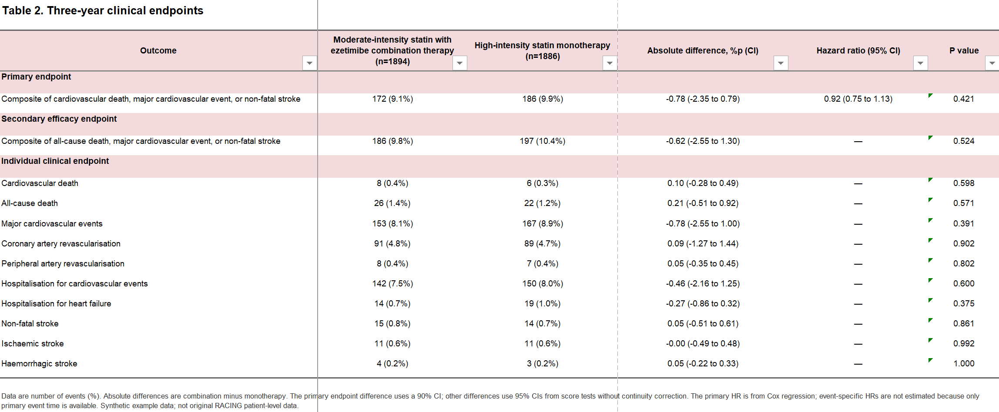{width="200%"}
:::

\[**RCT란? RACING Trial으로 배우는 RCT 복습**\]

- 병합요법군과 단독요법군의 risk difference는 -0.78.
- 위험도 차이의 90% CI는 (-2.35 , 0.79).
- 신뢰구간 상한선 0.79 \< 실험에서 사전에 정한 비열등성 마진 2.0보다 작기 때문에 비열등성 입증함.

:::::

:::{.column width="50%"}
\[**Table2 설명**\]

- 일차 평가변수와 세부 임상 사건의 발생률을 치료군별로 비교한 표이다. 사건 발생률, 절대위험도 차이, 위험비와 신뢰구간을 제시한 표이다.
- 일차 평가변수 예방 효과 면에서 병합요법군이 단독요법군에 비열등하다는 것을 확인할 수 있다.

:::

::::::: 

## Table 3\_ LDL-C \< 70mg/dL 달성 결과

::: accent-box
codex가 만든 표와 그림은 개인마다 조금씩 다르게 나타날 수 있다. 형식보다는 내용에 집중하자.
:::

::::: columns
:::: {.column width="50%"}
::: center
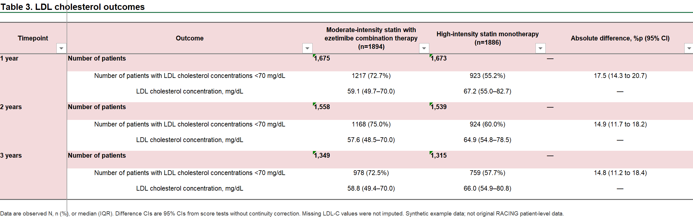{width="200%"}
:::
::::

::: {.column width="50%"}
\[**Table 3 설명**\]

- 1년, 2년, 3년 시점의 LDL-C 측정 인원과 LDL-C \<70 mg/dL 달성률을 치료군별로 비교한 표이다.
- 지질 조절 효과 면에서 병합요법군이 단독요법군보다 유의하게 우월하다는 것을 확인할 수 있다.
:::

:::::

## Table 4\_ 안전성 평가 변수

::: accent-box
codex가 만든 표와 그림은 개인마다 조금씩 다르게 나타날 수 있다. 형식보다는 내용에 집중하자.
:::

:::::: columns
:::: {.column width="50%"}
::: center
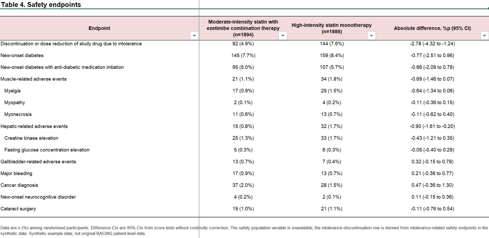{width="200%"}
:::
::::

::: {.column width="50%"}
\[**Table 4 설명**\]

- 무작위 배정 환자 전체를 대상으로 치료군별 안전성 사건 발생률을 비교한 표이다.
- synthetic data에서 약제 중단/감량 값이 존재하지 않아 대신 안전성 사건을 묶어 파생 변수로 분석을 진행했다.
- 약제 불내성으로 인한 중단 혹은 감량은 병합요법군에서 더 적게 일어났지만, 병합요법군이 유의하게 우월하다고 보기는 어렵다.
:::
::::::

## Figure 1\_ 연구 대상자 흐름

::: accent-box
codex가 만든 표와 그림은 개인마다 조금씩 다르게 나타날 수 있다. 형식보다는 내용에 집중하자.
:::

:::::: columns
:::: {.column width="50%"}
::: center
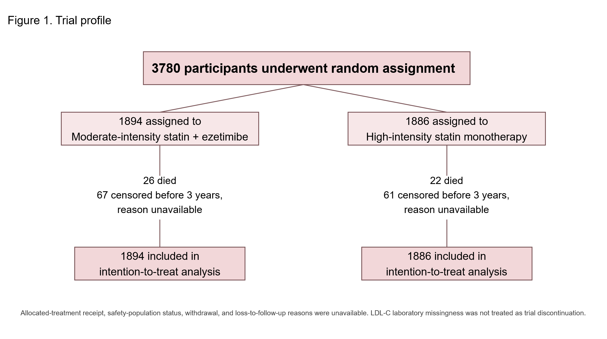{width="200%"}
:::
::::

::: {.column width="50%"}
\[**Figure 1 설명**\]

- 총 3,780명의 무작위 배정과 치료군별 배정 현황, 사망, 3년 이전 돌연 중단 및 intention-to-treat 분석 포함 인원을 나타낸 그림이다.
- 두 군에 인원이 균등하게 분배된 것을 확인할 수 있다.
:::
::::::

## Figure 2\_ 일차 평가변수 누적 발생률 (K-M 곡선)

::: accent-box
codex가 만든 표와 그림은 개인마다 조금씩 다르게 나타날 수 있다. 형식보다는 내용에 집중하자.
:::

:::::: columns
:::: {.column width="50%"}
::: center
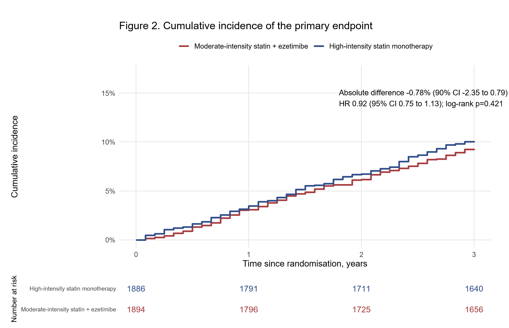{width="200%"}
:::
::::

::: {.column width="50%"}
\[**Figure 2 설명**\]

- 무작위 배정 이후 3년 동안 일차 평가변수의 누적발생률을 치료군별로 비교한 그림이다.
- 단순 사건 발생뿐 아니라 사건이 언제 발생했는지까지 확인할 수 있다.
- 두 그래프가 비슷하게 움직이는 것으로 보아 병합요법군이 단독요법군에 일차 평가변수 발생률 면에서 비열등한 것을 확인할 수 있다.
:::
::::::

## Figure 3\_ Subgroup analysis forest plot

::: accent-box
codex가 만든 표와 그림은 개인마다 조금씩 다르게 나타날 수 있다. 형식보다는 내용에 집중하자.
:::

:::::: columns
:::: {.column width="50%"}
::: center
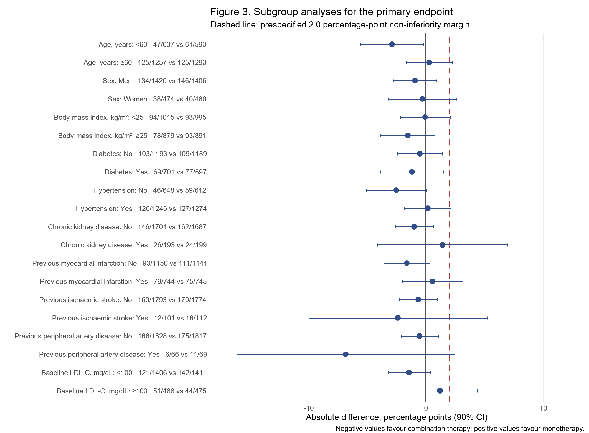{width="200%"}
:::
::::

::: {.column width="50%"}
\[**Figure 3 설명**\]

- 하위 집단별 일차 평가변수의 절대위험도 차이와 90% 신뢰구간을 나타낸 그림이다. 붉은 점선은 비열등성 한계인 2.0%p이다.
- 하위 집단별로 두 치료요법 사이에 유의한 차이가 있다고 보기 어렵다.
:::
::::::
::::::::::::::::::::::::::
