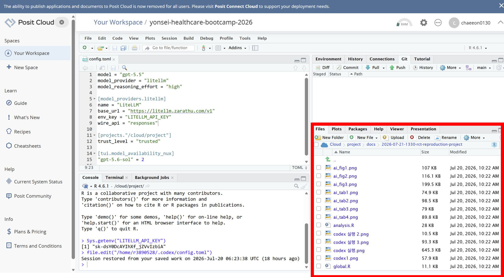
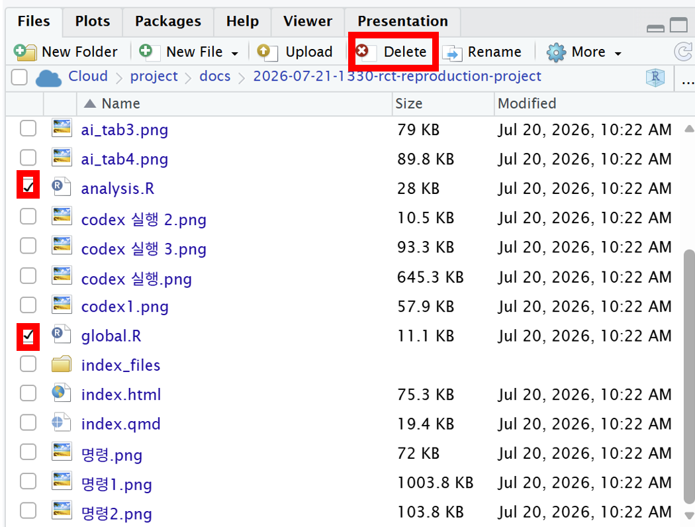

## 데이터 지우기
::: space-xs
:::

::::: columns
::: {.column width="50%"}
{width="80%"}
:::

::: {.column width="50%"}

:::highlight-box
Files 아래  
Cloud > Project > docs > 2026-07-21-1330-rct-reproduction-project에서  
**global.R**과 **analysis.R**을 찾는다. 
:::

:::
:::::

::::: columns
::: {.column width="50%"}
{width="80%"}
:::

::: {.column width="50%"}

:::highlight-box
global.R과 analysis.R을 선택하여 **Delete**를 누른다.  
Are you sure you want to permanently delete the selected files? This cannot be undone. > **Yes**를 누른다. 
:::

:::
:::::
