## 오늘의 목표

::: large
- RCT는 무엇이며, 왜 임상 연구에서 중요한 연구 설계인가?
- RCT는 어떻게 교란 (confounding)을 줄이고 두 군의 공정한 비교를 가능하게 하는가?
- 좋은 RCT 연구의 요소들에는 어떤 것들이 있는가?
- RACING Trial에서는 RCT의 핵심 설계가 어떻게 적용되었는가?
:::

## 강의 흐름

:::::::: {style="padding: 10px 50px;"}
::: highlight-box
**01. RCT는 무엇인가**
:::

::: highlight-box-blue
**02. 왜 RCT가 필요한가**
:::

::: highlight-box-teal
**03. RCT 결과를 신뢰할 수 있는 이유**
:::

::: highlight-box-purple
**04. 잘 설계된 RCT의 핵심 요소**
:::

::: highlight-box
**05. 예시 연구: RACING Trial**
:::
::::::::

## RCT는 무엇인가 {.intro-slide}

::: spacer-xs
:::

::: accent-box
RCT = 무작위 배정 + 비교군 + 사전정의된 결과 평가
:::

::::: columns
::: {.column width="50%"}
[**Randomized Controlled Trial**]{.section-title}

- 연구 대상자를 둘 이상의 군으로 무작위 배정한다.
- 각 군에 서로 다른 치료나 전략을 적용한다.
- 사전에 정한 결과를 같은 기준으로 비교한다.
:::

::: {.column width="50%"}
[**RCT의 기본 구조**]{.section-title}

- 대상자 등록 -\> 무작위 배정 -\> 치료군/ 비교군\* -\> 추적 관찰 -\> 결과 비교
- \*비교군: 연구 질문에 따라 위약(placebo), <br> 기존 표준치료, 다른 active treatment, 무치료가 될 수 있다.
:::
:::::

::: center
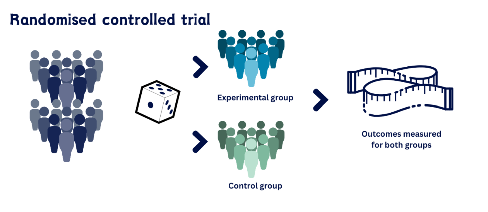{width="70%"}
:::

## 왜 RCT가 필요한가 {.intro-slide}

::: spacer-xs
:::

::: accent-box
RCT는 치료 효과를 보기 전에, 두 군이 공정하게 비교될 수 있는 상태를 만들기 위해 필요하다.
:::

::: large
- 치료 후 환자 경과가 좋아졌다고 해서, 그 변화가 반드시 치료 때문이라고 말할 수 있을까?
:::

- 환자의 나이, 질병 중증도, 기저질환, 생활습관은 치료 선택과 결과에 모두 영향을 줄 수 있다.

- 이런 차이가 치료 효과처럼 보이면 결과 해석이 왜곡된다.

::::: columns
::: {.column width="50%"}
[**RCT가 줄이려는 문제**]{.section-title}

- 치료 선택의 차이
- 질병 중증도의 차이
- 기저질환의 차이
- **교란(confounding)**: 예후 위험도의 차이처럼 치료와 결과에 동시에 영향을 줄 수 있는 요인
:::

::: {.column width="50%"}
[**RCT의 해결 방식**]{.section-title}

- **무작위배정**을 통해 교란 요인이 두군에 평균적으로 분산 <br><br>
- **층화 무작위배정**을 통해 당뇨와 같은 중요한 예후 인자 균형 유지 <br><br>
- **블록 무작위배정**을 통해 군별 대상자 수 균형 유지
:::
:::::

## 무작위 배정 {.intro-slide}

::: space-xs
:::

::: highlight-box
[**1:1 무작위배정**]{.section-title}

대상자를 치료군과 비교군에 같은 비율로 배정하는 방식이다. <br> 가장 단순하게는 대상자마다 동전을 던져 앞면이면 치료군, 뒷면이면 비교군에 배정하는 것과 비슷하다.
:::

:::: columns

::: {.column width="60%"}
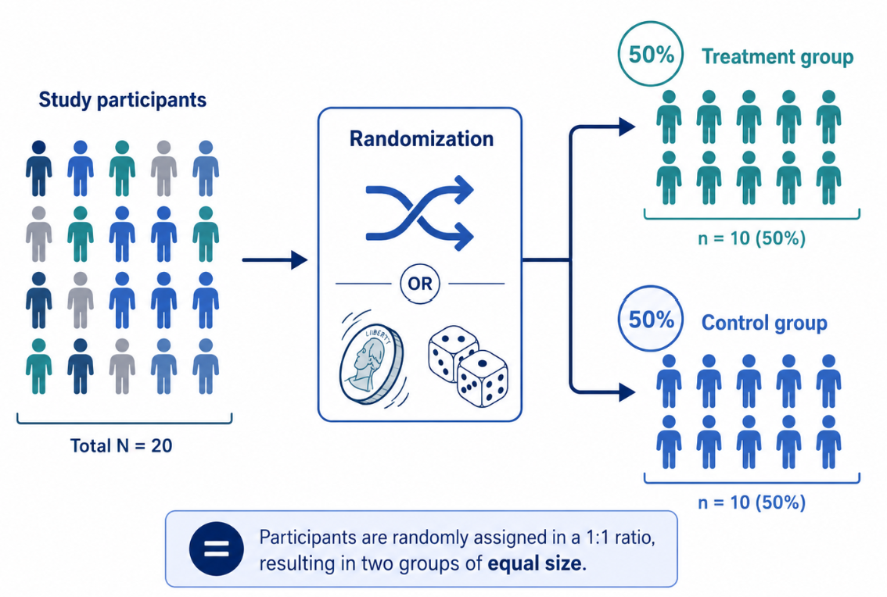{width="150%"}
:::

::: {.column width="40%"}

::: highlight-box-blue
[**단순 1:1 무작위배정의 한계**]{.section-title}

무작위 배정은 매번 독립적으로 일어나기 때문에 <br>
50:50 확률로 배정해도 연구 진행중에는 두 군의 숫자가 크게 벌어질 수 있다.<br>
이를 보완하는 방법이 블록 무작위배정이다.
:::

:::

::::

## 무작위 배정 - 블록 {.intro-slide}

::: space-xs
:::

::::::::: columns
:::: {.column width="40%"}
::: center
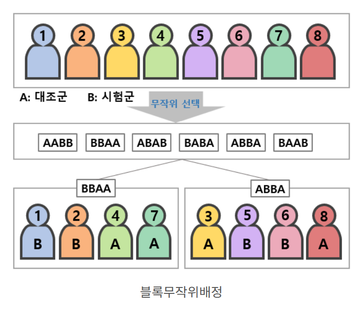{width="120%"}
:::
::::

:::::: {.column width="60%"}

::: accent-box
정해진 블록마다 **A군과 B군의 수를 맞춰서** 배정하는 방법이다.
:::

::: highlight-box-blue
예를 들어 **블록 크기 4**라면,\
4명 안에 **반드시 A군 2명, B군 2명**이 들어간다.
:::

::: highlight-box
[**예시**]{.section-title}

블록 크기가 4라면 각 블록은 다음과 같이 배정될 수 있다.

``` text
A B B A
B A A B
A A B B
B B A A
A B A B
B A B A
```
순서는 무작위로 섞기 때문에 배정은 여전히 예측하기 어렵다. <br>
각 블록마다 A군 2명, B군 2명이므로 **연구 중에도 두 군의 수가 비슷하게 유지**된다.
<br><br>
block 크기가 4로 일정한 경우, 블록 내 뒤쪽 배열을 예측할 가능성이 있다.<br>
따라서 block 크기를 4 또는 6을 번갈아써서 예측 가능성을 낮추기도 한다. 
:::

::::::

:::::::::

## 무작위 배정- 층화 {.intro-slide}

::: space-xs
:::

::::::: columns
:::: {.column width="40%"}
::: center
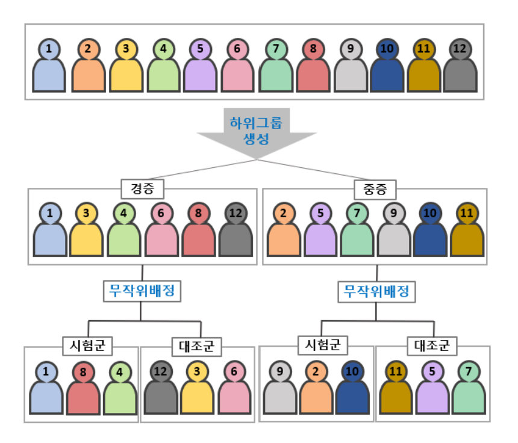{width="120%"}
:::

::: highlight-box
[**참고**]{.section-title}

**블록 무작위배정**은 A군과 B군의 **환자수**가 비슷하게 유지되도록 하는 것이고, <br>
**층화 무작위배정은** 중요한 **환자 특성**이 <br> A군과 B군 한쪽에 몰리지 않게 한다. 
:::
::::

:::: {.column width="60%"}
::: accent-box
대상자를 중요한 특성에 따라 먼저 나눈 뒤,<br>
**각 층 안에서 A군과 B군으로 무작위배정**하는 방법이다.
:::

::: highlight-box-blue
[**예시**]{.section-title}

당뇨병 여부가 예후에 중요하다고 가정하자. <br>
단순 1:1 무작위배정을 한다면, 우연히 당뇨병 환자가 한쪽 군에 몰릴 가능성이 있다.
:::

::: highlight-box-gray
전체 100명 중 당뇨병 환자 40명이라고 하자. <br>
층화 무작위배정은 먼저 당뇨병 유무로 나눈 뒤, 각 층 안에서 무작위배정한다.

```text
  당뇨병 있음 40명  → A군 20명 / B군 20명
  당뇨병 없음 60명  → A군 30명 / B군 30명
```

따라서 두 군은 다음처럼 구성된다. <br>
A군: 당뇨병 있음 20명 + 당뇨병 없음 30명 -> 총 50명 <br>
B군: 당뇨병 있음 20명 + 당뇨병 없음 30명 -> 총 50명

따라서 A군과 B군에서 당뇨병 환자와 비당뇨병 환자의 비율이 같아진다.       
즉, 층화 무작위배정은 결과에 영향을 줄 수 있는 중요한 환자 특성이 두 군에 비슷한 비율로 배정되게 한다.

:::
::::
:::::::

## RCT 결과를 신뢰할 수 있는 이유 {.intro-slide}

::: spacer-xs
:::

::: accent-box
RCT의 신뢰도는 결과에 대한 사후적 해석이 아니라, 두 군이 **공정하게 비교**될 수 있도록 사전에 설계되었다는 점에서 나온다.
:::

::: large
- 무작위배정으로 두 군이 **유사한 출발선**에 놓인다.
- 두 군은 서로 다른 치료 전략을 받는다.
- 같은 기간 동안 같은 기준으로 추적된다.
- 관찰된 결과 차이를 치료 효과로 해석할 근거가 생긴다.
:::

## 잘 설계된 RCT의 핵심 요소 {.intro-slide}

::: spacer-xs
:::

::: accent-box
좋은 RCT는 연구 질문, 검정 가설, 평가 변수, sample size, 랜덤화가 서로 논리적으로 연결되어 있다.
:::

<br>

:::::::: summary-grid-3
::: {.summary-item .si-green}
**연구 질문**

Patient Intervention Control Outcome (PICO)
:::

::: {.summary-item .si-blue}
**가설과 검정**

연구 질문에 따라 적절한 가설과 검정방법 선택
:::

::: {.summary-item .si-teal}
**일차 평가변수**

연구 시작 전에 미리 정한 핵심 outcome
:::

::: {.summary-item .si-purple}
**sample size**

일차 평가변수, 예상 사건률, 기대 효과를 바탕으로 미리 정한 sample size
:::

::: {.summary-item .si-blue}
**무작위배정**

누가 어느 군에 들어갈지 예측 불가능
:::
::::::::

## 예시 연구: RACING Trial {.intro-slide}

::: spacer-xs
:::

::: large
- 논문 제목: Long-term efficacy and safety of moderate-intensity statin with ezetimibe combination therapy versus high-intensity statin monotherapy in patients with atherosclerotic cardiovascular disease (RACING)
- 연구명: RACING Trial
- 논문 유형: Randomised, open-label, non-inferiority trial
- 출판지: The Lancet
- 출판년도: 2022
- 저자: Byeong-Keuk Kim, Sung-Jin Hong, Myeong-ki Hong (연세대학교 세브란스 병원)
:::

## RACING Trial: 1- Study Design

::: spacer-xs
:::

::::::: columns
:::: {.column width="60%"}
::: center
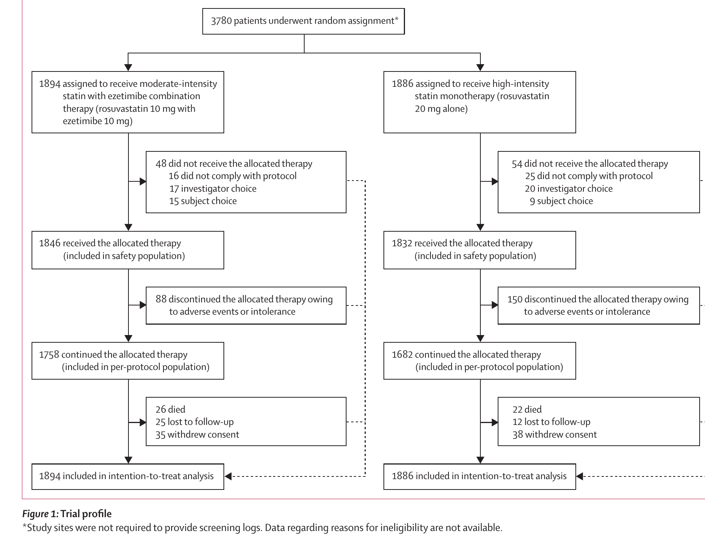{width="300%"}
:::

::: highlight-box
 총 **3,780명의 ASCVD 환자**가 무작위배정되어 <br>
 병합요법군 **1,894명**, 고강도 statin 단독요법군 **1,886명**으로 나뉘었다.
:::

::::

:::: {.column width="40%"}
::: highlight-box
**LDL-C \< 100 mg/dL 여부와 당뇨병 유무**에 따라 **층화 무작위배정**하여, <br> 치료 결과에 영향을 줄 수 있는 환자 특성이 한쪽 군에 몰리지 않도록 했다.
:::

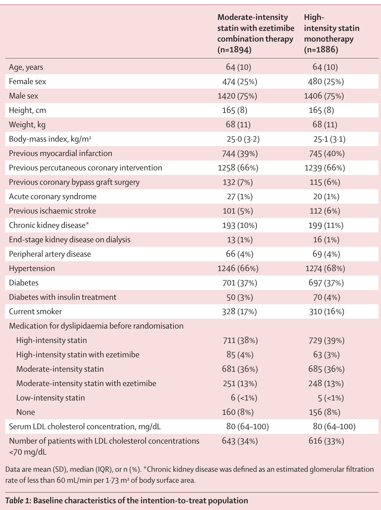{width="250%"}
::::
:::::::

## RACING Trial: 2 - 연구 질문 {.intro-slide}

::: accent-box
이제 RACING Trial의 RCT의 핵심 요소를 어떻게 구현했는지 하나씩 확인한다.
:::

:::::: columns
:::: {.column width="50%"}
[**핵심 연구 질문 (Primary Objective)**]{.section-title}

::: large
- **ASCVD 환자**에서 <br> **중강도 statin + ezetimibe 병합요법**은 <br> **고강도 statin 단독요법**과 비교해<br>**3년 주요 심혈관 사건 (Primary endpoints)**<br> 예방 효과가 **열등**하지 않은가?
:::
::::

::: {.column width="50%"}
[**PICO**]{.section-title}

- Patient: ASCVD 환자
- Intervention: rosuvastatin 10 mg + ezetimibe 10 mg
- Control: rosuvastatin 20 mg
- Outcome: 3년 주요 심혈관 사건

[**비열등성 검정**]{.section-title}

- 병합요법이 statin 단독요법보다 임상적으로 뒤떨어지지 않는지 평가한다.
:::
::::::

## RACING Trial: 2 - 2차 연구 질문 {.intro-slide}

:::::: columns
:::: {.column width="50%"}
[**Secondary Efficacy Objective**]{.section-title}

::: large
- 병합요법이 단독요법에 비열등했다면,<br> 병합요법이 단독요법보다<br> **LDL-C 목표 달성률**은 **우월한가?**
:::
::::

::: {.column width="50%"}
[**우월성 검정**]{.section-title}

- LDL-C 70mg/dL 미만으로 낮추는 목표 달성률을 비교
- LDL-C 목표 달성률을 1년/2년/3년에 평가함.
:::
::::::

<br><br>

:::::: columns
:::: {.column width="50%"}
[**Secondary Safety Objective**]{.section-title}

::: large
- 병합요법이 단독요법보다<br>**약물 불내성으로 인한 중단 또는 감량**이 <br> 더 **적은가?**
:::
::::

::: {.column width="50%"}
[**Safety 비교**]{.section-title}

- 부작용과 내약성 평가
- 새로 발생한 당뇨/ 근육 관련 이상반응/간 관련 이상반응을 관찰함.
:::
::::::

## RACING Trial:3 - 평가 변수(Endpoints)

::: spacer-xs
:::

::: accent-box
평가변수는 치료 효과와 안전성을 무엇으로 판단할지 미리 정한 기준이다.
:::

<br>

::: highlight-box
**일차 평가변수(primary endpoint):** 이 연구의 핵심 outcome. <br> 3년 동안 아래 사건 중 하나라도 발생하면 primary endpoint가 발생한 것으로 판단했다. <br> **심혈관 사망 + 주요 심혈관 사건 + 비치명적 뇌졸중**
:::

::: highlight-box-purple
**이차 유효성 평가변수(secondary efficacy endpoint):** 치료 효과를 추가로 확인하기 위한 outcome.

- Primary endpoint의 개별 구성요소 발생률
- 1년, 2년, 3년 LDL-C \< 70 mg/dL 달성률
- LDL-C \< 55 mg/dL 달성률은 post-hoc analysis로 평가
:::

::: highlight-box-gray
**안전성 평가변수(safety endpoint):** 치료가 얼마나 안전하고 지속 가능한지를 보기 위한 outcome.

- 약제 불내성으로 인한 약물 중단 또는 감량
- 새로 발생한 당뇨
- 근육 관련 이상반응
:::

## RACING Trial: 4 - 가설 검정 {.intro-slide}

::: spacer-xs
:::

::::: columns
::: {.column width="50%"}
[**일차 평가변수- 비열등성 검정**]{.section-title}

- 사전에 정한 비열등성 검정 기준
- 비열등성 margin: **2.0%p**
- 판단 기준: CI upper bound \< 2.0%p이면 비열등성 입증
- Time-to-event outcome analysis 사용

<br><br>

[**이차 평가변수- 우월성 검정**]{.section-title}

- LDL-C \< 70 mg/dL 목표 달성률(Efficacy endpoint), <br> 즉 지질 조절효과에 대한 우월성 검정
- 약물 중단/감량 등 safety endpoints도 함께 비교
- primary endpoint와 다르게 다중 비교 보정을 하지 않았기 때문에 Type 1 error 존재할 수 있음. 따라서 확증적 검정으로 표현하지 않음
:::

::: {.column width="50%"}
[**왜 RCT에서 중요한가**]{.section-title}

- 판단 기준을 연구 시작 전에 정한다.
- 표본 수도 그 기준에 맞춰 계산한다.
- 결과를 본 뒤 기준을 바꾸지 않는다.
- 그래서 두 군의 비교를 더 신뢰할 수 있다.
:::
:::::

## RACING Trial: sample size 계산하기

::: spacer-xs
:::

::: accent-box
선행 연구(IMPROVE-IT Trial)에서 일차 평가 변수 예상 event rate을 잡았음. 병합요법: 13%, 단독요법 14%. <br> 비열등성 margin: 2.0%p <br> dropout (loss-to-follow-up): 15%
:::

``` r
p1 <- 0.13
p2 <- 0.14

margin <- 0.02
alpha <- 0.05
power <- 0.80

z_alpha <- qnorm(1 - alpha)
z_beta <- qnorm(power)
n_per_group <- ((z_alpha + z_beta)^2 *
    (p1 * (1 - p1) + p2 * (1 - p2))) /
    (margin - (p1 - p2))^2

ceiling(n_per_group)

ceiling(ceiling(n_per_group) * 2 / (1 - 0.15))
```

``` text
[1] 1605
[2] 3777
```

::: highlight-box-blue
따라서 양군합계, 실험에 참여하는 총 대상자수는 약 3780명이어야 한다.<br> 좋은 RCT에서 표본 수는 독립적인 숫자가 아니라, 연구 질문, 평가변수, 검정 가설이 연결되어 나온 결과이다.
:::


## RACING Trial: 4 - 가설 검정 결과- 일차 평가변수

:::::: columns
::: {.column width="65%"}
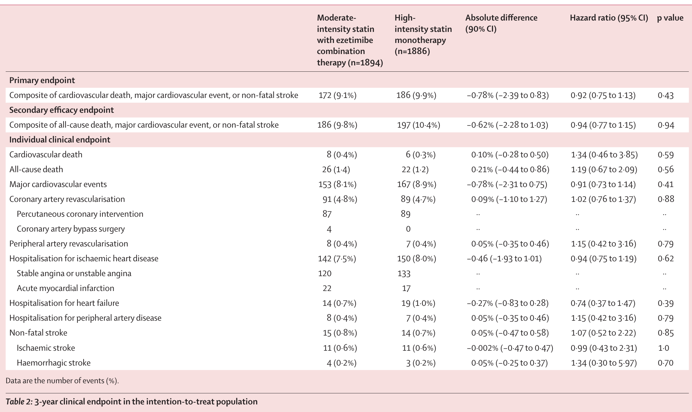{width="120%"}
:::

:::: {.column width="35%"}
::: key-message-bar
**일차 평가변수 비열등성 검정**

비열등성 margin:2.0%p <br> 두 치료요법의 차의 90% 신뢰구간은 (-2.39, 0.83) <br> **신뢰구간의 upper bound(0.83)이 사전에 정한 비열등성 margin (2.0)보다 작기 때문에 병합요법이 단독요법에 비열등하다고 할 수 있다.**
:::
::::
::::::

## RACING Trial: 4 - 가설 검정 결과- 생존분석

:::::: columns
::: {.column width="65%"}
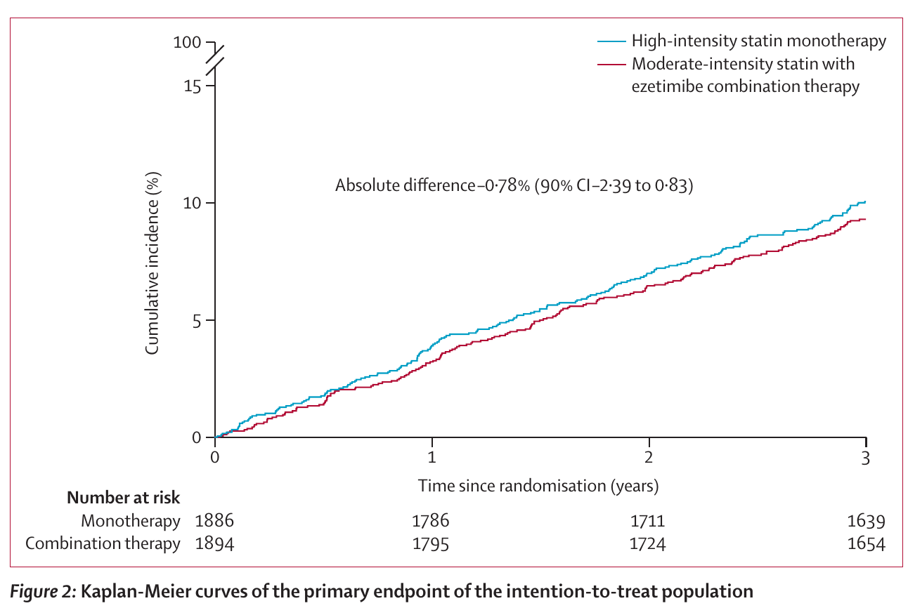{width="100%"}
:::

:::: {.column width="35%"}
::: key-message-bar
**일차 평가변수 생존분석**

일차 평가변수의 발생 여부뿐 아니라 언제 event 발생했는지까지 고려하여 분석함. <br> K-M 곡선은 시간에 따라 사건이 얼마나 누적되는지 보여주는 그림이고, 이를 통해 **두 치료요법의 사건 발생 양상은 전반적으로 비슷함**을 확인할 수 있다.
:::
::::
::::::

## RACING Trial: 4 - 가설 검정 결과- 2차 평가 변수

::: spacer-xs
:::

:::::: columns
::: {.column width="65%"}
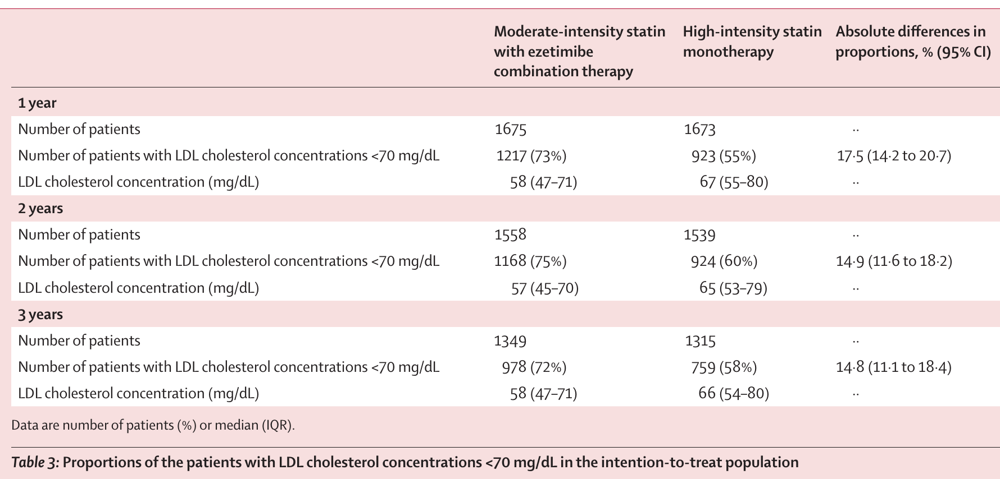{width="120%"}
:::

:::: {.column width="35%"}
::: key-message-bar
**이차 평가변수 우월성 검정**

모든 시점에서 병합요법의 LDL-C 목표 달성률이 더 높았기 때문에,<br>
**지질 조절 효과 면에서는 병합요법이 더 유리한 결과**를 보였다.
:::
::::
::::::

## RACING Trial: 4 - 가설 검정 결과- 안전성 평가 변수

::: spacer-xs
:::

:::::: columns
::: {.column width="60%"}
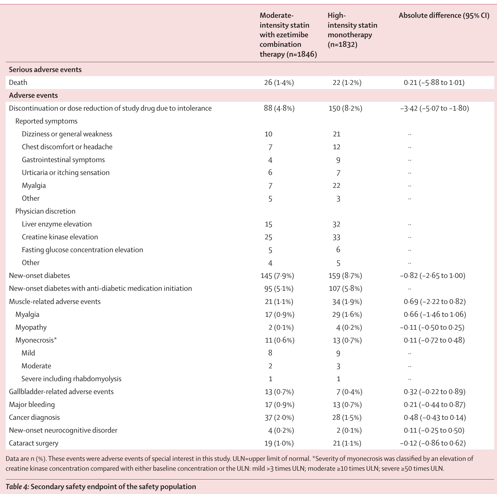{width="200%"}
:::

:::: {.column width="40%"}
::: key-message-bar
**안전성 평가변수**

**약제 불내성으로 인한 중단 또는 감량은 병합요법군에서 유의미하게 더 적었다.** <br> 새로 발생한 당뇨 합병증, 근육 관련 이상반응은 병합요법군에서 더 적게 나타났지만 유의미한 수준은 아니었다.
:::
::::
::::::

## RACING Trial: 4- 가설 검정 결과 - Subgroup Analysis

::: space-xs
:::

::::::: columns
::: {.column width="60%"}
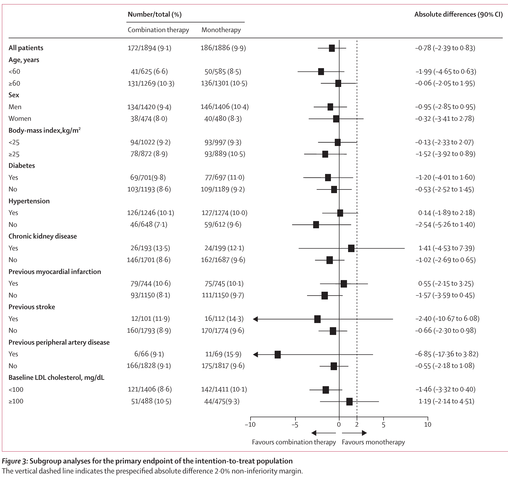{width="200%"}
:::

::::: {.column width="35%"}
::: key-message-bar
**하위군 분석**

하위군 분석은 일차 평가변수 결과가 특정 환자군에서만 나타난 것인지 확인하는 보조분석.
:::

<br>

::: key-message-bar
나이, 성별, BMI, 당뇨, 고혈압, 과거 심혈관 질환, baseline LDL-C에 따라 하위군을 나눠서 분석했다. <br> 분석 결과, 하위군 전반에서 두 치료요법의 차이는 일관된 방향을 보였다. 따라서 **하위군별 치료효과가 크게 다르다고 보기 어렵다.**
:::
:::::
:::::::

## 정리 {.conclusion-slide}

::: spacer-xs
:::

::: accent-box
RCT는 두 군을 공정하게 비교하기 위해 연구 시작 전부터 설계된 임상 연구 방법이다.
:::

::: large
- **RCT의 정의**\
  연구 대상자를 무작위로 치료군과 비교군에 배정하고, 사전에 정한 결과를 같은 기준으로 비교하는 연구 설계이다.

- **RCT가 필요한 이유**\
  나이, 중증도, 기저질환 같은 교란 요인이 한쪽 군에 치우치지 않도록 하여 치료 효과를 더 공정하게 평가하기 위해서이다.

- **좋은 RCT의 핵심 요소**\
  연구 질문(PICO), 가설 검정, 일차 평가변수, sample size, 무작위배정이 서로 논리적으로 연결되어 있어야 한다.

- **RACING Trial에서 확인한 점**\
  연구 질문 → 평가변수 → 비열등성 검정 → sample size → 랜덤화가 하나의 흐름으로 설계되어 있었다.
:::

::: {.summary-item .si-purple}
결국 RCT의 핵심은 **두 군을 공정하게 비교할 수 있도록 연구 질문, 평가변수, 표본수, 랜덤화가 사전에 일관되게 설계되었는지**를 확인하는 것이다.
:::
