## Executive summary

::: large
- CDM은 병원들의 데이터를 똑같은 형태로 만든다.

- 하나의 분석코드로 다기관메타분석 가능

- 분석 전과정에 R을 이용하나, [Feedernet](https://feedernet.com/) 에서 R없이 기본분석 가능.
:::

## Common Data Model(CDM) {.center .middle}

## Why CDM

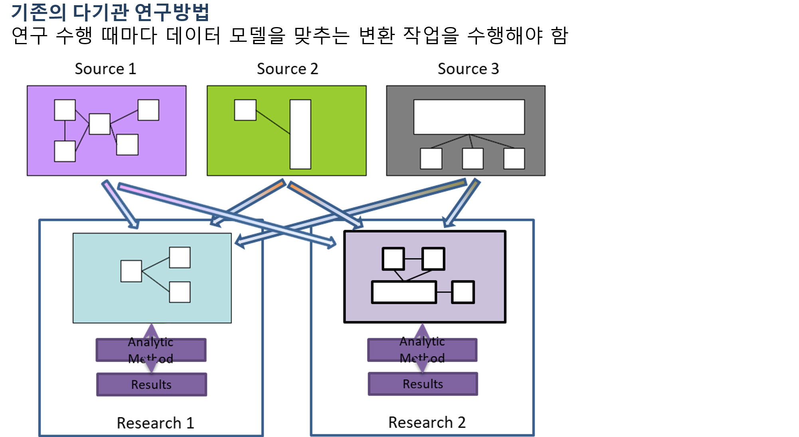</a>

출처: 유승찬교수님 슬라이드.

## Why CDM(2)

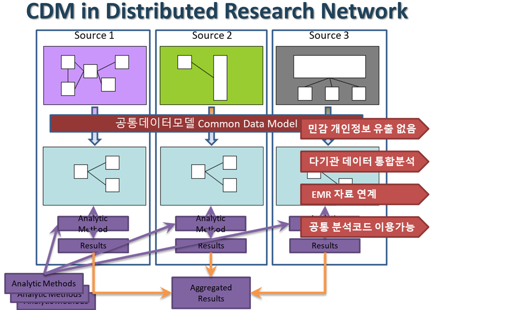</a>

## Why CDM(3)

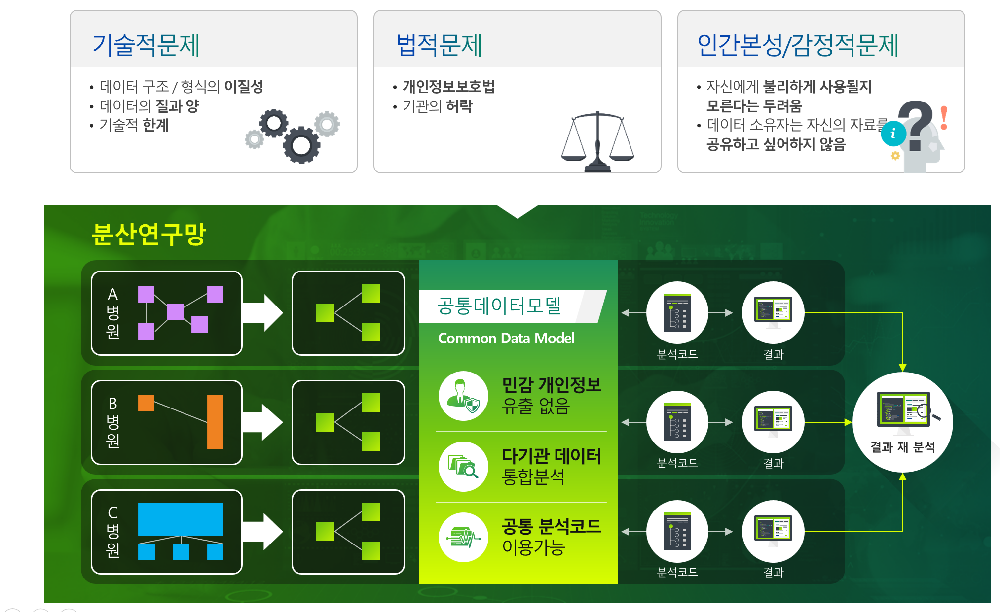</a>

## OMOP CDM

**OMOP (2008-2013)** www.omop.org

- OMOP = Observational Medical Outcomes Partnership
- Research on methods for drug safety evaluation
- Methods library developed; positive/negative drug outcome pairs
- Common Data Model (then, was a byproduct)
- Foundation for the NHI
- Transition to Reagan Udall Foundation for the FDA

**OHDSI** (after 2013) www.ohdsi.org - OHDSI = Observational Health Data Science and Informatics - Continues to use the name ‘OMOP CDM’ - Community of researchers; public; non-pharma funded

## OMOP CDM V6

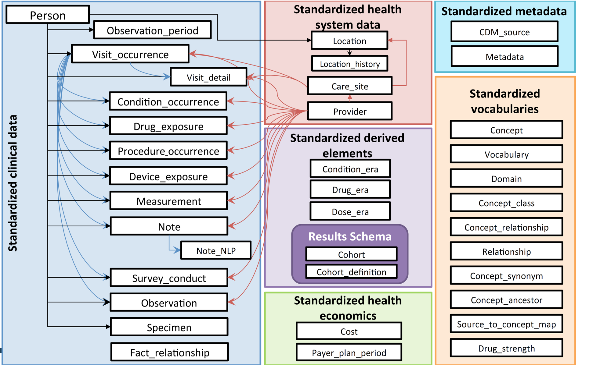</a>

동일한 데이터 구조 뿐 아니라 OMOP 코드라는 공통 의료용어체계를 이용해 물리/논리적 공통모델을 사용함

## Standardized Vocabulary 예

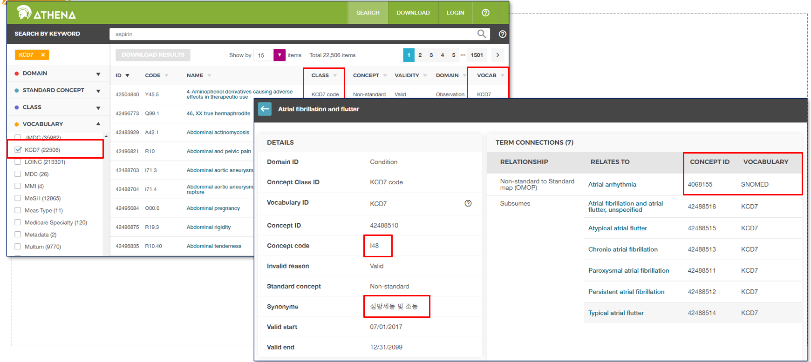</a>

## 국내 참여 병원

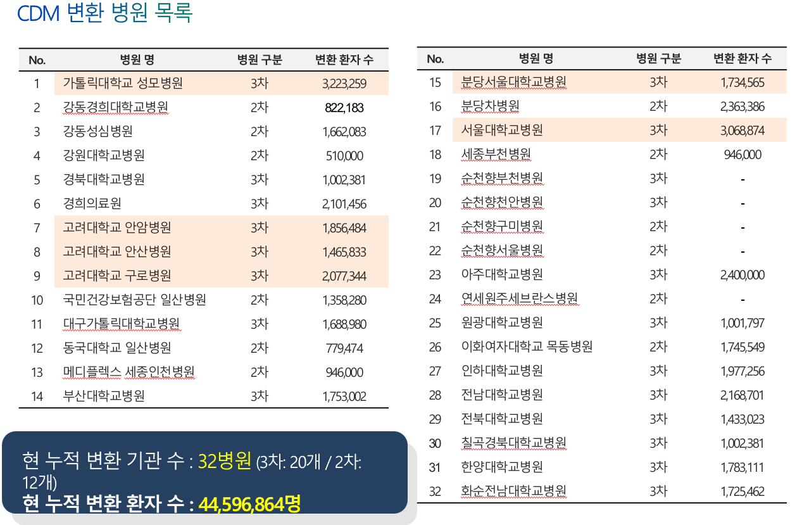</a>

## CDM with R {.center .middle}

## R first

::: large
CDM 분석 모든과정은 [R패키지](https://github.com/OHDSI)로 구현됨.
:::

</a>

## 분석코드, 결과도 R패키지

::: large
연구설계, 분석방법이 포함된 자체 R패키지가 코드공유 표준.

- R패키지를 여러 기관에서 실행
:::

https://github.com/zarathucorp/RanitidineCancerRisk

::: large
분석결과는 R Shiny로

- 실행결과를 R기반 웹애플리케이션으로 표현

- 분석코드에 웹코드도 포함되어있음.
:::

## [ATLAS](https://atlas-demo.ohdsi.org/)

::: large
웹기반 연구설계: R 몰라도 가능
:::

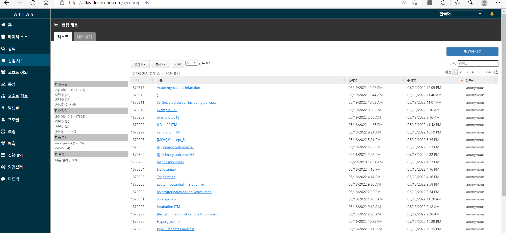</a>

## 데이터 소스

::: large
데이터 선택: 기본정보 제공
:::

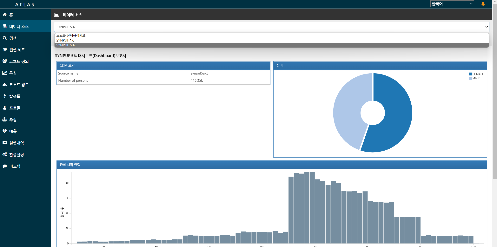</a>

## 컨셉세트

::: large
연구에 이용할 개념 정의 - 예: 고혈압, ACEI, PCI..

- 사망은 기본으로 있음
:::

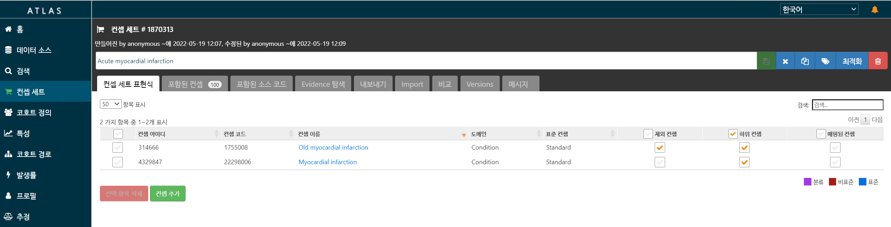</a>

## 코호트 정의

::: large
컨셉세트 이용해 코호트 정의

- 최소 Target/Control/Outcome 코호트 3개 필요

- Negative control 도 필요(자체만들기 or 기본제공)
:::

</a>

## 분석

::: large
추정: Logistic/Cox

예측: xgboost, Lasso, 딥러닝
:::

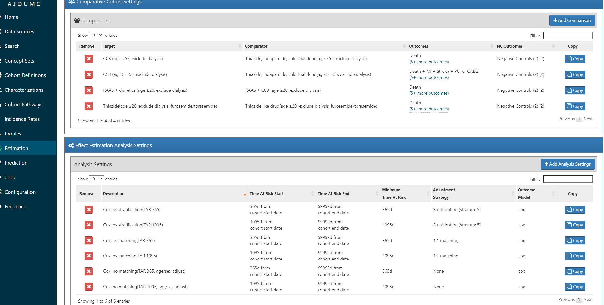</a>

## R패키지 다운

::: large
컨셉, 코호트, 분석이 모두 포함된 R 패키지 다운로드
:::

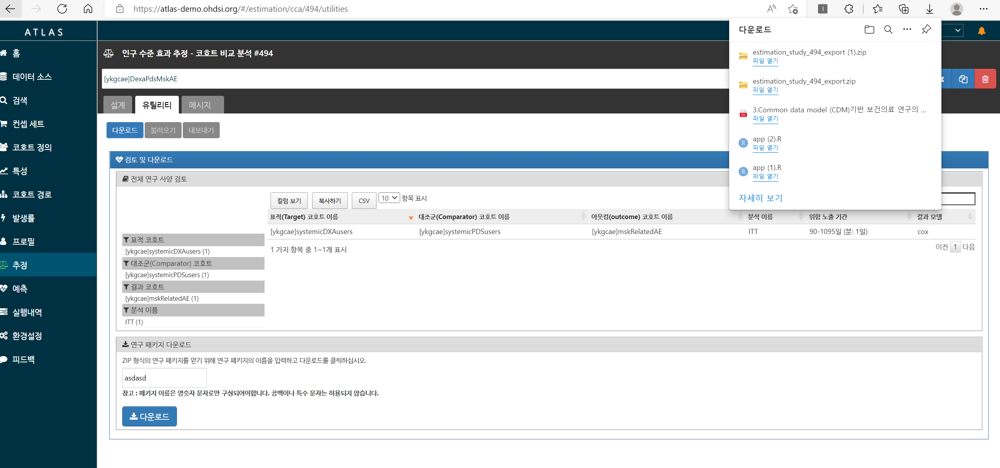</a>

::: large
이후 (1)각 병원의 RStudio server 접속, (2)패키지 설치, (3)실행 하여 분석결과 zip 파일 얻음.
:::

## Feedernet 이용

::: large
가장 쉬운 방법 - R코드 안봐도됨.

- 다기관메타 쉽게 가능(분석할 병원 추가로 끝)

단점 - ATLAS 에서 지원하는 분석만 됨. 직접 수정한 R패키지 불가

- 접근권한 얻은 병원만 분석 가능. 소속, 신분에 따라 다름
:::

::: large
분석은 심플하되, 다기관 물량으로 승부하는 컨셉
:::

## 단계

::: large
**(1) Feedernet 에서 Atlas, 분석실행 둘다** - Atlas에서 지원하는 분석, Feedernet 허가된 데이터만 분석가능

**(2) Feedernet/각병원 Atlas로 설계, 분석은 R서버 접속.** - Atlas에서 지원하는 분석, 자체 CDM설치병원의 데이터 분석가능

**(3) 설계도 R로, 분석도 R서버 접속** - 자유롭게 분석설계 가능, 자체 CDM 설치병원의 데이터 분석가능
:::

## Textbook

::: large
공식 교과서: 친절한 예제, [영어버전은 무료공개](https://ohdsi.github.io/TheBookOfOhdsi/)

[공식 유튜브](https://www.youtube.com/watch?v=dr9FhEkf04o&list=PLSKQ1ikU3kiHk7OTa234TEPgg2il21Jol)
:::

</a>

## CDM 연구지원경험 {.center .middle}

## 심평원 Covid-19 데이터

- 한시적 오픈 with CDM버전, 패키지 만들어 심평원 보내면 실행결과만 보내줌.

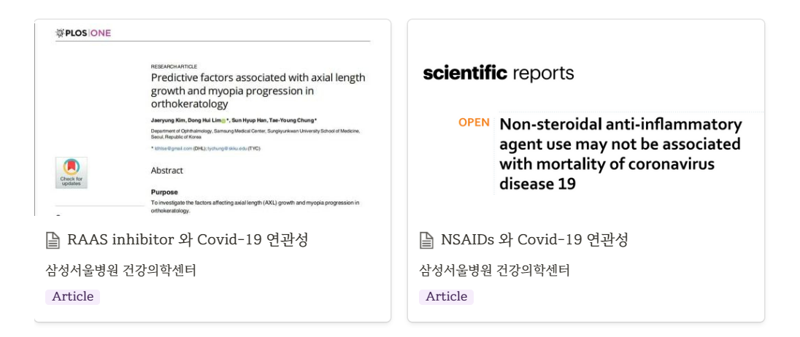</a>

[RAAS vs Other HTN drug in Covid-19](http://147.47.68.165:1111/cdm/aceiarbv5/)

- https://journals.plos.org/plosone/article?id=10.1371/journal.pone.0248058#pone-0248058-g001

[NSAIDs vs AAP in Covid-19](http://147.47.68.165:1111/cdm/nsaidaapv5/)

- https://www.nature.com/articles/s41598-021-84539-5

## 강동성심병원

- 첫 CDM 연구, ATLAS로 패키지만들고 강동성심 DB 접속해 R 실행

- Kaplan-meier 그림을 논문용으로 업그레이드

::: highlight-box-gray
원본 사례 그림은 외부 링크가 만료되어 제외했습니다. 아래 논문이나 분석 링크를 기준으로 연구 흐름을 설명합니다.
:::

https://onlinelibrary.wiley.com/doi/abs/10.1111/jgh.14983

## [공단표본코호트 V1](https://gut.bmj.com/content/70/11/2066.full)

- CDM 변환된 공단표본코호트와, [원본 표본코호트 결과](http://147.47.68.165:1111/doctorssi/PPI_NHIS/) 비교

::: highlight-box-gray
원본 사례 그림은 외부 링크가 만료되어 제외했습니다. 아래 논문이나 분석 링크를 기준으로 연구 흐름을 설명합니다.
:::

## [공단표본코호트 V1(2)](https://onlinelibrary.wiley.com/doi/full/10.1002/cam4.4514)

- CDM 변환된 공단표본코호트 이용

::: highlight-box-gray
원본 사례 그림은 외부 링크가 만료되어 제외했습니다. 아래 논문이나 분석 링크를 기준으로 연구 흐름을 설명합니다.
:::

## [공단표본코호트 V1(3)](https://www.mdpi.com/2075-4426/12/4/584?fbclid=IwAR2ULqlw5yYutcCJG2uU91Z7ivizTq4x1pXAlqqUklhHftD8zpcsE3HqwLg)

- CDM 변환된 공단표본코호트 이용

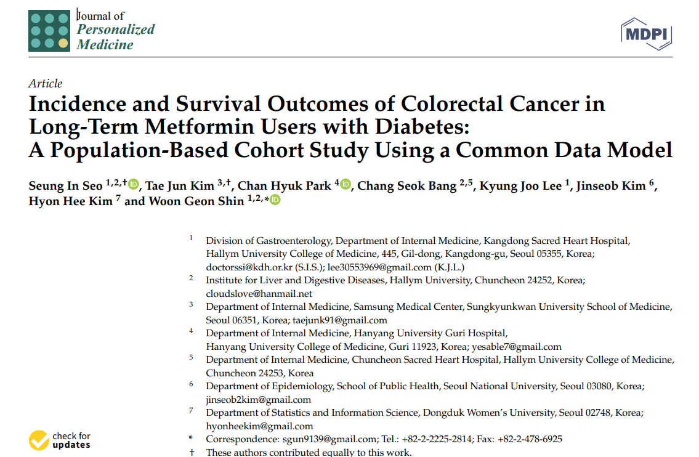</a>

</a>

## [Feedernet 다기관메타](https://www.nature.com/articles/s41598-021-97989-8)

- [ACEI vs ARB](http://147.47.68.165:1111/cdm/meta-drugcancer/)

::: highlight-box-gray
원본 사례 그림은 외부 링크가 만료되어 제외했습니다. 아래 논문이나 분석 링크를 기준으로 연구 흐름을 설명합니다.
:::

## [Feedernet 다기관메타(2)](https://www.mdpi.com/2075-4418/12/2/263)

- [ACEI_ARB vs OtherHTNdrug](http://147.47.68.165:1111/cdm/meta-drugcancer/)

::: highlight-box-gray
원본 사례 그림은 외부 링크가 만료되어 제외했습니다. 아래 논문이나 분석 링크를 기준으로 연구 흐름을 설명합니다.
:::

## [Feedernet 다기관메타(3)](https://onlinelibrary.wiley.com/doi/10.1111/jgh.15879?fbclid=IwAR2g6SzD4ejIZpg1Qfg8frpLbor-Zw29i-g5v73_HDS7eaeZ4r5CtD19HkQ)

- [ACEI vs ARB](http://147.47.68.165:1111/doctorssi/meta_osteoporosis/)

::: highlight-box-gray
원본 사례 그림은 외부 링크가 만료되어 제외했습니다. 아래 논문이나 분석 링크를 기준으로 연구 흐름을 설명합니다.
:::

## [Feedernet 다기관메타(4)](https://cardiab.biomedcentral.com/articles/10.1186/s12933-022-01524-6)

- [pitavastatin vs other Statin](http://147.47.68.165:1111/meta-analysis/)

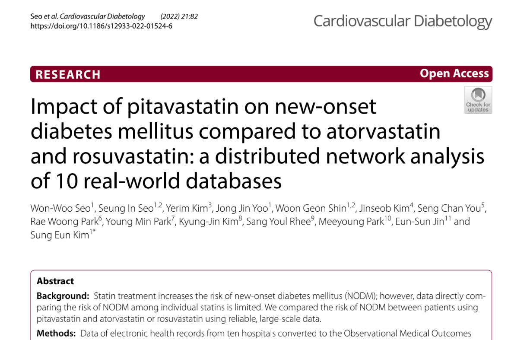</a>

</a>

## Executive summary

::: large
- CDM은 병원들의 데이터를 똑같은 형태로 만든다.

- 하나의 분석코드로 다기관메타분석 가능

- 분석 전과정에 R을 이용하나, [Feedernet](https://feedernet.com/) 에서 R없이 기본분석 가능.
:::

## END {.center .middle}
