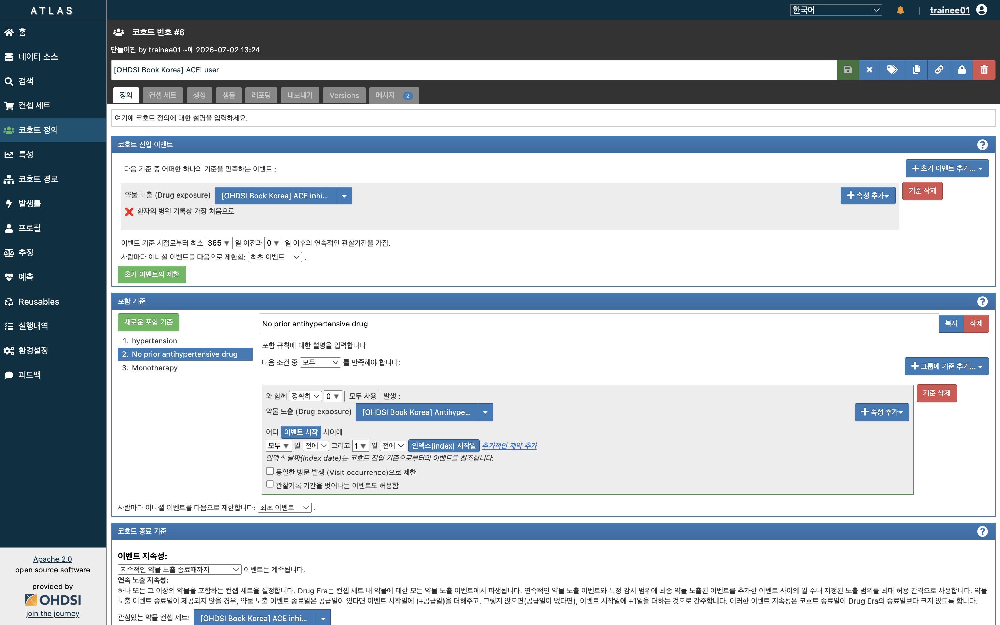
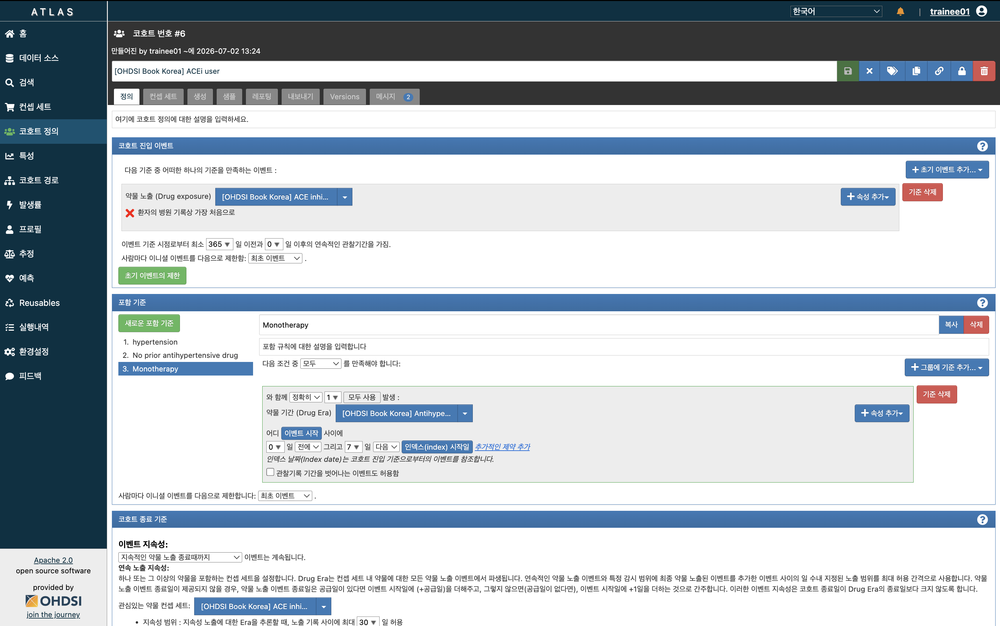

## Executive summary

::: large
- Concept set: 약물, 시술, 질병 등 개념 정의

- Cohort definition: Concept set 이용 Target/Comparator/Outcome 코호트 설정

- Analysis: 관찰시간, PS매칭여부, 통계모델 설정
:::

## 코호트 디자인 {.center .middle}

## The new-user cohort design

## Main design choices

| Choice | Description |
|:-----------------------------------|:-----------------------------------|
| Target cohort | A cohort representing the target treatment |
| Comparator cohort | A cohort representing the comparator treatment |
| Outcome cohort | A cohort representing the outcome of interest |
| Time-at-risk | At what time (often relative to the target and comparator cohort start and end dates) do we consider the risk of the outcome? |
| Model | The model used to estimate the effect while adjusting for differences between the target and comparator |

## 실습: 고혈압 약제 비교

| Choice | Value |
|:-----------------------------------|:-----------------------------------|
| Target cohort | New users of ACE inhibitors as first-line monotherapy for hypertension. |
| Comparator cohort | New users of thiazides or thiazide-like diuretics as first-line monotherapy for hypertension. |
| Outcome cohort | Angioedema or acute myocardial infarction. |
| Time-at-risk | Starting the day after treatment initiation, stopping when exposure stops. |
| Model | Cox proportional hazards model using variable-ratio matching. |

: Main design choices for our comparative cohort study.

## Concept Import 하는법 {.smaller}

::: highlight-box-blue
<strong>1. Import 클릭</strong> → <strong>2. 제공된 Concept ID 복사·붙여넣기</strong> → <strong>3. Add를 눌러 Concept Set에 추가</strong>
:::

::: {style="height: 510px; margin: 20px 42px 0 42px;"}

:::

## Concept: ACEI

| Concept Id | Concept Name | Excluded | Descendants | Mapped |
|------------|:-------------|----------|-------------|--------|
| 1308216    | Lisinopril   | NO       | YES         | NO     |
| 1310756    | moexipril    | NO       | YES         | NO     |
| 1331235    | quinapril    | NO       | YES         | NO     |
| 1334456    | Ramipril     | NO       | YES         | NO     |
| 1335471    | benazepril   | NO       | YES         | NO     |
| 1340128    | Captopril    | NO       | YES         | NO     |
| 1341927    | Enalapril    | NO       | YES         | NO     |
| 1342439    | trandolapril | NO       | YES         | NO     |
| 1363749    | Fosinopril   | NO       | YES         | NO     |
| 1373225    | Perindopril  | NO       | YES         | NO     |

<button type="button" class="concept-id-copy" data-concept-ids="1308216, 1310756, 1331235, 1334456, 1335471, 1340128, 1341927, 1342439, 1363749, 1373225">

Concept ID 복사

</button>

## Concept: Thiazide or thiazide-like diuretic

| Concept Id | Concept Name        | Excluded | Descendants | Mapped |
|------------|:--------------------|----------|-------------|--------|
| 907013     | Metolazone          | NO       | YES         | NO     |
| 974166     | Hydrochlorothiazide | NO       | YES         | NO     |
| 978555     | Indapamide          | NO       | YES         | NO     |
| 1395058    | Chlorthalidone      | NO       | YES         | NO     |

<button type="button" class="concept-id-copy" data-concept-ids="907013, 974166, 978555, 1395058">

Concept ID 복사

</button>

## Concept: outcome

- Angioedema

| Concept Id | Concept Name | Excluded | Descendants | Mapped |
|------------|:-------------|----------|-------------|--------|
| 432791     | Angioedema   | NO       | YES         | NO     |

- AMI with Inpatient or ER visit

| Concept Id | Concept Name              | Excluded | Descendants | Mapped |
|------------|:--------------------------|----------|-------------|--------|
| 314666     | Old myocardial infarction | YES      | YES         | NO     |
| 4329847    | Myocardial infarction     | NO       | YES         | NO     |

| Concept Id | Concept Name                       | Excluded | Descendants | Mapped |
|------------|:-------------------------|------------|------------|------------|
| 262        | Emergency Room and Inpatient Visit | NO       | YES         | NO     |
| 9201       | Inpatient Visit                    | NO       | YES         | NO     |
| 9203       | Emergency Room Visit               | NO       | YES         | NO     |

<button type="button" class="concept-id-copy" data-concept-ids="432791, 314666, 4329847, 262, 9201, 9203">

Concept ID 복사

</button>

## Concept for other criteria: Hypertensive disorder

| Concept Id | Concept Name          | Excluded | Descendants | Mapped |
|------------|:----------------------|----------|-------------|--------|
| 316866     | Hypertensive disorder | NO       | YES         | NO     |

: Hypertensive disorder

<button type="button" class="concept-id-copy" data-concept-ids="316866">

Concept ID 복사

</button>

## Concept for other criteria: Hypertension drugs (1/5) {.smaller}

| Concept Id | Concept Name        | Excluded | Descendants | Mapped |
|------------|:--------------------|----------|-------------|--------|
| 904542     | Triamterene         | NO       | YES         | NO     |
| 907013     | Metolazone          | NO       | YES         | NO     |
| 932745     | Bumetanide          | NO       | YES         | NO     |
| 942350     | torsemide           | NO       | YES         | NO     |
| 956874     | Furosemide          | NO       | YES         | NO     |
| 970250     | Spironolactone      | NO       | YES         | NO     |
| 974166     | Hydrochlorothiazide | NO       | YES         | NO     |
| 978555     | Indapamide          | NO       | YES         | NO     |
| 991382     | Amiloride           | NO       | YES         | NO     |

: Hypertension drugs, part 1

<button type="button" class="concept-id-copy" data-concept-ids="904542, 907013, 932745, 942350, 956874, 970250, 974166, 978555, 991382">

Concept ID 복사

</button>

## Concept for other criteria: Hypertension drugs (2/5) {.smaller}

| Concept Id | Concept Name                                      | Excluded | Descendants | Mapped |
|------------|:--------------------------------------------------|----------|-------------|--------|
| 1305447    | Methyldopa                                        | NO       | YES         | NO     |
| 1307046    | Metoprolol                                        | NO       | YES         | NO     |
| 1307863    | Verapamil                                         | NO       | YES         | NO     |
| 1308216    | Lisinopril                                        | NO       | YES         | NO     |
| 21601490   | Sulfonamides, plain                               | NO       | YES         | NO     |
| 21601503   | Sulfonamides and potassium                        | NO       | YES         | NO     |
| 21600452   | Rauwolfia alkaloids and diuretics in combination | NO       | YES         | NO     |
| 21601458   | Other antihypertensives and diuretics             | NO       | YES         | NO     |

: Hypertension drugs, part 2

<button type="button" class="concept-id-copy" data-concept-ids="1305447, 1307046, 1307863, 1308216, 21601490, 21601503, 21600452, 21601458">

Concept ID 복사

</button>

## Concept for other criteria: Hypertension drugs (3/5) {.smaller}

| Concept Id | Concept Name                                               | Excluded | Descendants | Mapped |
|------------|:-----------------------------------------------------------|----------|-------------|--------|
| 21600464   | Methyldopa and diuretics in combination                    | NO       | YES         | NO     |
| 21601455   | MAO inhibitors and diuretics                               | NO       | YES         | NO     |
| 21601489   | LOW-CEILING DIURETICS, EXCL. THIAZIDES                     | NO       | YES         | NO     |
| 21601542   | Low-ceiling diuretics and potassium-sparing agents         | NO       | YES         | NO     |
| 21600466   | Imidazoline receptor agonists in combination with diuretics | NO       | YES         | NO     |
| 21600472   | Guanidine derivatives and diuretics                        | NO       | YES         | NO     |
| 21601541   | DIURETICS AND POTASSIUM-SPARING AGENTS IN COMBINATION       | NO       | YES         | NO     |
| 21601461   | DIURETICS                                                   | NO       | YES         | NO     |

: Hypertension drugs, part 3

<button type="button" class="concept-id-copy" data-concept-ids="21600464, 21601455, 21601489, 21601542, 21600466, 21600472, 21601541, 21601461">

Concept ID 복사

</button>

## Concept for other criteria: Hypertension drugs (4/5) {.smaller}

| Concept Id | Concept Name                                                  | Excluded | Descendants | Mapped |
|------------|:--------------------------------------------------------------|----------|-------------|--------|
| 1395058    | chlorthalidone                                                 | NO       | YES         | NO     |
| 1340128    | captopril                                                      | NO       | YES         | NO     |
| 21601779   | CALCIUM CHANNEL BLOCKERS AND DIURETICS                         | NO       | YES         | NO     |
| 21601780   | Calcium channel blockers and diuretics                         | NO       | YES         | NO     |
| 21601730   | BETA BLOCKING AGENTS, THIAZIDES AND OTHER DIURETICS            | NO       | YES         | NO     |
| 21601733   | Beta blocking agents, selective, thiazides and other diuretics | NO       | YES         | NO     |
| 21601731   | Beta blocking agents, non-selective, thiazides and other diuretics | NO    | YES         | NO     |
| 21601718   | BETA BLOCKING AGENTS AND OTHER DIURETICS                       | NO       | YES         | NO     |

: Hypertension drugs, part 4

<button type="button" class="concept-id-copy" data-concept-ids="1395058, 1340128, 21601779, 21601780, 21601730, 21601733, 21601731, 21601718">

Concept ID 복사

</button>

## Concept for other criteria: Hypertension drugs (5/5) {.smaller}

| Concept Id | Concept Name                                                   | Excluded | Descendants | Mapped |
|------------|:---------------------------------------------------------------|----------|-------------|--------|
| 21601832   | ANGIOTENSIN II RECEPTOR BLOCKERS (ARBs), COMBINATIONS          | NO       | YES         | NO     |
| 21601833   | Angiotensin II receptor blockers (ARBs) and diuretics           | NO       | YES         | NO     |
| 21600470   | Alpha-adrenoreceptor antagonists and diuretics                  | NO       | YES         | NO     |
| 21601728   | Alpha and beta blocking agents and other diuretics              | NO       | YES         | NO     |
| 21601453   | Alkaloids, excl. rauwolfia, in combination with diuretics       | NO       | YES         | NO     |
| 21601782   | AGENTS ACTING ON THE RENIN-ANGIOTENSIN SYSTEM                   | NO       | YES         | NO     |
| 21601784   | ACE inhibitors, plain                                           | NO       | YES         | NO     |
| 21601783   | ACE INHIBITORS, PLAIN                                           | NO       | YES         | NO     |

: Hypertension drugs, part 5

<button type="button" class="concept-id-copy" data-concept-ids="21601832, 21601833, 21600470, 21601728, 21601453, 21601782, 21601784, 21601783">

Concept ID 복사

</button>

## Antihypertensive medication (1/3) {.smaller}

| Concept Id | Concept Name   | Excluded | Descendants | Mapped |
|------------|:---------------|----------|-------------|--------|
| 1307863    | Verapamil      | NO       | YES         | NO     |
| 1308842    | valsartan      | NO       | YES         | NO     |
| 904542     | Triamterene    | NO       | YES         | NO     |
| 1342439    | trandolapril   | NO       | YES         | NO     |
| 942350     | torsemide      | NO       | YES         | NO     |
| 1341238    | Terazosin      | NO       | YES         | NO     |
| 1317640    | telmisartan    | NO       | YES         | NO     |
| 970250     | Spironolactone | NO       | YES         | NO     |
| 1334456    | Ramipril       | NO       | YES         | NO     |

<button type="button" class="concept-id-copy" data-concept-ids="1307863, 1308842, 904542, 1342439, 942350, 1341238, 1317640, 970250, 1334456">

Concept ID 복사

</button>

## Antihypertensive medication (2/3) {.smaller}

| Concept Id | Concept Name | Excluded | Descendants | Mapped |
|------------|:-------------|----------|-------------|--------|
| 1331235    | quinapril    | NO       | YES         | NO     |
| 1353766    | Propranolol  | NO       | YES         | NO     |
| 1350489    | Prazosin     | NO       | YES         | NO     |
| 1345858    | Pindolol     | NO       | YES         | NO     |
| 1373225    | Perindopril  | NO       | YES         | NO     |
| 1327978    | Penbutolol   | NO       | YES         | NO     |
| 40226742   | olmesartan   | NO       | YES         | NO     |
| 1319880    | Nisoldipine  | NO       | YES         | NO     |

<button type="button" class="concept-id-copy" data-concept-ids="1331235, 1353766, 1350489, 1345858, 1373225, 1327978, 40226742, 1319880">

Concept ID 복사

</button>

## Antihypertensive medication (3/3) {.smaller}

| Concept Id | Concept Name | Excluded | Descendants | Mapped |
|------------|:-------------|----------|-------------|--------|
| 1318853    | Nifedipine   | NO       | YES         | NO     |
| 1318137    | Nicardipine  | NO       | YES         | NO     |
| 1314577    | nebivolol    | NO       | YES         | NO     |
| 1313200    | Nadolol      | NO       | YES         | NO     |
| 1310756    | moexipril    | NO       | YES         | NO     |
| 1309068    | Minoxidil    | NO       | YES         | NO     |
| 1307046    | Metoprolol   | NO       | YES         | NO     |
| 907013     | Metolazone   | NO       | YES         | NO     |

<button type="button" class="concept-id-copy" data-concept-ids="1318853, 1318137, 1314577, 1313200, 1310756, 1309068, 1307046, 907013">

Concept ID 복사

</button>

## Cohort Exit Criteria

</a>

복용기간 안중요하다면 크게 신경쓸 필요 없음.

## Cohort: New ACEI mono

</a>

## 자료 {.center}

</a>

https://atlas-demo.ohdsi.org/#/cohortdefinition/1775515

## 자료 {.center}

</a>

## 자료 {.center}

</a>

## New, continuous 365

</a>

## Comparator: New Thiazide (1/3)

</a>

https://atlas-demo.ohdsi.org/#/cohortdefinition/1770676

## Comparator: New Thiazide (2/3)

</a>

## Comparator: New Thiazide (3/3)

</a>

## Outcome: Angioedema

</a>

https://atlas-demo.ohdsi.org/#/cohortdefinition/1770673

## Outcome: AMI

</a>

https://atlas-demo.ohdsi.org/#/cohortdefinition/1770674

## Outcome: Negative control (1/5) {.smaller}

::: {style="font-size: 0.9em; line-height: 1.25; margin-bottom: 10px;"}
- 의미없으리라 예상되는 outcome
- 관심없어도 최소 1개는 넣어야 실행됨
- Cohort 필요없고 Concept만 필요.
:::

| Concept Id | Concept Name | Excluded | Descendants | Mapped |
|------------|:-------------|----------|-------------|--------|
| 440193     | Wristdrop                                      | NO       | YES         | NO     |
| 4115367    | Wrist joint pain                               | NO       | NO          | NO     |
| 140641     | Verruca vulgaris                               | NO       | NO          | NO     |
| 437264     | Tobacco dependence syndrome                    | NO       | NO          | NO     |
| 378427     | Tear film insufficiency                        | NO       | NO          | NO     |
| 81151      | Sprain of ankle                                | NO       | NO          | NO     |

<button type="button" class="concept-id-copy" data-concept-ids="440193, 4115367, 140641, 437264, 378427, 81151">

Concept ID 복사

</button>

## Outcome: Negative control (2/5) {.smaller}

| Concept Id | Concept Name | Excluded | Descendants | Mapped |
|------------|:-------------|----------|-------------|--------|
| 443172     | Splinter of face, without major open wound     | NO       | NO          | NO     |
| 36713918   | Somatic dysfunction of lumbar region           | NO       | NO          | NO     |
| 141932     | Senile hyperkeratosis                          | NO       | NO          | NO     |
| 380706     | Regular astigmatism                            | NO       | NO          | NO     |
| 81634      | Ptotic breast                                  | NO       | NO          | NO     |
| 439790     | Psychalgia                                     | NO       | NO          | NO     |
| 46286594   | Problem related to lifestyle                   | NO       | NO          | NO     |
| 373478     | Presbyopia                                     | NO       | NO          | NO     |
| 4202045    | Postviral fatigue syndrome                     | NO       | NO          | NO     |
| 4091513    | Passing flatus                                 | NO       | NO          | NO     |
| 438130     | Opioid abuse                                   | NO       | NO          | NO     |

<button type="button" class="concept-id-copy" data-concept-ids="443172, 36713918, 141932, 380706, 81634, 439790, 46286594, 373478, 4202045, 4091513, 438130">

Concept ID 복사

</button>

## Outcome: Negative control (3/5) {.smaller}

| Concept Id | Concept Name | Excluded | Descendants | Mapped |
|------------|:-------------|----------|-------------|--------|
| 140648     | Onychomycosis due to dermatophyte              | NO       | NO          | NO     |
| 40480893   | Nonspecific tuberculin test reaction           | NO       | NO          | NO     |
| 136368     | Non-toxic multinodular goiter                  | NO       | NO          | NO     |
| 377572     | Noise effects on inner ear                     | NO       | NO          | NO     |
| 4209423    | Nicotine dependence                            | NO       | NO          | NO     |
| 4103703    | Melena                                         | NO       | NO          | NO     |
| 4083487    | Macular drusen                                 | NO       | NO          | NO     |
| 195873     | Leukorrhea                                     | NO       | NO          | NO     |
| 438329     | Late effect of motor vehicle accident          | NO       | NO          | NO     |
| 434203     | Late effect of contusion                       | NO       | NO          | NO     |
| 432593     | Kwashiorkor                                    | NO       | NO          | NO     |

<button type="button" class="concept-id-copy" data-concept-ids="140648, 40480893, 136368, 377572, 4209423, 4103703, 4083487, 195873, 438329, 434203, 432593">

Concept ID 복사

</button>

## Outcome: Negative control (4/5) {.smaller}

| Concept Id | Concept Name | Excluded | Descendants | Mapped |
|------------|:-------------|----------|-------------|--------|
| 196168     | Irregular periods                              | NO       | NO          | NO     |
| 444132     | Injury of knee                                 | NO       | NO          | NO     |
| 139099     | Ingrowing nail                                 | NO       | NO          | NO     |
| 4344500    | Impingement syndrome of shoulder region        | NO       | NO          | NO     |
| 374375     | Impacted cerumen                               | NO       | NO          | NO     |
| 4201717    | Ileostomy present                              | NO       | NO          | NO     |
| 441788     | Human papilloma virus infection                | NO       | NO          | NO     |
| 4012934    | Homocystinuria                                 | NO       | NO          | NO     |
| 4012570    | High risk sexual behavior                      | NO       | NO          | NO     |
| 440329     | Herpes zoster without complication             | NO       | NO          | NO     |
| 4231770    | Hereditary thrombophilia                       | NO       | NO          | NO     |

<button type="button" class="concept-id-copy" data-concept-ids="196168, 444132, 139099, 4344500, 374375, 4201717, 441788, 4012934, 4012570, 440329, 4231770">

Concept ID 복사

</button>

## Outcome: Negative control (5/5) {.smaller}

| Concept Id | Concept Name | Excluded | Descendants | Mapped |
|------------|:-------------|----------|-------------|--------|
| 433577     | Hammer toe                                     | NO       | NO          | NO     |
| 4166231    | Genetic predisposition                         | NO       | NO          | NO     |
| 40481632   | Ganglion cyst                                  | NO       | NO          | NO     |
| 259995     | Foreign body in orifice                        | NO       | NO          | NO     |
| 4092896    | Feces contents abnormal                        | NO       | NO          | NO     |
| 4170770    | Epidermoid cyst                                | NO       | NO          | NO     |
| 433527     | Endometriosis (clinical)                       | NO       | NO          | NO     |
| 433111     | Effects of hunger                              | NO       | NO          | NO     |
| 45757370   | Disproportion of reconstructed breast          | NO       | NO          | NO     |
| 4115402    | Difficulty sleeping                            | NO       | NO          | NO     |
| 76786      | Derangement of knee                            | NO       | NO          | NO     |

<button type="button" class="concept-id-copy" data-concept-ids="433577, 4166231, 40481632, 259995, 4092896, 4170770, 433527, 433111, 45757370, 4115402, 76786">

Concept ID 복사

</button>

## 분석 디자인 {.center .middle}

## Study population

</a>

## Covariate

::: large
Propensity score 계산때 광범위한 공변량 이용

- 따라서 제외할 공변량 반드시 정의해야함. 특히 Target/Comparator 코호트 내용은 반드시 제외.

광범위 공변량 싫다면 쓸 공변량만 넣을 수도
:::

</a>

## Concept to exclude

::: large
코호트 디자인때 설정하면 모든 분석에 적용
:::

</a>

## Time at risk

::: large
보통 Cohort start 1일 후부터 살펴봄
:::

</a>

## PS adj

::: large
No matching, matching, stratification(N 손실없음) 중 선택
:::

</a>

## Outcome model

::: large
Cox, logistic
:::

</a>

## Executive summary

::: large
- Concept set: 약물, 시술, 질병 등 개념 정의

- Cohort definition: Concept set 이용 Target/Comparator/Outcome 코호트 설정

- Analysis: 관찰시간, PS매칭여부, 통계모델 설정
:::

## END {.center .middle}
