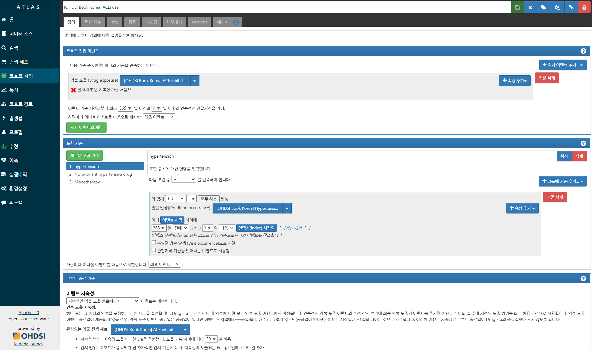
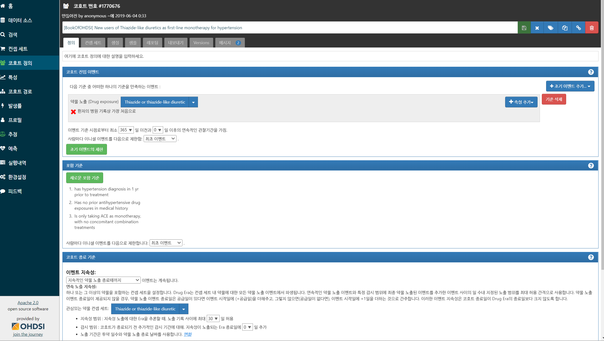
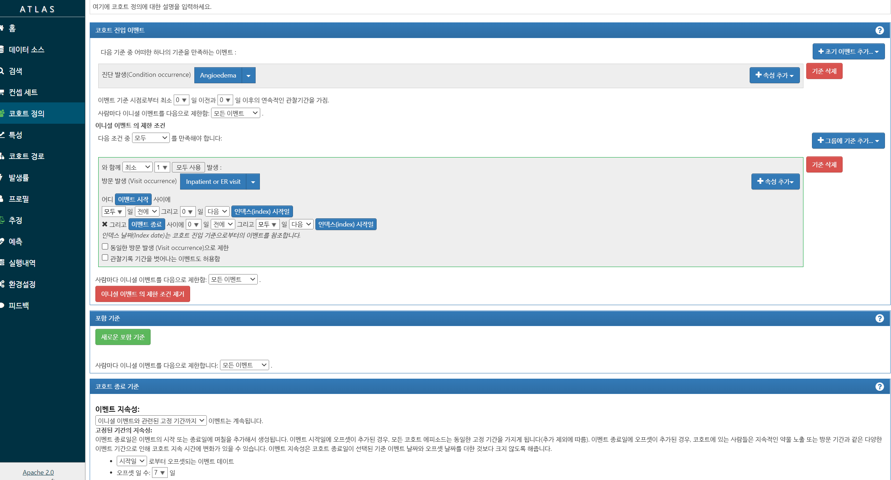
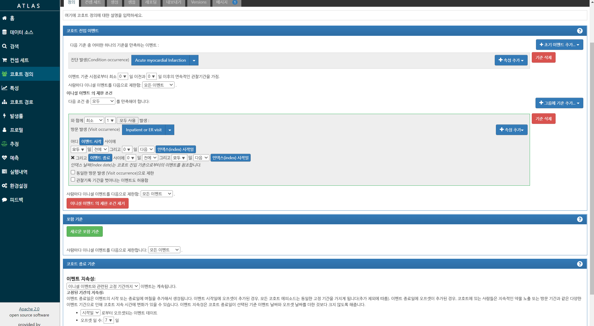
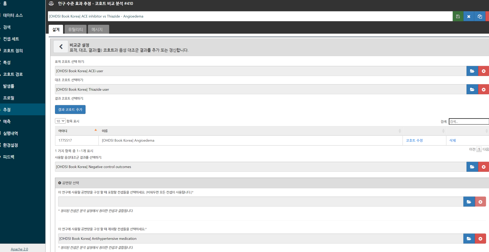

## Executive summary

::: large
- Concept set: 약물, 시술, 질병 등 개념 정의

- Cohort definition: Concept set 이용 Target/Comparator/Outcome 코호트 설정

- Analysis: 관찰시간, PS매칭여부, 통계모델 설정

- Meta analysis: Feedernet 다기관분석 합침
:::

## 코호트 디자인 {.center .middle}

## The new-user cohort design

## Main design choices

| Choice | Description |
|:-----------------------------------|:-----------------------------------|
| Target cohort | A cohort representing the target treatment |
| Comparator cohort | A cohort representing the comparator treatment |
| Outcome cohort | A cohort representing the outcome of interest |
| Time-at-risk | At what time (often relative to the target and comparator cohort start and end dates) do we consider the risk of the outcome? |
| Model | The model used to estimate the effect while adjusting for differences between the target and comparator |

## 실습: 고혈압 약제 비교

| Choice | Value |
|:-----------------------------------|:-----------------------------------|
| Target cohort | New users of ACE inhibitors as first-line monotherapy for hypertension. |
| Comparator cohort | New users of thiazides or thiazide-like diuretics as first-line monotherapy for hypertension. |
| Outcome cohort | Angioedema or acute myocardial infarction. |
| Time-at-risk | Starting the day after treatment initiation, stopping when exposure stops. |
| Model | Cox proportional hazards model using variable-ratio matching. |

: Main design choices for our comparative cohort study.

## Concept: ACEI

| Concept Id | Concept Name | Excluded | Descendants | Mapped |
|------------|:-------------|----------|-------------|--------|
| 1308216    | Lisinopril   | NO       | YES         | NO     |
| 1310756    | moexipril    | NO       | YES         | NO     |
| 1331235    | quinapril    | NO       | YES         | NO     |
| 1334456    | Ramipril     | NO       | YES         | NO     |
| 1335471    | benazepril   | NO       | YES         | NO     |
| 1340128    | Captopril    | NO       | YES         | NO     |
| 1341927    | Enalapril    | NO       | YES         | NO     |
| 1342439    | trandolapril | NO       | YES         | NO     |
| 1363749    | Fosinopril   | NO       | YES         | NO     |
| 1373225    | Perindopril  | NO       | YES         | NO     |

## Concept: Thiazide or thiazide-like diuretic

| Concept Id | Concept Name        | Excluded | Descendants | Mapped |
|------------|:--------------------|----------|-------------|--------|
| 907013     | Metolazone          | NO       | YES         | NO     |
| 974166     | Hydrochlorothiazide | NO       | YES         | NO     |
| 978555     | Indapamide          | NO       | YES         | NO     |
| 1395058    | Chlorthalidone      | NO       | YES         | NO     |

## Concept: outcome

- Angioedema

| Concept Id | Concept Name | Excluded | Descendants | Mapped |
|------------|:-------------|----------|-------------|--------|
| 432791     | Angioedema   | NO       | YES         | NO     |

- AMI with Inpatient or ER visit

| Concept Id | Concept Name              | Excluded | Descendants | Mapped |
|------------|:--------------------------|----------|-------------|--------|
| 314666     | Old myocardial infarction | YES      | YES         | NO     |
| 4329847    | Myocardial infarction     | NO       | YES         | NO     |

| Concept Id | Concept Name                       | Excluded | Descendants | Mapped |
|------------|:------------------------|------------|------------|------------|
| 262        | Emergency Room and Inpatient Visit | NO       | YES         | NO     |
| 9201       | Inpatient Visit                    | NO       | YES         | NO     |
| 9203       | Emergency Room Visit               | NO       | YES         | NO     |

## Cohort: New ACEI mono

</a>

## 자료 {.center}

</a>

https://atlas-demo.ohdsi.org/#/cohortdefinition/1775515

## New, continuous 365

</a>

## Concept for other criteria: Hypertensive disorder

| Concept Id | Concept Name          | Excluded | Descendants | Mapped |
|------------|:----------------------|----------|-------------|--------|
| 316866     | Hypertensive disorder | NO       | YES         | NO     |

: Hypertensive disorder

## Concept for other criteria: Hypertension drugs (1/3) {.smaller}

| Concept Id | Concept Name               | Excluded | Descendants | Mapped |
|------------|:---------------------------|----------|-------------|--------|
| 904542     | Triamterene                | NO       | YES         | NO     |
| 907013     | Metolazone                 | NO       | YES         | NO     |
| 932745     | Bumetanide                 | NO       | YES         | NO     |
| 942350     | torsemide                  | NO       | YES         | NO     |
| 956874     | Furosemide                 | NO       | YES         | NO     |
| 970250     | Spironolactone             | NO       | YES         | NO     |
| 974166     | Hydrochlorothiazide        | NO       | YES         | NO     |
| 978555     | Indapamide                 | NO       | YES         | NO     |
| 991382     | Amiloride                  | NO       | YES         | NO     |
| 1305447    | Methyldopa                 | NO       | YES         | NO     |
| 1307046    | Metoprolol                 | NO       | YES         | NO     |
| 1307863    | Verapamil                  | NO       | YES         | NO     |
| 1308216    | Lisinopril                 | NO       | YES         | NO     |
| 21601490   | Sulfonamides, plain        | NO       | YES         | NO     |
| 21601503   | Sulfonamides and potassium | NO       | YES         | NO     |

: Hypertension drugs, part 1

## Concept for other criteria: Hypertension drugs (2/3) {.smaller}

| Concept Id | Concept Name                                                | Excluded | Descendants | Mapped |
|------------|:------------------------------------------------------------|----------|-------------|--------|
| 21600452   | Rauwolfia alkaloids and diuretics in combination            | NO       | YES         | NO     |
| 21601458   | Other antihypertensives and diuretics                       | NO       | YES         | NO     |
| 21600464   | Methyldopa and diuretics in combination                     | NO       | YES         | NO     |
| 21601455   | MAO inhibitors and diuretics                                | NO       | YES         | NO     |
| 21601489   | LOW-CEILING DIURETICS, EXCL. THIAZIDES                      | NO       | YES         | NO     |
| 21601542   | Low-ceiling diuretics and potassium-sparing agents          | NO       | YES         | NO     |
| 21600466   | Imidazoline receptor agonists in combination with diuretics | NO       | YES         | NO     |
| 21600472   | Guanidine derivatives and diuretics                         | NO       | YES         | NO     |
| 21601541   | DIURETICS AND POTASSIUM-SPARING AGENTS IN COMBINATION       | NO       | YES         | NO     |
| 21601461   | DIURETICS                                                   | NO       | YES         | NO     |
| 1395058    | chlorthalidone                                              | NO       | YES         | NO     |
| 1340128    | captopril                                                   | NO       | YES         | NO     |
| 21601779   | CALCIUM CHANNEL BLOCKERS AND DIURETICS                      | NO       | YES         | NO     |
| 21601780   | Calcium channel blockers and diuretics                      | NO       | YES         | NO     |
| 21601730   | BETA BLOCKING AGENTS, THIAZIDES AND OTHER DIURETICS         | NO       | YES         | NO     |

: Hypertension drugs, part 2

## Concept for other criteria: Hypertension drugs (3/3) {.smaller}

| Concept Id | Concept Name                                                       | Excluded | Descendants | Mapped |
|------------|:-------------------------------------------------------------------|----------|-------------|--------|
| 21601733   | Beta blocking agents, selective, thiazides and other diuretics     | NO       | YES         | NO     |
| 21601731   | Beta blocking agents, non-selective, thiazides and other diuretics | NO       | YES         | NO     |
| 21601718   | BETA BLOCKING AGENTS AND OTHER DIURETICS                           | NO       | YES         | NO     |
| 21601832   | ANGIOTENSIN II RECEPTOR BLOCKERS (ARBs), COMBINATIONS              | NO       | YES         | NO     |
| 21601833   | Angiotensin II receptor blockers (ARBs) and diuretics              | NO       | YES         | NO     |
| 21600470   | Alpha-adrenoreceptor antagonists and diuretics                     | NO       | YES         | NO     |
| 21601728   | Alpha and beta blocking agents and other diuretics                 | NO       | YES         | NO     |
| 21601453   | Alkaloids, excl. rauwolfia, in combination with diuretics          | NO       | YES         | NO     |
| 21601782   | AGENTS ACTING ON THE RENIN-ANGIOTENSIN SYSTEM                      | NO       | YES         | NO     |
| 21601784   | ACE inhibitors, plain                                              | NO       | YES         | NO     |
| 21601783   | ACE INHIBITORS, PLAIN                                              | NO       | YES         | NO     |

: Hypertension drugs, part 3

## Cohort Exit Criteria

</a>

복용기간 안중요하다면 크게 신경쓸 필요 없음.

## Comparator: New Thiazide

</a>

https://atlas-demo.ohdsi.org/#/cohortdefinition/1770676

## Outcome: Angioedema

</a>

https://atlas-demo.ohdsi.org/#/cohortdefinition/1770673

## Outcome: AMI

</a>

https://atlas-demo.ohdsi.org/#/cohortdefinition/1770674

## Outcome: Negative control

::: large
- 의미없으리라 예상되는 outcome

- 관심없어도 최소 1개는 넣어야 실행됨

- Cohort 필요없고 Concept만 필요.

https://atlas-demo.ohdsi.org/#/conceptset/1866136/expression
:::

## 분석 디자인 {.center .middle}

## Study population

</a>

## Covariate

::: large
Propensity score 계산때 광범위한 공변량 이용

- 따라서 제외할 공변량 반드시 정의해야함. 특히 Target/Comparator 코호트 내용은 반드시 제외.

광범위 공변량 싫다면 쓸 공변량만 넣을 수도
:::

</a>

## Concept to exclude

::: large
코호트 디자인때 설정하면 모든 분석에 적용
:::

</a>

## Time at risk

::: large
보통 Cohort start 1일 후부터 살펴봄
:::

</a>

## PS adj

::: large
No matching, matching, stratification(N 손실없음) 중 선택
:::

</a>

## Outcome model

::: large
Cox, logistic
:::

</a>

## Executive summary

::: large
- Concept set: 약물, 시술, 질병 등 개념 정의

- Cohort definition: Concept set 이용 Target/Comparator/Outcome 코호트 설정

- Analysis: 관찰시간, PS매칭여부, 통계모델 설정
:::

## END {.center .middle}
