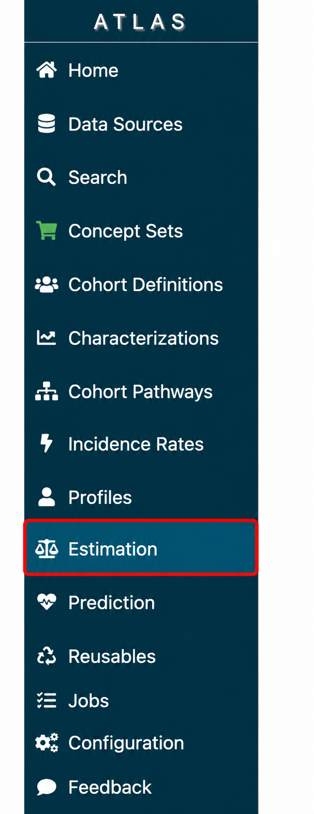
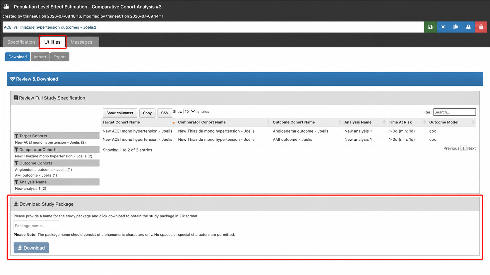
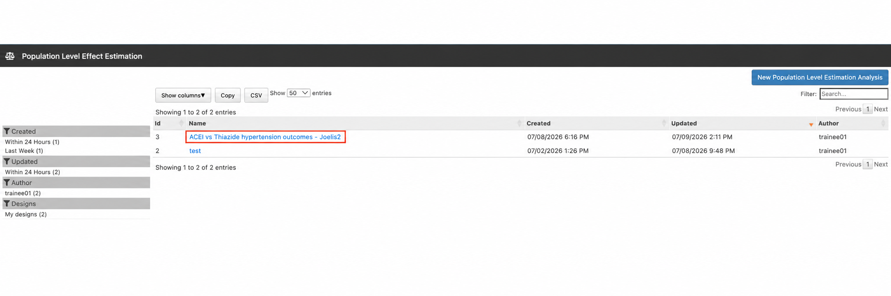
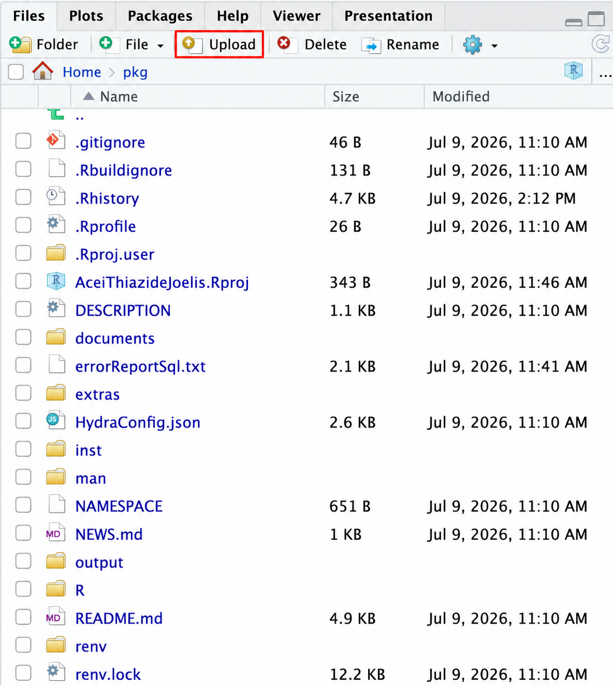
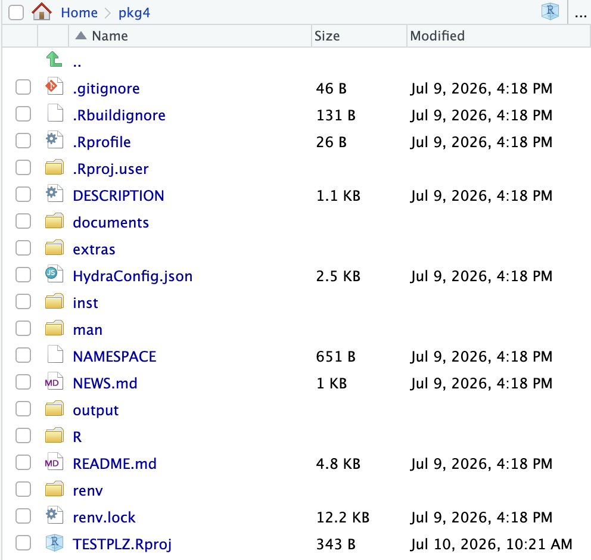
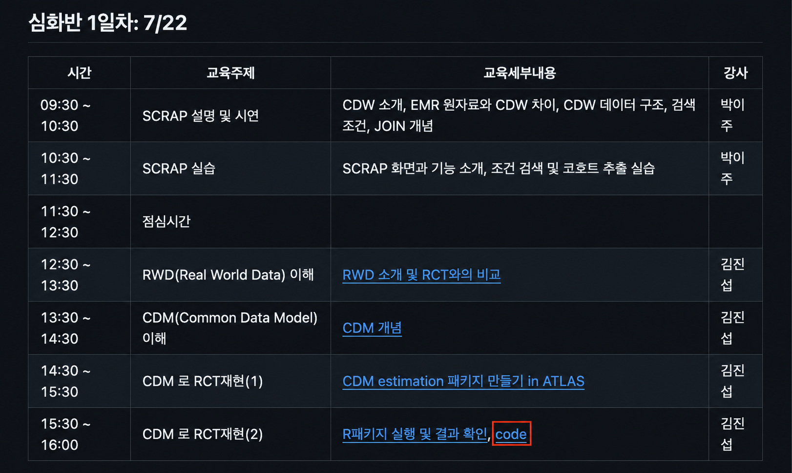
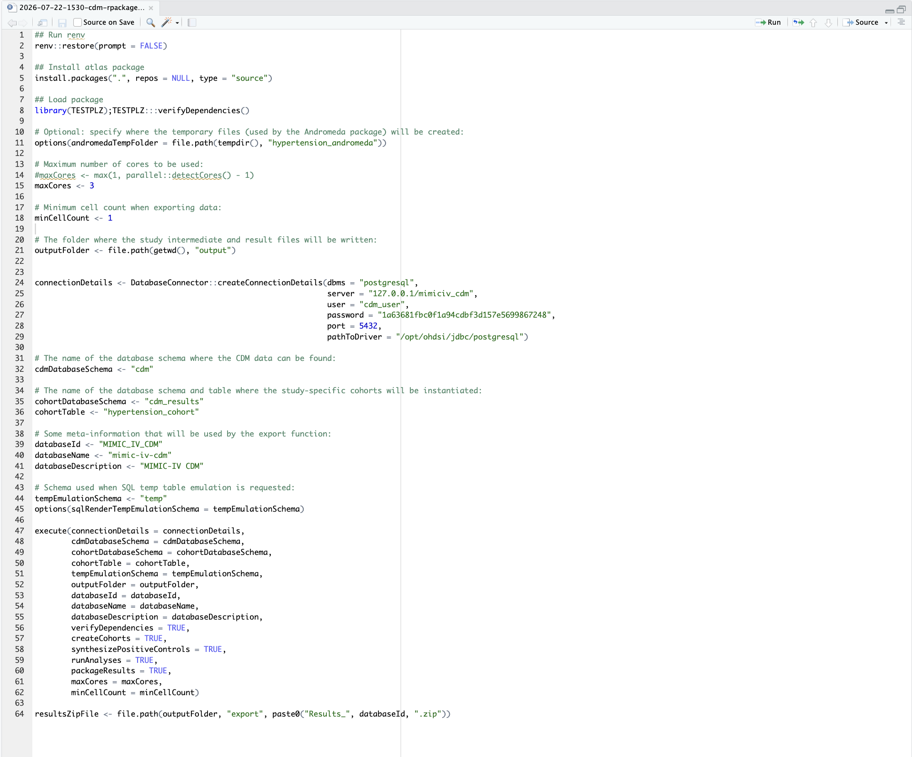
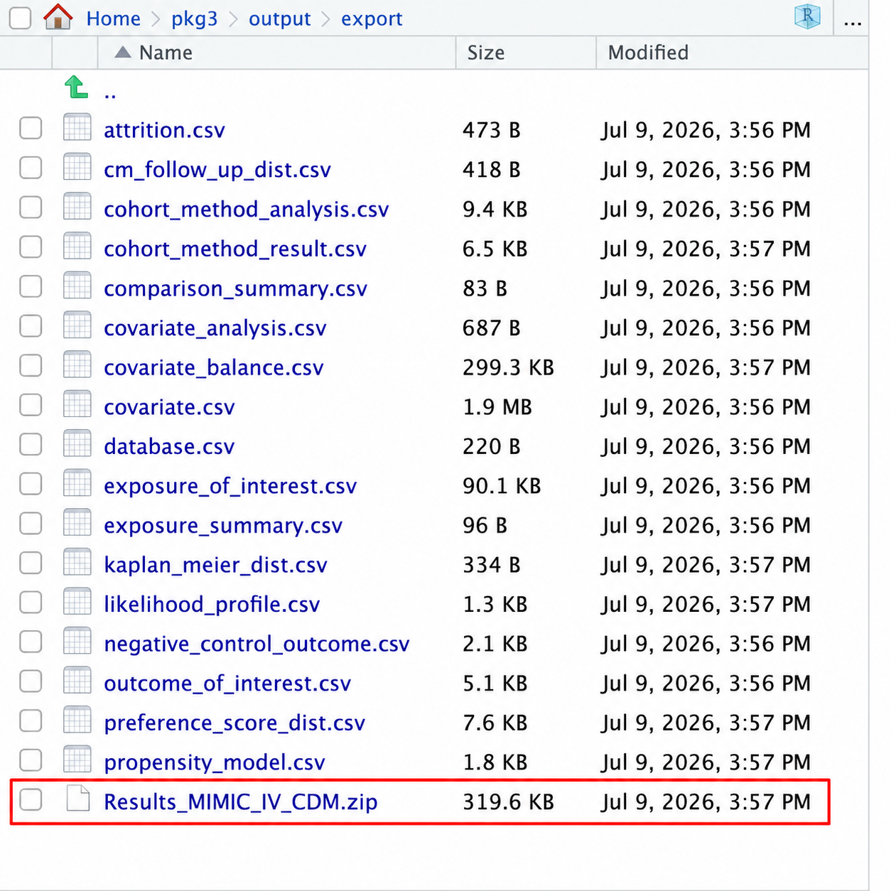

## 오늘의 목표

::: large
**01.** ATLAS에서 만든 estimation 분석 패키지를 다운로드합니다. 
**02.** RStudio 서버에서 패키지 구조와 실행 코드를 확인합니다. 
**03.** 제공되는 코드를 단계별로 실행하여 결과 파일을 생성합니다. 
**04.** 생성된 결과 zip을 CDM META Analysis에서 확인합니다.
:::

::: highlight-box
목표: ATLAS 설계물이 실제 R 분석 결과로 이어지는 흐름을 알수있게 도와줍니다.
:::

## 핵심 개념 {.intro-slide}

::: spacer-xs
:::

::: accent-box
ATLAS에서 만든 분석은 아직 실행할수 있는 결과가 아니라, R에서 실행할 수 있도록 정리된 분석 설계입니다.
:::

:::: columns
::: {.column width="58%"}
[**Background Info**]{.section-title}

- ATLAS는 코호트, 비교군, 결과변수, 분석 조건을 설계하는 도구입니다.
- Study Package는 이 설계를 R 코드와 설정 파일로 묶어 내려받은 것입니다.
- RStudio에서는 이 패키지를 실제 CDM 데이터베이스에 연결해 실행합니다.
- 실행 후 생성된 결과 파일을 통해 cohort 수, outcome 발생, effect estimate를 확인합니다.
:::
::::

## 실습 시작: Study Package 다운로드 {.smaller}

::::::::::: {style="display: grid; grid-template-columns: 390px 1fr; gap: 30px; align-items: stretch; height: 680px; margin: 18px 34px 0 34px;"}
:::::: {style="display: flex; flex-direction: column; justify-content: center; gap: 18px;"}
::: highlight-box
<strong>1. Estimation 메뉴 클릭</strong> ATLAS에서 실행할 분석 화면으로 이동합니다.
:::

::: highlight-box-blue
<strong>2. 분석 이름 클릭</strong> 다운로드할 study package의 분석 항목을 선택합니다.
:::

::: highlight-box-teal
<strong>3. Utilities → Download</strong> Package name을 입력한 뒤 zip 파일을 다운로드합니다.
:::
::::::

:::::: {style="display: grid; grid-template-columns: 0.82fr 1.55fr; grid-template-rows: 1fr 1fr; gap: 18px; min-width: 0;"}
::: {style="grid-row: 1 / 3; min-width: 0; min-height: 0; display: flex; align-items: center; justify-content: center; padding: 8px; box-sizing: border-box; background: rgba(255,255,255,0.82); border: 1px solid #dfe8dc; border-radius: 6px;"}

:::

::: {style="min-width: 0; min-height: 0; display: flex; align-items: center; justify-content: center; padding: 8px; box-sizing: border-box; background: rgba(255,255,255,0.82); border: 1px solid #dfe8dc; border-radius: 6px;"}

:::

::: {style="min-width: 0; min-height: 0; display: flex; align-items: center; justify-content: center; padding: 8px; box-sizing: border-box; background: rgba(255,255,255,0.82); border: 1px solid #dfe8dc; border-radius: 6px;"}

:::
::::::
:::::::::::

## Rstudio 서버에 업로드

- 제공되는 Rstudio 서버에 접속, username password 입력 후 로그인
- 작업할 폴더 생성
  - zip 업로드 후 압축 해제

::: {style="position: absolute; right: 105px; top: 205px; bottom: 40px; width: 760px;"}

:::

## 다운로드된 패키지 구조 확인

RStudio Files 창에서 압축 해제된 package 폴더를 확인합니다.

- `.Rproj`: RStudio 프로젝트 파일
- `DESCRIPTION`, `NAMESPACE`: R package 기본 정보
- `R/`, `man/`: 패키지 함수와 문서
- `extras/`: 실행용 스크립트 위치
- `inst/`, `HydraConfig.json`: ATLAS 분석 설정
- `README.md`: 실행 안내
- `renv/`, `renv.lock`: 패키지 환경 재현

::: {style="position: absolute; right: 45px; top: 180px; bottom: 70px; width: 680px;"}

:::

## Github에서 코드 가져오기

- 제공되는 github link를 통해 yonsei-healthcare-bootcamp로 들어가기
  - 링크: https://github.com/zarathucorp/yonsei-healthcare-bootcamp-2026
- 밑으로 내려서 심화반 1일차: 7/22 찾기
  - "code" 라고 써있는 링크 클릭하기
  - 코드 전체 복사 후 Rstudio로 가져오기

::: {style="height: 140px; margin: 4px 360px 0 360px;"}

:::

## 코드 실행 및 결과 확인 {.smaller}

::::::: {style="display: grid; grid-template-columns: 0.98fr 0.92fr; gap: 30px; align-items: stretch; height: 680px; margin: 14px 34px 0 34px;"}
::::: {style="min-width: 0;"}
::: highlight-box-blue
<strong>실행 방법</strong> 가져온 <code>code/2026-07-22-1530-cdm-rpackage-run.R</code> 코드를 단계별로 실행합니다. 커서가 있는 줄 또는 선택한 코드 블록이 Console에서 실행됩니다.
:::

::: {style="font-size: 0.72em; line-height: 1.42; margin-top: 14px;"}

<strong>실행 흐름</strong>

<ol style="margin-top: 0; padding-left: 1.25em;">

<li><code>renv::restore()</code> : 필요한 패키지 환경 복원</li>

<li><code>install.packages(".", ...)</code> : study package 설치</li>

<li><code>library(TESTPLZ)</code> : 패키지 로드 및 dependency 확인</li>

<li><code>outputFolder</code>, <code>maxCores</code> 등 실행 옵션 설정</li>

<li><code>connectionDetails</code> : CDM database 연결 정보 설정</li>

<li><code>cdmDatabaseSchema</code>, <code>cohortDatabaseSchema</code> 설정</li>

<li><code>execute(...)</code> : cohort 생성, 분석 실행, 결과 패키징</li>

<li><code>resultsZipFile</code> : 생성된 결과 zip 파일 경로 확인</li>

</ol>
:::
:::::

::: {style="min-width: 0; min-height: 0; display: flex; align-items: center; justify-content: center; padding: 10px; box-sizing: border-box; background: rgba(255,255,255,0.84); border: 1px solid #dfe8dc; border-radius: 6px;"}

:::
:::::::

## CDM META Analysis 실행 {.smaller}

- output 폴더에 저장된 결과물 .zip 파일 다운로드
  - output -\> export -\> Results_MIMIC_IV_CDM.zip
- 인터넷에 openstat.ai 검색 후 들어가기
  - 기초 분석 오른쪽 아래에 있는 CDM META ANALYSIS 클릭
    - 왼쪽 상단에 있는 Upload .zip 파일에 저장한 .zip 파일 업로드
      - 결과 확인

::::: {style="display: grid; grid-template-columns: 1fr 1.15fr; gap: 34px; align-items: center; margin: 26px 48px 0 48px;"}
::: {style="margin: 0; min-width: 0;"}

:::

::: {style="margin: 0; min-width: 0;"}

:::
:::::
